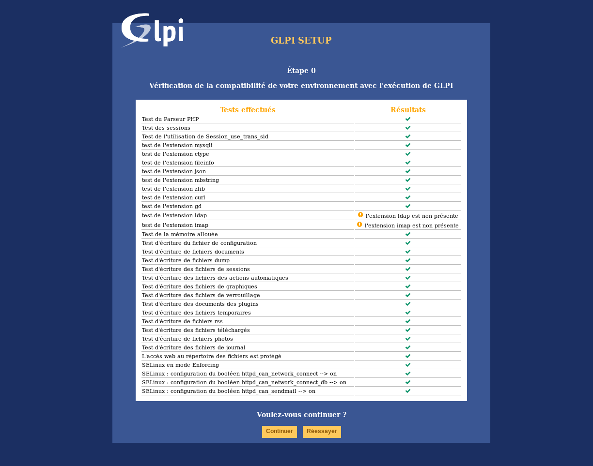
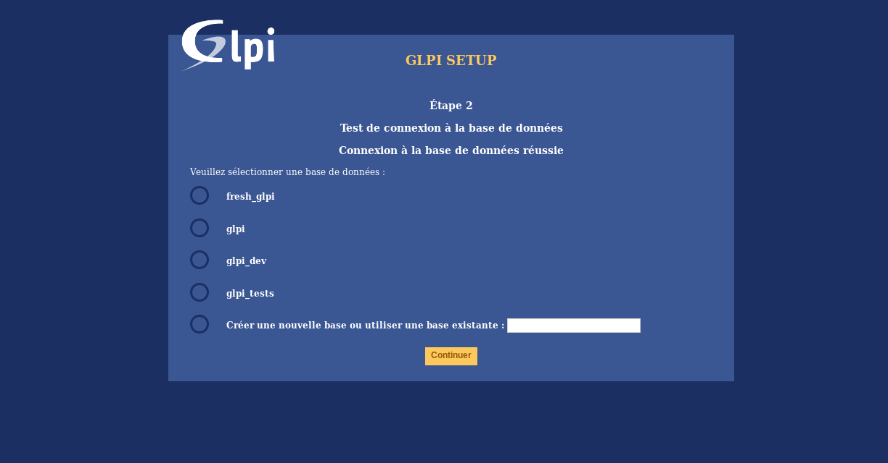
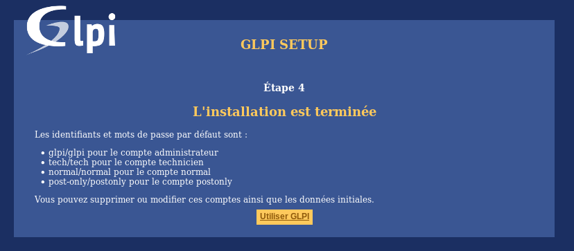

Utiliser l'assistant d'installation en ligne de GLPI
====================================================

Pour débuter l'installation, faire pointer le navigateur web sur le dossier racine de GLPI :
`https://{adresse_glpi}/ <https://{adresse_glpi}/>`_

Lors de la première connexion à cette adresse, une procédure d'installation pas-à-pas débute.

Choix de la langue (Select your language)
-----------------------------------------

La première étape consiste à choisir la langue dans laquelle se déroulera l'installation. Sélectionner la langue souhaitée, puis valider.

Licence
-------

L'utilisation de GLPI est soumise à l'acceptation de la licence d'utilisation GNU : :abbr:`GPL (General Public Licence)` proposée à la lecture. Une fois la licence lue et acceptée, valider le formulaire.

.. image:: images/license_agreement.png
   :alt: Termes de la licence
   :align: center
   :scale: 50%

Sans acceptation des termes de la licence, il est impossible d'accéder aux étapes suivantes.

Installation / mise à jour
--------------------------

L'écran suivant permet de choisir entre installer GLPI ou effectuer une mise à jour.

.. image:: images/install-update.png
   :alt: Installation ou mise à jour
   :align: center
   :scale: 50%

Cliquer sur Installation.

Vérification de l'environnement
^^^^^^^^^^^^^^^^^^^^^^^^^^^^^^^

Cette étape va vérifier que le système satisfait les pré-requis à l'installation. Si ce n'est pas le cas, il est impossible d'accéder aux étapes suivantes et un message d'erreur explicite indique les actions à réaliser avant d'essayer à nouveau.

Certains pré-requis sont optionnels, il sera alors possible de valider le formulaire même s'ils ne sont pas respectés.

Connexion à la base de données
^^^^^^^^^^^^^^^^^^^^^^^^^^^^^^

Les paramètres de connexion à la base de données sont demandés.

.. image:: images/db.png
   :alt: Paramètres de la base de données
   :align: center
   :scale: 50%

* *Serveur MySQL* : saisir le chemin réseau d'accès au serveur, par exemple `localhost`, ou `mysql.domaine.tld` ;
* *Utilisateur MySQL* : saisir le nom d'utilisateur ayant le droit de se connecter au serveur MySQL ;
* *Mot de passe MySQL* : saisir le mot de passe associé à l'utilisateur défini précédemment.

Une fois que ces champs sont correctement remplis, valider le formulaire.

La connexion à la base est alors établie à des fins de tests. Si les paramètres sont invalides, un message d'erreur est affiché, il faut modifier les paramètres de connexion et essayer à
nouveau.

Choix de la base de données
^^^^^^^^^^^^^^^^^^^^^^^^^^^

Une fois la connexion au serveur MySQL établie, il faut créer ou choisir la base de données destinée à accueillir les données de l'application GLPI puis l'initialiser.

Deux possibilités sont offertes :

* Utiliser une base existante

   Sélectionner cette base dans la liste des bases affichées. Valider pour initialiser la base de données.

   .. warning::

      Le contenu de la base de données sélectionnée sera détruit lors de l'initialisation de celle-ci.

* Créer une nouvelle base

   Sélectionner *Créer une nouvelle base de données*, saisir le nom de la nouvelle base dans le champ texte prévu à cet effet puis valider pour créer la base de données.

   .. warning::

      Cette étape nécessite que l'utilisateur ait les droits nécessaires à la création d'une nouvelle base.

Initialisation de la base de données
^^^^^^^^^^^^^^^^^^^^^^^^^^^^^^^^^^^^

Cette étape initialise la base de données avec les valeurs par défaut.

.. image:: images/db-ok.png
   :alt: Initialisation de la base de données
   :align: center
   :scale: 50%

En cas d'erreur, lire attentivement les informations.

Installation terminée
^^^^^^^^^^^^^^^^^^^^^

Cette étape présente le récapitulatif de la procédure d'installation et donne la liste des comptes utilisateurs créés. Lire attentivement ces informations et valider pour effectuer la première connexion à
l'application.

.. note::

   Les comptes utilisateurs par défaut sont les suivants :

   * *glpi/glpi* pour le compte administrateur
   * *tech/tech* pour le compte technicien
   * *normal/normal* pour le compte normal
   * *post-only/postonly* pour le compte post-only

.. warning::

   Il faut bien entendu par la suite supprimer ou modifier ces comptes par défaut pour des raisons évidentes de sécurité.

   Veiller avant la suppression du compte ``glpi`` à créer un nouvel utilisateur avec le profil ``super-admin``.
