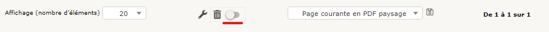

Supprimer un objet
==================

La plupart des objets GLPI ne sont pas supprimables directement, il est nécessaire de les placer en Corbeille dans un premier temps puis de le supprimer définitivement dans la corbeille.

Mettre en corbeille
-------------------

Afin de mettre en corbeille un objet dans GLPI:

* Rendez vous dans le menu concerné;
* Recherchez l'objet souhaité dans la liste ou via le moteur de recherche;
* Sélectionnez le ou les objets souhaités via la case à cocher;
* Une fois les objets sélectionnés, cliquez sur " Actions ";
* Une fenêtre pop up vous permettra de choisir entre plusieurs actions à effetcuer sur le ou les objets;
* Sélectionnez l'action " Mettre à la corbeille ".

Supprimer définitivement
------------------------

Pour supprimer les objets définitivement, cela implique d'accéder à la corbeille.

Pour accéder à la corbeille:

* Rendez vous dans le menu concerné;
* Cliquez sur le bouton d'activation de la corbeille;

* Cela modifiera la liste des objets pour afficher uniquement les objets en corbeille;
* Sélectionnez le ou les objets à supprimer via les cases à cocher;
* Cliquez sur le bouton " Actions ";
* Sélectionnez l'action " Supprimer définitivement"

.. note::

		Le nom de l'action de suppression peut varier selon le menu !

