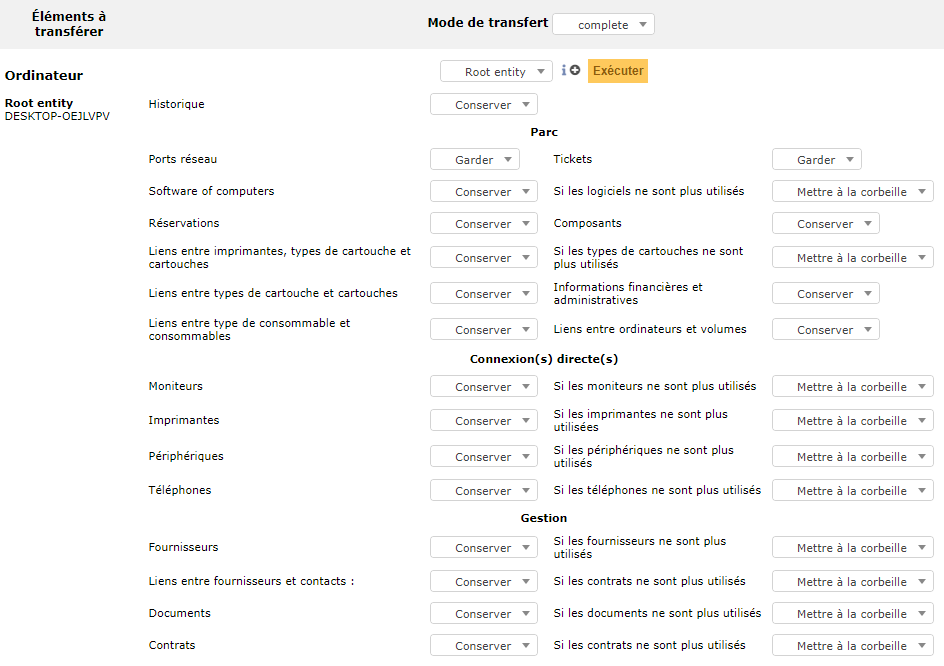

Transférer un objet d'une entité vers une autre
===============================================

Pour basculer un objet dans une autre entité de GLPI, il est nécessaire de passer par la liste de tranfert.

Pour ajouter un objet dans la liste de transfert:

* Rendez vous dans le menu de l'objet concerné;
* Sélectionnez ou rechercher le ou les objets souhaités via le moteur de recherche;
* Une fois votre sélection terminée,  cliquez sur le bouton " Actions " pour afficher la liste des actions massives;
* Choisissez l'action " Ajouter à la liste de transfert" puis cliquez sur " Envoyer ".

L'objet est désormais dans la liste de transfert et vous serez envoyé directement dans la liste. Vous pouvez continuer à naviguer dans GLPI et ajouter d'autres objets.

Pour revenir dans la liste de transfert:

* Rendez vous dans le menu Administration > Règles > Transférer;
* Cliquez sur l'icone oeil pour accédez aux objets dans la liste.

Pour transférer un objet:

* Une fois dans la liste des objets prêts pour un transfert, choisissez le "Mode de transfert ". Par défaut, le mode " complete " est déjà configuré;
* Quand le mode sera sélectionné, choisissez dans la liste déroulante l'entité de destination du ou des objets;
* Diférents paramètres de transfert seront à votre disposition en fonction des objets en liste également.

Exemple pour un objet Ordinateur :

