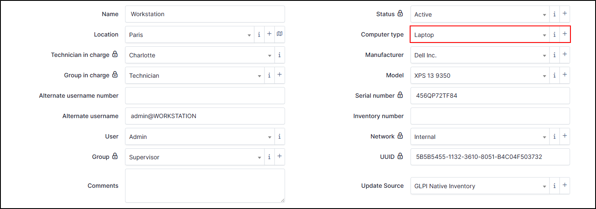
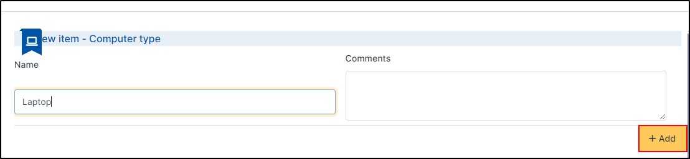
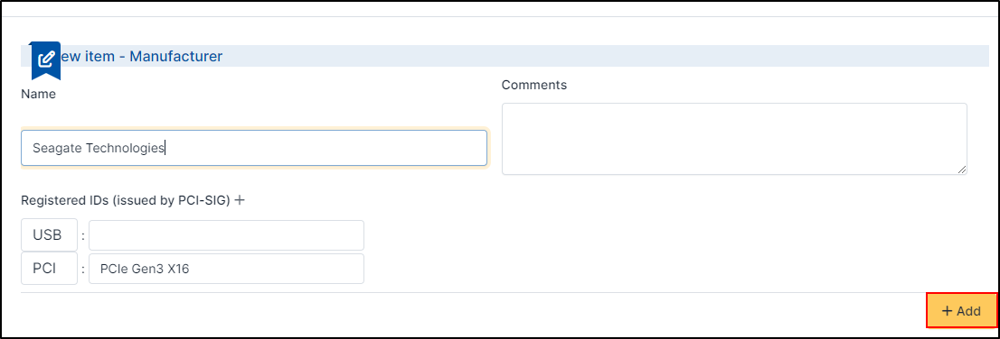

Common fields
=============

Alternate username
~~~~~~~~~~~~~~~~~~

The alternate username is a field returned by the inventory. It is filled in by the user who opened the session on the machine concerned.
This field can be updated if, during the next inventory, another user logs on to the machine.It takes the form ``user@machine_name``. This field can be changed manually,
but it will be locked (by default) to prevent it being updated at a later date. See the article on :doc:`locks`

Alternate username number
~~~~~~~~~~~~~~~~~~~~~~~~~

In this field, you can manually enter a user identification number. This field is not updated by the inventory.

.. image:: ../image/alternate-username-number.png
   :alt: module assets - alternate username number
   :align: center
   :scale: 51%

Comments
~~~~~~~~

It's just a text field in which you can indicate what you want.

Computer type
~~~~~~~~~~~~~

The type of computer allows you to specify whether the machine is a laptop, a server, a workstation, etc.
There is no predefined type; the different types must be created.

- To create a **computer type**, click **+**
- Enter a **Name**
- Enter a comment if it's necessary
- Click **+ Add**

The computer will be available for all entities. You can use **templates** or **rules** with computer type

Group
~~~~~
You can add a group manually or create a group directly by this field.

.. image:: ../image/group.png
   :alt: module assets - user
   :align: center
   :scale: 50%

- To create a group, click on **+ Add**
- If it's necessary, check the box **Child entities** (this group will be visible in the sub-entity of the one you are in)
- Enter a **Name**
- A **Code** (optionnal)
- Choose if this group is **Child of**
- Select yes or no to **Recursive membership** (if enabled, members of this group will also become implicit members of its children groups)
- You can define whether this group can be **visible in a ticket** (as a requester, observer, assigned to, task, can be notified)
- Define if the group can be a **manager in a project**
- Select if this group **can contain** **Items** and/or **Users**
- Click **+ Add**

.. image:: ../image/add-group-1.png
   :alt: module assets - group
   :align: center
   :scale: 63%
.. image:: ../image/add-group-2.png
   :alt: module assets - group
   :align: center
   :scale: 63%

- In this window, you need to add users. In **Users** tab, select those you wish to associate with the group (prefer users with a technical or higher profile)

1. Select **user**
2. Define it this user can be **Manage** group (add/modify memebers, name, etc.)
3. whether or not to authorise **Delegatee** rights (can open ticket for the group)
4. **Add** your group

Once the group has been created, you can add another or select it from the drop-down list.

Group in charge
~~~~~~~~~~~~~~~

A group in charge can modify the information of the computer and his elements (status, computer type, etc.)

.. image:: ../image/group-in-charge.png
   :alt: module assets - group in charge
   :align: center
   :scale: 51%

- To create a group, click on **+ Add**
- If it's necessary, check the box **Child entities** (this group will be visible in the sub-entity of the one you are in)
- Enter a **Name**
- A **Code** (optionnal)
- Choose if this group is **Child of**
- Select yes or no to **Recursive membership** (if enabled, members of this group will also become implicit members of its children groups)
- You can define whether this group can be **visible in a ticket** (as a requester, observer, assigned to, task, can be notified)
- Define if the group can be a **manager in a project**
- Select if this group **can contain** **Items** and/or **Users**
- Click **+ Add**

.. image:: ../image/add-group-1.png
   :alt: module assets - group in charge
   :align: center
   :scale: 63%

.. image:: ../image/add-group-2.png
   :alt: module assets - group in charge
   :align: center
   :scale: 63%

- In this window, you need to add users. In **Users** tab, select those you wish to associate with the group (prefer users with a technical or higher profile)

.. image:: ../image/add-users-in-group-charge.png
   :alt: module assets - add user in group in charge
   :align: center
   :scale: 43%

1. Select **user**
2. Define it this user can be **Manage** group (add/modify memebers, name, etc.)
3. whether or not to authorise **Delegatee** rights (can open ticket for the group)
4. **Add** your group

Once the group has been created, you can add another or select it from the drop-down list.

.. Note:: If you cant another option with groups, see :doc:`../administration/groups`

Inventory number
~~~~~~~~~~~~~~~~

**Inventory number** is information added manually. It is generally managed internally by the company.

Location
~~~~~~~~

You can add location manually or dynamically.

.. warning:: Depending on your needs, pay attention to the entity you are in and its recursivity, so that it is visible or not to other entities.

.. Note:: All locations your created here are available for other GLPI objects depending on the entity in which you created it

To add a location **manually** :

If your have already entered locations :

* Select the one that is right for you in the drop-down list.

If you have not previously entered a location :

* Click on **+**
* In the new box, enter the informations that you need :

  * Name
  * Code
  * As child of
  * Postal code
  * state
  * Building number
  * Longitude
  * Latitude
  * Altitude
  * Comments
  * Aliras
  * Address
  * Town
  * Country
  * Room number

.. image:: ../image/add-location-1.png
   :alt: module assets - add location
   :align: center
   :scale: 61 %
.. image:: ../image/add-location-2.png
   :alt: module assets - add location
   :align: center
   :scale: 61 %

* Click **+ Add**
* After saving, you can add a new location or close this window
* Now, select the location for your computer

To add a location **automatically** :

You need to create **location rules** to affect a location to a computer. Before, you need to define the criteria which will trigger the rule (a tag inventory, a subnet, a domain, etc.)
In our example, we're going to create a rule that takes the `inventory tag <https://glpi-agent.readthedocs.io/en/latest/man/glpi-agent.html#execution-mode-options>`_ into account. If the tag is France, then apply the Paris location

* In **administration > Rules > Location Rules**
* Click **+ Add**
* You can add differents informations (name, logical operator, comments, description, active)
.. Warning:: **Logical operator AND / OR**

   - **"OR"** the rule will then apply from the 1st corresponding criterion. It will ignore all subsequent criteria.
   - **"AND"**, on the other hand, will have to take all the criteria into account for the rule to be applied.
* **Active** your rule
* Clik **+ Add**
* In **Criteria**, click **Add a new criterion**
* Select **Agent > Inventory tag**
* Enter **France**
* Click **+ Add**

* In **Actions** tab, click **Add a new action**
* Select the location to assign
* Click **+ Add**

.. image:: ../image/add-rule-location-action.png
   :alt: module assets - add rule location
   :align: center
   :scale: 48%

You can test the rule location by clicking on **Test rules engines** in **Administration > Locations rules**

.. image:: ../image/test-rule-location.png
   :alt: module assets - add rule location
   :align: center
   :scale: 67%

Manufacturer
~~~~~~~~~~~~~

Manufacturers are automatically retrieved by the automatic inventory and assigned to the computer. you can also create/add them manually.

.. image:: ../image/manufacturer.png
   :alt: module assets - computer-manufacturer
   :align: center
   :scale: 50%

- To create a manufacturer, click **+**
- Add a **Name**
- You can add a registrered ID issued by `PCI-SIG <https://pcisig.com/developers/integrators-list>`_ for USB or/and PCI. You can add more by clicking **+**.

Once the manufacturer has been created, you can add another or select it from the drop-down list.

Model
~~~~~

When the inventory is uploaded, the template field is filled in automatically. You can also create/add templates manually.
Modeles can also be used by templates and rules.

.. image:: ../image/model.png
   :alt: module assets - computer model
   :align: center
   :scale: 50%

- To create a model, click **+**
- Add a **Name**
- Add a **Product number** if it's necessary
- You can specify the **Weight** and the **Depth**, the **Required units** (in the case of a rack server)
- You can indicate the **Power connections** and the **Power consumption**
- Indicate whether it is a half rack
- Add pictures (front, rear, other)

.. image:: ../image/add-model-1.png
   :alt: module assets - computer model
   :align: center
   :scale: 63%

.. image:: ../image/add-model-2.png
   :alt: module assets - computer model
   :align: center
   :scale: 63%

Example with picture :

.. image:: ../image/rack-model.png
   :alt: module assets - rack model
   :align: center
   :scale: 42%

If you insert a machine with photos in a rack, the photos will be visible in that rack

Example of a server in a rack with photo :

.. image:: ../image/example-rack-model.png
   :alt: module assets - rack view
   :align: center
   :scale: 67%

Network
~~~~~~~

**Network** is information added manually. you can pre-fill this information using a template.

.. image:: ../image/network.png
   :alt: module assets - network
   :align: center
   :scale: 50%

- To create a network, click **+**
- Enter a **Name**
- Enter a **Comment** (optionnal)
- Click **+ Add**
- You can add another one or close this window
- Then select the network you want from the drop-down list

.. image:: ../image/add-network.png
   :alt: module assets - add network
   :align: center
   :scale: 63%

Serial number
~~~~~~~~~~~~~

This information is automatically retrieved by the automatic inventory. You can add/modify this information manually. By default, if you add or modify this field
it will be locked, the automatic inventory will not modify this information. You can unlock the field.

Status
~~~~~~

The status provides information about the state of the machine.
By default, there is no status. You can create as many statuses as you like, which can be used by rules.

.. Note:: some plugins may add statuses such as `Uninstall <https://glpi-plugins.readthedocs.io/en/latest/uninstall/index.html>`_

.. image:: ../image/status.png
   :alt: module assets - user
   :align: center
   :scale: 50%

* To create a status, click on **+**
* If it's necessary, check the box **Child entities** (this status will be visible in the sub-entity of the one you are in)
* Add a **Name** (the one that will appear on the computer's file)
* Choose if this status is **Child of**
* Define if the **item with this status can be showed in assistance**
* Select the visibility of the status in :

  * Computers
  * Monitors
  * Network devices
  * Devices
  * Phones
  * Printers
  * Licences
  * Certificates
  * Enclosures
  * PDUs
  * Lines
  * Racks
  * Versions
  * Clusters
  * Contracts
  * Appliances
  * Database instances
  * Cables
  * Unmanaged devices
  * Passivces devices
  * System board items
  * Firmware items
  * Processor items
  * Memory items
  * Hard drive items
  * Network card items
  * Drive items
  * Battery items
  * Graphical card items
  * Soudncard items
  * Controller items
  * PCI device items
  * Case items
  * Power supply items
  * Generic device items
  * Simcar items
  * Sensor items
  * Camera items

* Click **+ Add**

Once the status has been created, you can add another or select it from the drop-down list.

Technician in charge
~~~~~~~~~~~~~~~~~~~~

A technician in charge can modify the information of the computer and his elements (status, computer type, etc.)

.. Note:: A technician is a person with a technician profile or higher

- In **Technician in charge** tab, select the technician you require.

A technician in charge can see the material that he can manage in **Administration > Users** in the **managed items** in the user file

Update source
~~~~~~~~~~~~~

Update source is the way in which the machine has been incremented in the inventory.
If it was done by the agent, GLPI Native Inventory will be indicated. For a manual entry, this field will remain empty. You can add manual sources

- To create update source, click **+**
- Enter a **Name**
- Enter a comment (optionnal)
- Close the window and select the value in the drop-down list

.. image:: ../image/add-update-source.png
   :alt: module assets - update source
   :align: center
   :scale: 65%

User
~~~~

If the user who opened the session on the machine is also present in the GLPI database (either in the internal database or any other external data source),
this field will be filled in. It will remain empty if the user does not exist in the database. You can add a user manually
but it will be locked (by default) to prevent it being updated at a later date. See the article on :doc:`locks`

UUID
~~~~

.. image:: ../image/UUID.png
   :alt: module assets - UUI
   :align: center
   :scale: 51%

The **UUID** (Universally Unique IDentifier) is automatically update by the automatic inventory. This UUID is the unique identifier of the motherboard.
You can add/modify this information manually. By default, if you add or modify this field it will be locked, the automatic inventory will not modify this information. You can unlock the field.

You can retrieve this value using :

- Linux : ``dmidecode``
- Winodws : ``wmic path win32_computersystemproduct get uuid``
- MAC : **Apple Logo > About This MAC > System report > Hardware UUID**

