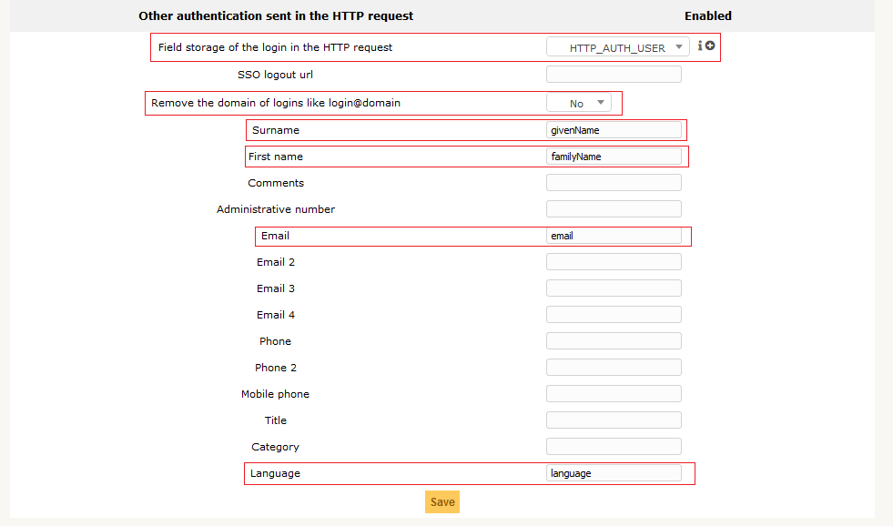
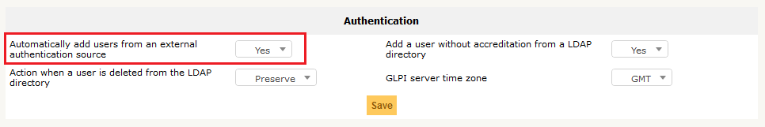
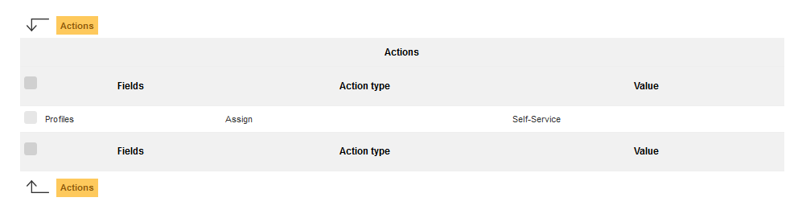

Setup OAuth (SSO) authentication
--------------------------------

In this article, we will see how to to setup oauth (SSO) authentication to allow automatic authentication and import users from external services.

.. image:: external_providers.png

Currently connects via:

* `Google <https://developers.google.com/identity/sign-in/web/sign-in>`_
* `Facebook <https://developers.facebook.com/apps/>`_
* `Github <https://github.com/settings/developers>`_
* `Amazon <https://developer.amazon.com/fr/blogs/appstore/post/Tx3NJ8243NI3ONM/announcing-login-with-amazon-an-authentication-service-to-securely-connect-with-amazon-customers>`_
* `Azure Active Directory <https://docs.microsoft.com/EN-us/azure/app-service/configure-authentication-provider-aad>`_ (:doc:`azure_ad`)
* `Gitlab <denied:hhttps://docs.gitlab.com/ee/api/oauth2.html>`_

Plugin Oauthsso Installation
*****************************

This plugin is available on the Marketplace in your GLPI Network Ckoud Instance.

* Go in `Setup -> Plugins` (`-> Marketplace` if display is not by default )
* Install Oauthsso

.. image:: sso_plugin_marketplace.png

Plugin configuration
********************

This plugin uses the External authentications feature of GLPI. To be functional, it needs to be configured.

* Go in `Setup -> Authentication -> Others authentication methods`
* In `Other authentication sent in the HTTP request` section
* `Field storage of the login in the HTTP request` should be defined (`HTTP_AUTH_USER` most of the time)
* `Remove the domain of logins like login@domain` should be set to `No` (see warning below)

Users who want authenticate will not be known by GLPI, so it's could be interesting to setup some fields to create them with a little bit of information.

For example:

* Surname : **givenName**
* First Name: **familyName**
* Email : **email**
* language : **language**

.. warning::

   The field `Remove the domain of logins like login@domain` must be set to `No` to avoid illegitimate authentications!

   As an Example, for Google suite, if you have an email like ``username@domain`` and the option set to `Yes`, the imported user in GLPI will have name ``username``.

   If an external person try to connect with email like ``username@anotherdomain``, it will authenticate in GLPI like it would be the first email.

* Save your setup

Now, you need to enable `Automatically add users from an external authentication source`. Go in `Setup -> Authentication -> Setup` and set `Automatically add users from an external authentication source` to `Yes`.

Oauth SSO authentication configuration
**************************************

Now, the plugin is ready to use.

* Go in `Setup -> oauth SSO applications`
* click on the "plus" icon to add a new Oauth SSO application
* Choose your provider

.. warning::

   The fields to be completed may change depending the provider !

See top of the current page for documentation from the different provider.

When the provider is enabled, you will see the new GLPI login page!

Authorizations assignment rules
********************************

Most of the time, you will need to establish some rules to manage users after authentication, especially Authorizations assignment rules.

To create rules for users, you will need to go in `Administration -> Rules -> Authorizations assignment rules` menu.

There is no mandatory rules, you could create all rules you want to meets your need.

For example: *I need to assign Self-Service Profile on my users*.

Remember that we enabled an option above to avoid illegitimate authentication! This parameter, in practice, will keep the domain in the User ID field. The users will therefore be registered in GLPI like this: ``login@mydomain``.

This can therefore become a criteria of my rule because ``@mydomain`` is a common denominator of all my users:

.. image:: rule_criteria.png

Now, i can establish an action for my rule. Here, i want to assign Self-Service profile:

Google specificity
******************

This provider requires to enable Google+ API before providing any user details (like given name or emails).

See: https://console.developers.google.com/apis/api/plus.googleapis.com/overview

Google oauth service also supports multiple emails in their response.
Like above, you can also fill additional fields in `Setup -> Authentication -> Others authentication methods`:

* Email 2: email2
* Email 3: email3
* Email 4: email4

Candidates for future providers
*******************************

See:

* http://oauth2-client.thephpleague.com/providers/league/
* http://oauth2-client.thephpleague.com/providers/thirdparty/