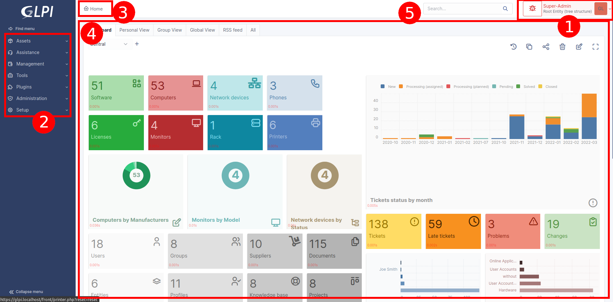

Understanding the interface
===========================

Depending on the user's profile, some menus and content may differ, but the logic of the interface remains the same.

The GLPI interface is made up of different areas grouping together the application's functionalities according to their nature.

#. The user menu allows you to manage your preferences, access help, change the current language, and disconnect.
#. The main menu allows you to navigate through the different modules.
#. The breadcrumb trail allows you to locate the context of use of the main work area.
#. The entity selector (in multi-entity mode).
#. The main working area is the privileged space for interaction with the application.
#. The search box allows you to perform a global search at any time.
