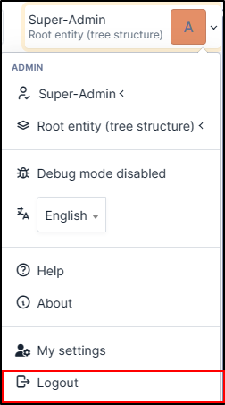

General
=======

Choose a web browser
--------------------

GLPI requires the use of a web browser.

Optimal functioning of the application is obtained by using a modern browser compliant with web standards.

The following web browsers are supported:

* Edge
* Firefox (including 2 latests ESR version)
* Chrome

GLPI also works on mobile; it is generally compatible with the mobile versions of the supported browsers.

How to connect
--------------

Open your browser and go to the GLPI homepage (`https://{glpi_address}/ <https://{glpi_address}>`_).

Access to the full functionality of the application requires authentication. An unauthenticated user can possibly access certain functions if GLPI has been configured to allow it:

* Open a ticket,
* Consult the assets,
* View the :abbr:`FAQ (Frequently Asked Questions)`,
* etc.

Depending on the profile of the authenticated user, they may be shown the :ref:`standard interface <standard_interface>`, or :ref:`simplified interface <simplified_interface>`.

End your session
----------------

To log out, click the logout button in the top right of the screen. Once logged out, you will be redirected to the login page.

