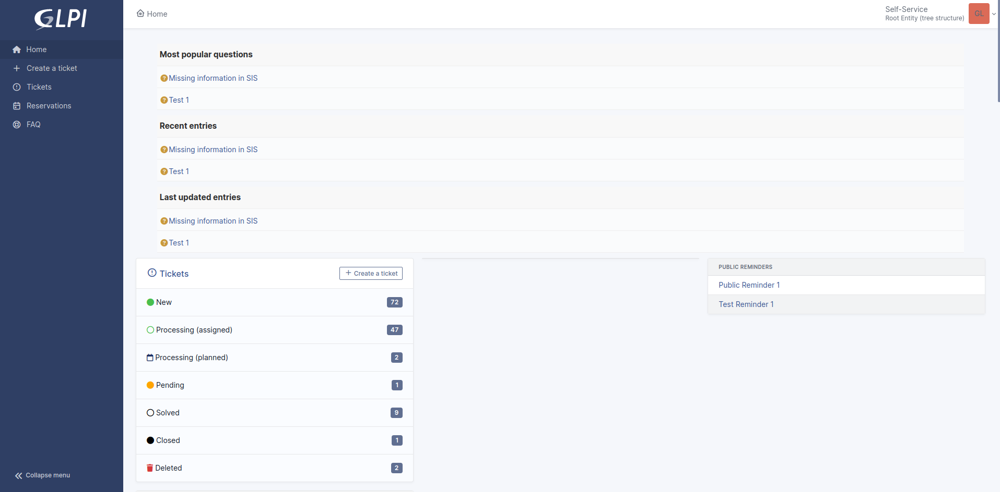

User interfaces
===============

.. note::

   The choice of the default interface as well as the visiblity of different modules can be configured in the profiles or from :doc:`the user's preferences <preferences>`.

.. _standard_interface:

Standard Interface
------------------

This is the main interface of the application. All the modules are available, but there are limits depending on the profile settings.

The home page of the standard interface provides a summary view for quick access to active elements (tickets, notes, planning, contracts, etc.).

It is divided into 5 views:

* *Dashboard*

   A customizable dashboard
* *Personal view*

   Shows the tickets opened, rejected, to be processed, to be approved (for which the logged-in user is the requestor) or those on which this user has an interaction as a validator or technician (awaiting validation, in progress, to be closed, in waiting). This view also offers him current issues, his schedule and available notes.
* *Group view*

   Offers the same information about tickets and issues as the personal view, but using the groups to which it belongs as a reference. Depending on their profile, they may or may not have access to the tickets for which their groups are requesting.

* *Global view*

   Offers statistics on tickets and issues according to their status and on contracts according to their expiration date. It also offers the view of the latest additions of objects in GLPI. Depending on the configuration used, new tickets can also be presented in this tab.

* *RSS feed*

   Proposes the content of defined RSS feeds. :doc:`RSS feeds are managed from the "Tools  > RSS Feeds" menu <../modules/tools/rssfeed>`.

.. note::

   For Personal and Group views, only tables with information are displayed.

.. note::

   Two security messages may be displayed when you log in for the first time after completing the installation procedure.

   The first asks you to change the passwords of the accounts created by default in GLPI, the second asks you to delete the directory ``glpi/install``.
   There may also be one or more other messages here related to security or needed database schema changes

   .. image:: images/security-messages.png
      :alt: Security messages
      :align: center
      :scale: 50%

   As long as you have not performed these operations, the messages will remain.

.. _simplified_interface:

Simplified Interface
--------------------

It is the most restrictive interface of the application and is built for an end-user more than a technician. Therefore, the number of available modules is reduced to a minimum.

It is intended for users with very limited permissions in the application such as the built-in self-service and helpdesk profiles.

In the default configuration, a user can, from this interface, only create tickets, follow the processing of their tickets, make reservations, view the notes or public RSS feeds (or create private notes or feeds) and consult the Frequently Asked Questions.

The home page offers the number of its tickets according to their status as well as the most popular and recent FAQ topics.
