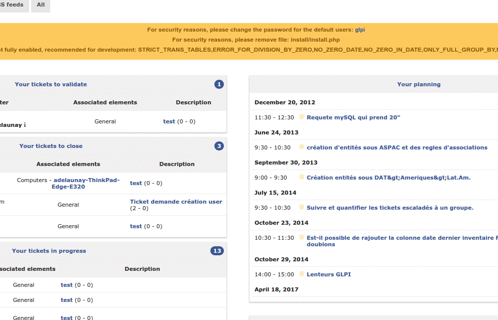

Navigate GLPI modules
=================================

The various functions of GLPI have been grouped into several modules, built around similar contexts of use.
The top bar of the interface allows you to navigate between these modules:

* The :doc:`Assets module <../../modules/parc/index>` provides access to the various inventoried materials,
* The :doc:`Assistance module <../../modules/assistance/index>` allows you to create and monitor tickets, problems and changes; as well as see statistics.
* The :doc:`Management module <../../modules/gestion/index>` allows you to manage contacts, suppliers, budgets, contracts and documents.
* The :doc:`Tools module <../../modules/outils/index>` allows you to manage projects, notes, the knowledge base, reservations, RSS feeds and view reports.
* The :doc:`Administration module <../../modules/administration/index>` allows you to administer users, groups, entities, profiles, rules and dictionaries. It also allows the maintenance of the application (basic backup and restore, check if a new version is available) as well as the management of the email queue.
* The :doc:`Setup module <../../modules/configuration/index>` provides access to the general configuration options of GLPI: notifications, collectors, automatic tasks, authentication, plugins, external links, SLA, management of titles, components as well as control of the uniqueness of fields.

The menus presented vary according to the authorizations of the logged in user. The navigation context is presented to the user in the breadcrumb trail.

.. note::

   You will find at the bottom right a button allowing you to quickly return to the top of the page if necessary.

There are keyboard shortcuts that allow you to navigate from one module / submodule to another. Here is the list of these shortcuts:

* ``1`` => Home
* *Assets*

   * ``o`` => Computers
   * ``s`` => Software

* *Assistance*

   * ``t`` => Tickets
   * ``a`` => Statistics
   * ``p`` => Planning

* *Management*

   * ``d`` => Documents

* *Tools*

   * ``b`` => Knowledge base
   * ``r`` => Reservations
   * ``e`` => Reports

* *Administration*

   * ``u`` => Users
   * ``g`` => Groups

* *Setup*

   * ``n`` => Dropdowns

.. note::

   The combination of keys to associate with these shortcuts varies depending on the operating systems and browsers used. Here are some examples according to the browsers:

   * Mozilla Firefox / Chrome

      Simultaneously press the keys ``Alt``, ``Shift`` and *the desired shortcut*.

   * Opera

      Simultaneously press the keys ``Esc``, ``Shift`` and *the desired shortcut*.

In addition, since version 9.2, GLPI offers navigation with approximate search (fuzzy) accessible from the keyboard shortcut ``Ctrl`` + ``Alt`` + ``G``.
This will open a modal window allowing you to filter, via a search field, all the menus of GLPI (all the levels are present, you have for example access to the 3rd level such as the dropdowns or the components).

In this window, additional shortcuts are available:

* ``🡇`` and ``🡅`` in order to navigate through the results
* ``Enter`` to change the active glpi page on the selected result
* ``Esc`` to close the window.

