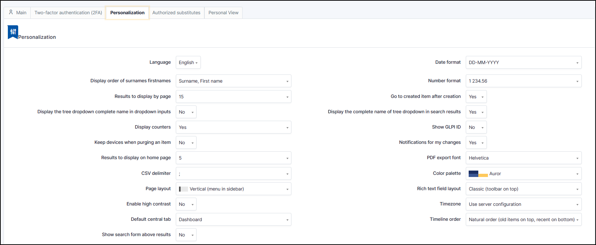

Manage your Preferences
=======================

User preferences are accessible from the `Preferences` tab of the user form by clicking on your name at the top right of the interface, from any page.

Each authenticated user has the possibility to modify his preferences if they have the `Personalize` update right in their profile.

.. note::
   These options override the default ones set in the general setup.
   For more information about the available options refer to the `general setup documentation <../../../modules/configuration/general/default_values.html>`_.

Main Tab
--------

Here the user can modify the usual personal information:

* Surname
* First name
* Email address
* Phone numbers
* Location
* Language
* ...

.. note::

   Some fields cannot be modified if they come from an LDAP directory.

A user can add email addresses and select the default address, which will be used for sending notifications.

They can also specify some default behaviors of the application, such as the selected profile and entity. They can also turn off notifications for actions they take.

Depending on the profiles, the experienced user can also choose to exit the normal application mode. In debug mode, GLPI displays errors, all variable values, SQL queries, etc. It is useful to activate this mode in the event of GLPI malfunction. A maximum amount of information can therefore be communicated to the developers. This mode also allows you to have additional information on different objects in a specific tab (notifications, etc.).

.. Note:: Note that the Remote access key section allows you to regenerate the security key used to access the private flows offered by GLPI. Currently the ICAL and WEBCAL flows of the planning are protected by this security key which is integrated into the url.

Two-factor authentication Tab
-----------------------------

MFA is now native to GLPI. MFA (or multi-factor authentication) allows you to secure access to your account by means of double authentication.
After entering your password, you'll need to enter the access code provided by your application (Free OTP, Authy, Authenticator, etc.).

- First, you need to download an application like *Authy*,
- Go to your preferences in the top right-hand corner
- Click on my settings > Two-factor authentication (2FA)
- Open your auth application
- Click on "+" (or new, add, etc. depending on the application you have chosen) and scan the QR code (if you can't scan the QR code, you can enter the code directly)

- A code appears on your application, enter the field provided for this purpose on the GLPI side
- Click on **verify**.

- You MFA is now activated

.. important:: Keep your backup codes. If your application is inaccessible, you can use these codes to access GLPI.

   .. image:: images/mfa_enabled.png
      :alt: Screen for MFA
      :align: center
      :scale: 80 %

- By this tab you can disable your MFA (your codes will be lost and you will have to repeat the above procedure to reactivate it)
- You can also regenerate backup codes (old backup codes will be overwritten)

Personalization Tab
-------------------

The customisation section breaks down into several parts. In this section, changes are made to the way your interface behaves. You can customise :

General customisation
~~~~~~~~~~~~~~~~~~~~~

- **Language** : change the language of your interface (the language in this section takes over if another language is defined in the `default values <../../../modules/configuration/general/default_values.html>`_ of the general configuration)
- **Display order of surnames** : how do you want to display the identity of your contacts (surname, first name or first name, surname)
- **Results to display by page** : select the number of results to display for the various searches carried out in the modules (1 to 50)
- **Display the tree dropdown complete name in dropdown inputs** : whether or not to display the full names of drop-down lists (if not, this may affect the layout in some cases) (Yes / No)
- **Diplay counters** : display the counters of saved searches (Yes / No)
- **Keep devices when purging an item** : (Yes / No. No by default)
- **Results to display on home page** : display the number of results on the home page of a module (tickets, compuers, etc.) (5 to 30)
- **CSV delimiter** : delimiter for import/export CSV (; or , by default **;**)
- **Page layout** : change the position of the main menu (horizontal or vertical)
- **Enable high constrast** : feature that alters the colors (Yes / No)
- **Default central bar** : choose which element will be visible on your home page (dashboard, personnal view, group view, global view, RSS feeds)
- **Show search from above results** : whether or not to include the search engine in the toolbar (Yes / No)
- **Date format** : how to display date (YYY-MM-DD,DD-MM-YYYY, MM-DD-YYYY)
- **Number format** : how to display number (1 234.56 / 1,2345.56 / 1 234,56 / 1234.56 / 1234,56)
- **Go to created item after creation** : After creating an object, you can go directly to this object (Yes / No)
- **Display the complete name of tree dopdown in search results** : Yes / No
- **Show GLPI ID** : show the ID of the GLPI's objects (Yes / No)
- Notifications for my changes :
- **PDF export font** : choose the font for PDF exports
- **Color palette** : Choose your theme for your GLPI interface
- **Rich text field layout** : define the behaviour of the text formatting bar
- **Timezone** : select your timezone
- **Timeline order** : order of display of the history of the different types of follow-up in a ticket (natural order (old items on top, recent on bottom) reverse order (old itmes on bottom, recent on top))

.. note::

   The Number of results per page value shown here cannot exceed the maximum value set in the general display options.

Assistance customisation and priority colors
~~~~~~~~~~~~~~~~~~~~~~~~~~~~~~~~~~~~~~~~~~~

- **Private followups by default** : all your follow-ups will be considered private. To make them public, uncheck the private box (Yes / No)
- **Private tasks by default** : all your tasks will be considered private. To make them public, uncheck the private box (Yes / No)
- **Tasks state by default** : choose the default status for your tasks (Information, To do, Done)
- **Pre-select me as a technician when adding a ticket follow-up** : when you create a ticket as a technician, choose whether you will be selected as "assigned to" (Yes / No)
- **Add me as a technician when adding a ticket follow-up**: if you are not assigned to the ticket and you add a follow-up, you will be assigned to this ticket (Yes / No)
- **Action button layout** : choose the layout of the buttons when you are about to reply to a ticket (Splitted or Merged)
- **Show new tickets on the home page** : display tickets in the global view from the home page (Yes / No)
- **Request sources bu default** : when creating a ticket (before submission), define the source of the request (Direct / E-Mail / Fromcreator / Other / Phone /Written)
- **Automatically refresh data (tickets list, project kanban) in minutes** : Choose whether you want to update your interface pages regularly (never to 30)
.. Warning::
   Be carreful, if you activate this option, it is possible that the refresh will take place when you write a follow-up, for example, which will cause you to lose what you have written. We advise you to deactivate this option.
- **Pre-select me as a requester when creating a ticket** : indicate me as the requester when I write a new ticket (this does not prevent you from selecting other people/groups at a later date if you have the rights to do so). (Yes / No)
- **Add me as a techncian when adding a ticket solution** : Add me as a technician when I add a solution to the ticket if it wasn't already assigned to me (Yes /No)
- **Timeline date display** : deletes seconds from dates (Precise / Relative)

You can change the priority colours. This will change all the colours for the :

- Tickets
- Problems
- Changes

Click on the color you want to change and select the one that suits you best. You can select a color that is already defined, either using the colour selector or the Hex code if you know it (#000000)

Due date progression
~~~~~~~~~~~~~~~~~~~~

When you add a :doc:`../modules/configuration/service_levels`, you can define :

- **The colours of the differents states** (You can select a color that is already defined, either using the colour selector or the Hex code if you know it (#000000))
- **The threshold of the warning state** (it is possible to steup the thresold in **percentage**, **hours** or **days**)
- **The threshold for the critical state** (it is possible to steup the thresold in **percentage**, **hours** or **days**)

Dashboards
~~~~~~~~~~

You can setup a default dashboard for :

1. Central (home page)
2. Assistance
3. Assets
4. Tickets (mini dashboard)

- For the third options, you can select the dashboard of your choice, including those you have added.
- For the last option, tickets (mini dashboard), you can desactivate it or display the mini dashboard in the tickets tab.

Notifications
~~~~~~~~~~~~~

You can define whether GLPI displays notifications when changes are made (updating a ticket, adding a task, etc.). You can define whether these should be displayed:

- Top left
- Top right
- Bottom left
- Bottom right

Authorized substitutes
~~~~~~~~~~~~~~~~~~~~~~

This option allows you to delegate ticket validation to one or more people (groups are not available here) for a certain period of time. All you have to do is select the dates on which you want to delegate your validation and select the user or users you want.
If you don't select an end date, users will be able to approve tickets until you manually revoke this right

Personal View Tab
-----------------

Lists custom views defined in objects by the user. In particular, it allows you to delete the personal views defined to return to global views.
