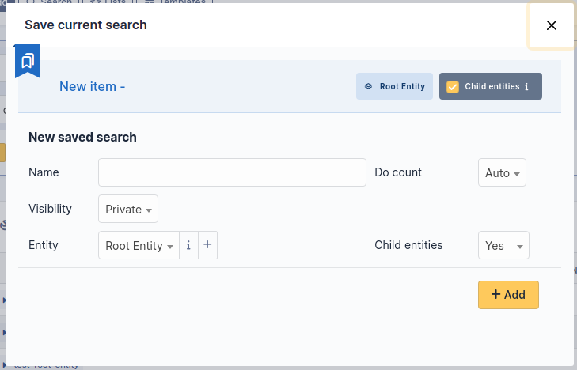
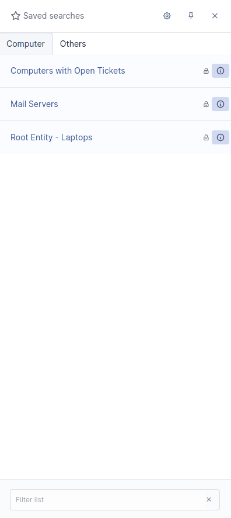

.. _bookmarks:

Saved Searches
==============

GLPI offers a system for saving searches (bookmarks). Once the search is done, it is possible to save it from a star-shaped button accessible in the search form.

There are two types of saved searches:

* *Private* searches: Usable by all users and they are only accessible by their author
* *Public* searches: Can only be created by authorized users and are accessible by all users provided they belong to the configured entities

Saved searches can be accessed by clicking on the star shaped button in the user menu.

From this interface, it is possible to:

* Reorder private searches (drag & drop) - public searches use automatic sorting
* Select a default search (only one possible per type of object) by clicking on the star icon
* Access the search results (by simply clicking on it)
* Access the saved searches management interface, by clicking on the wrench icon at the top right

.. warning::

   Setting a particularly heavy search as the default display can have catastrophic effects on the overall performance of the application!

Display of counters
-------------------

The GLPI settings are used to define whether the counters should be displayed or not. In the case of research, it's a bit more complicated.

This is because some searches can take a long time (and resources) to complete. In order to limit the impact on performance, the heaviest requests are not counted by default. So that the execution time of a saved query can be calculated; it must be executed at least once. A scheduled task is also offered to calculate execution times regularly (and thus avoid requests that would have become heavy over time).

Administrators can override the automatic count method, and have a search always or never be counted. This possibility should be used sparingly.

Configuring alerts
------------------

It is possible to configure the sending of “alerts” on a saved search using the GLPI notification system . Sending a notification is based on the number of results returned by the search, compared with the chosen operator to the entered value.

The notification(s) used are displayed for reference from the alerts configuration tab. For private research; only the user who created the search can be notified, using a template provided by default; in this case, a single notification will be linked.

For public searches, a specific event must be created, as well as a notification that uses it. This is only possible from the alerts configuration tab.

Once the specific notification is created, it has to be configured by associating it with a template and by selecting the desired recipients. Note that it is possible to associate several notifications with the same search via the event that corresponds to it.

.. note::

   As long as the notification specific to a public search is not created; it will not be possible to add alerts.

   .. image:: images/saved_search_nonotif.png
      :alt: No saved search notification message
      :align: center
