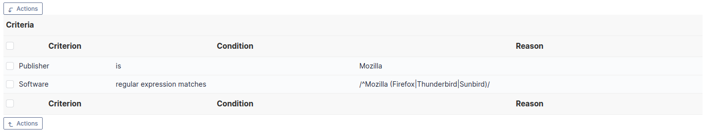
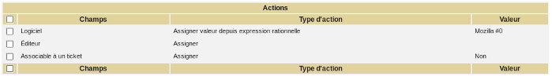
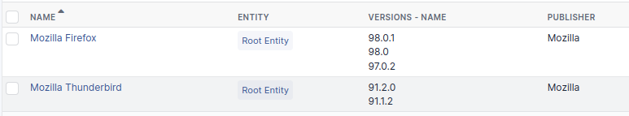

Dictionaries
=============

Dictionary's allow to modify data already existing in GLPI or new data in order to group redundant data.

Dictionaries are based on GLPI :doc:`rules engine </modules/administration/rules/rulesmanagement>` and are available for some types of items (software, suppliers, drop-downs). The rules associated with a dictionary will modify values that are either manually inserted or automatically inserted via an inventory tool or via plugins (for instance CSV file injector).

Import, export and duplication
------------------------------

Export, import and duplication are available for dictionarys or rules. These operations can be realized globally from dictionary's main page or by batch using mass actions from dictionary's search results. These functionalities are useful for instance when migrating rules from a pre-production environment to a production one.

.. note:: export or import use a XML file format

Configure data dictionaries
----------------------------

A dictionary works the following way:

1. data to be added enters the dictionary;
2. rules engine plays all rules applying to this type of data and stops on first matching rule;
3. modified data is returned by the dictionary and inserted into database.

The *Replay the dictionary rules* button (under the list of rules of the dictionary) allows to replay the rules on data already existing in database.

.. warning:: if database is big, the parameter *memory\_limit* in PHP configuration file must be carefully adjusted: processing by a dictionary can be heavy.

.. hint::
   * it is highly recommended to play rules on a test database and to backup database before production launch of the dictionary or before inserting new rules
   * a script is available in directory *scripts* of GLPI installation, named *compute\_dictionnary.php*, that allows to launch dictionnary processing in command line mode; this allows to bypass problems of execution limit and provides a significant speedup

Global dictionaries
~~~~~~~~~~~~~~~~~~~

Software
++++++++

The software dictionary modifies software data (name, version, manufacturer) in order to complete or merge software's. It is used to make more coherent equivalent software for which name is not identical (for example Mozilla Firefox 3.0 and Mozilla Firefox 3.6) or to add a manufacturer if it is not present. 

This dictionary allows also to redirect the creation of a software or of a set of software in a given entity, by choosing action *Entity* and to select the entity in which to create the software. This functionality can also be used with general option *Entity for software* available in entity configuration.

.. note:: for an optimal management of software and licenses in a multi-entity environment, it is possible to use the software dictionnary simultaneously with software visible in sub-entities and thus to use grouping functionality.

.. warning:: using action *Add regexp result* on a version must be used with maximum care; indeed, this action is only taken into account when importing data coming from an inventory tool and will be ignored when re-applying dictionary on an existing database.

As an example, following image describes grouping Mozilla software. Criteria are accumulated with AND. 

   Criteria for grouping Mozilla software

The following image describes associated action for grouping Mozilla software.

   Action for grouping Mozilla software

The following image presents result of grouping Mozilla software: software are grouped by type (Mozilla Thunderbird, Mozilla Firefox...) and versions are grouped by type.

   Result of grouping Mozilla software

.. topic:: Example for Windows updates grouping, very unclear!

   Autre exemple pour regrouper les mises à jour Windows. Cette fois le critères sont des OU et non des ET *Critères* Logiciel expression rationnelle vérifie /Correctif.\*XP.\*KB([0-9]\*)/ Logicel expression rationnelle vérifie /Mise.\*XP.\*KB([0-9]\*)/ Logiciel expression rationnelle vérifie /Update.\*XP.\*KB([0-9]\*)/ *Actions* Logiciel assigner Mise à jour Windows Version assigner valeur depuis regex #0

Manufacturer
++++++++++++

This dictionary allows to group under a unique name the manufacturer names coming from an inventory tool under different forms.

.. topic:: Exemple for manufacturer grouping, unclear!

   regrouper les fabricants .  Sun\_Microsystems . Sun Microsystems, Inc. for the OpenOffice.org-Community . Sun Microsystems, Inc. . Sun Microsystems, Inc sous le nom Sun Microsystems.

Printers
++++++++

This dictionary allows to modify printer information based on manufacturer and/or name. It is possible to reject an import (for example printer name starting with `//`), to group printers under same name, to assign a manufacturer or to force management type (global or unitary).

Drop-downs
~~~~~~~~~~

This dictionary allows to modify drop-downs related to inventory: types and models of items, operating system, version and service pack.

Models
++++++

Possible criteria are manufacturer and item model. 

.. topic:: Example: transforming technical number into commercial model name

   Often inventory tools extract model technical number, which is irrelevant for user. This example allows to extract commercial model name while keeping technical number which can be required in case of requesting a provider intervention.

   .. figure:: images/criteriaS42.png
      :alt: Example of dictionary for computer model: rule
      :align: center

      Example of dictionary for computer model: rule

   .. figure:: images/actionS42.png
      :alt: Example of dictionary for computer model: action
      :align: center

      Example of dictionary for computer model: action

   The obtained result will be for instance: Netvista S42 (8319LGV)

Types
+++++

Only possible criteria is item type.

.. topic:: Example: harmonizing peripheral names

   .. figure:: images/criteriaKbd.png
      :alt: Example of dictionary on peripheral type: rule
      :align: center

      Example of dictionary on peripheral type: rule

   Example of dictionary on peripheral type: action

   The obtained result will be for instance: Keyboard

Operating systems
+++++++++++++++++

Depending on chosen dictionary, the criteria will be based on operating system itself, on operating system service pack or on operating system version.
