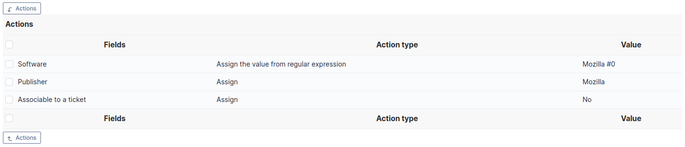

Dictionnaries
=============

.. |importrule| image:: images/importrule.png
.. |playrule| image:: images/playrule.png

Dictionnaries allow to modify data already existing in GLPI or new data in order to group redundant data.

Dictionaries are based on GLPI :doc:`rules engine </modules/administration/rules/rulesmanagement>` and are available for some types of items (softwares, suppliers, drop-downs). The rules associated with a dictionary will modify values that are either manually inserted or automatically inserted via an inventory tool or via plugins (for instance CSV file injector).

Import, export and duplication
------------------------------

Export, import and duplication are available for dictionnaries |importrule|. These operations can be realized globally from dictionnaries main page or by batch using mass actions from dictionnaries search results. These functionnalities are usefull for instance when migrating rules from a pre-production environment to a production one.

.. note:: export or import use a XML file format

Configure data dictionnaries
----------------------------

A dictionary works the following way:

1. data to be added enters the dictionary;
2. rules engine plays all rules applying to this type of data and stops on first matching rule;
3. modified data is returned by the dictionary and inserted into database.

Button |playrule| (under the list of rules of the dictionary) allows to replay the rules on data already existing in database.

.. warning:: if database is big, the parameter *memory\_limit* in PHP configuration file must be carefully adjusted: processing by a dictionary can be heavy.

.. hint::
   * it is highly recommended to play rules on a test database and to backup database before production launch of the dictionary or before inserting new rules
   * a script is available in directory *scripts* of GLPI installation, named *compute\_dictionnary.php*, that allows to launch dictionnary processing in command line mode; this allows to bypass problems of execution limit and provides a significant speedup

Global dictionnaries
~~~~~~~~~~~~~~~~~~~~

Softwares
+++++++++

The softwares dictionary modifies software data (name, version, manufacturer) in order to complete or merge sofwares. It is used to make more coherent equivalent softwares for which name is not identical (for example Mozilla Firefox 3.0 and Mozilla Firefox 3.6) or to add a manufacturer if it is not present. 

This dictionary allows also to redirect the creation of a software or of a set of softwares in a given entity, by choosing action *Entity* and to select the entity in which to create the software. This functionality can also be used with general option *Entity for software* available in entiy configuration.

.. note:: for an optimal management of softwares and licenses in a multi-entity environment, it is possible to use the softwares dictionnary simultaneously with softwares visible in sub-entities and thus to use grouping functionality.

.. warning:: using action *Add regexp result* on a version must be used with maximum care; indeed, this action is only taken into account when importing data coming from an inventory tool and will be ignored when re-applying dictionary on an existing database.

As an example, following image describes grouping Mozilla softwares. Criteria are cumulated with AND. 

.. figure:: images/critereMozilla.png
   :alt: Criteria for grouping Mozilla softwares
   :align: center

   Criteria for grouping Mozilla softwares

The following image describes associated action for grouping Mozilla softwares.

   Action for grouping Mozilla softwares

The following image presents result of grouping Mozilla software: softwares are grouped by type (Mozilla Thunderbird, Mozilla Firefox...) and versions are grouped by type.

.. figure:: images/resultatMozilla.png
   :alt: Result of grouping Mozilla softwares
   :align: center

   Result of grouping Mozilla softwares

.. ??? unclear++ Autre exemple pour regrouper les mises à jour Windows. Cette fois le critères sont des OU et non des ET *Critères* Logiciel expression rationnelle vérifie /Correctif.\*XP.\*KB([0-9]\*)/ Logicel expression rationnelle vérifie /Mise.\*XP.\*KB([0-9]\*)/ Logiciel expression rationnelle vérifie /Update.\*XP.\*KB([0-9]\*)/ *Actions* Logiciel assigner Mise à jour Windows Version assigner valeur depuis regex #0

Manufacturer
++++++++++++

This dictionary allows to group under a unique name the manufacturer names coming from an inventory tool under different forms.

.. ?? unclear *Exemple :* regrouper les fabricants .  Sun\_Microsystems . Sun Microsystems, Inc. for the OpenOffice.org-Community . Sun Microsystems, Inc. . Sun Microsystems, Inc sous le nom Sun Microsystems.

Printers
++++++++

This dictionary allows to modify printer information based on manufacturer and/or name. It is possible to reject an import (for example printer name starting with `//`), to group printers under same name, to assign a manufacturer or to force management type (global or unitary).

Drop-downs
~~~~~~~~~~

This dictionary allows to modify drop-downs related to inventory: types and models of items, operating system, version and service pack.

Models
++++++

Les critères pouvant être pris en compte sont le fabricant et le modèle de l'objet

**Exemple d'utilisation :** souvent les logiciel d'inventaire remonte le numéro technique du modèle, ce qui n'est pas parlant pour l'être humain. L'exemple ci-dessous permet d'avoir le nom commercial du modèle tout en conservant le numéro technique qui peut être demandé en cas de demande d'intervention auprès du fournisseur.

.. figure:: images/critereS42.png
   :alt: Exemple de dictionnaire sur un modèle d'ordinateur
   :align: center

   Exemple de dictionnaire sur un modèle d'ordinateur

.. figure:: images/actionS42.png
   :alt: Exemple de dictionnaire sur un modèle d'ordinateur
   :align: center

   Exemple de dictionnaire sur un modèle d'ordinateur

un exemple du résultat obtenu : Netvista S42 (8319LGV)

Types
+++++

Le seul critère possible est le type de l'objet.

**Exemple d'utilisation :** harmonisation des nom des périphériques.

.. figure:: images/critereKbd.png
   :alt: Exemple de dictionnaire sur un type de périphérique
   :align: center

   Exemple de dictionnaire sur un type de périphérique

.. figure:: images/actionKbd.png
   :alt: Exemple de dictionnaire sur un type de périphérique
   :align: center

   Exemple de dictionnaire sur un type de périphérique

résultat obtenu : Clavier

Operating systems
+++++++++++++++++

Suivant le dictionnaire choisi, le critère portera sur le système d'exploitation lui-même ou le service pack du système d'exploitation ou la version du système d'exploitation.

