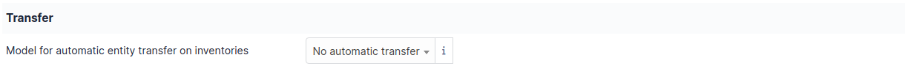

Entities
========

Entity concept is a key concept in GLPI. Having many similarities with a hierarchy or a division inside a company, it allows on a single instance of GLPI to isolate sets organized in a hierarchical manner. The chosen term is voluntarily neutral in order to adapt to many information systems.

A single instance (or installation) of GLPI, when composed of several entities, allows to consolidate common data and rules. Using entities allows to create a rather tight isolation between organizational units. 

.. hint:: When this isolation is not desired, it is better to use the functionalities offered by GLPI *Groups*.

Segmenting in entities can have several targets:

* isolate assets of each division in order to limit assets visibility for groups or users
* isolate assets of clients
* reproduce the existing hierarchy of the directory (LDAP, Active Directory...).

Using entities is very useful for a company where management is hierarchical and where employees must have access to the assets depending on the division they belong to.

One entities creating in GLPI, assets inventory, users, profiles and assistance service become dependent upon entities: a computer can be assigned to an entity, a ticket can be declared on an entity, profiles and authorizations can be specific to entities... Automatic entity assignment for users and assets are possible thanks to rules management.

.. topic:: Example: entities inside a company

   ::

              EM
        |------|------|
       EA            EB
      |   |        |    |
    EA1   EA2     EB1   EB2

   Mother entity (EM, or named *Root Entity* in GLPI) has two subsidiaries (EA and EB) which in turn have two divisions each (EA1, EA2 for EA, EB1, EB2 for EB). Each entity has access to its assets and subsidiary entities:

      * EM has access to its assets as well as to all assets of all entities
      * EA has access to its assets as well as to EA1 and EA2 assets
      * EA1 has only access to its own assets

A user can be attached to several entities with different authorizations in each entity, these authorizations being kept in daughter entities or not. For example a user will be able to open a ticket only inside user's division, the ticket applying only to the items of the same division.

On the contrary, a user being granted larger authorizations will be able to view all items, tickets and other objects, and this on all entities in which user's authorizations apply.

By default, GLPI has a single generic entity named *Root Entity*. This entity can be renamed at user's convenience.

Processes may vary depending upon entity; for this reason entities can have a delegate administration (authorization *Entities* in profile). This delegation must be granted to a very limited number of users who will be in charge of the complete management of the entity.

When using GLPI in multi-entities mode, management of some configuration parameters can apply in a different way in each entity.

The different tabs
------------------

Entities
~~~~~~~~

This tab lists existing sub-entities and allows to add a sub-entity to current entity.

Address
~~~~~~~

This tab groups administrative information of current entity: address, phone numbers, email...

Advanced information
~~~~~~~~~~~~~~~~~~~~

This tab groups technical identification data of the entity, those concerning generic entity assignment rules and those concerning users search interface. These data will be used by rules for automatic assignment to the entity (hardware if coupled with an inventory tool, user or group if connected to a LDAP directory, ticket if enabled ticket creation via mail collector) as well as for import and synchronization of users originating from a LDAP directory.

In order to offer to an entity administrator the possibility to import users from a LDAP directory, it is necessary to provide some parameters: directory associated with the entity and search filter. This search filter is meaningful only if entity definition is done by adding a restriction on LDAP filter. It is also possible to define the email domain specific to the entity which can be used to assign users to this entity.

Three options are available for generic entity assignment rules: the ``TAG`` coming from inventory tool, the LDAP information representing the entity (for example the `DN` of the entity) and the email domain associated with the entity.

Notifications
~~~~~~~~~~~~~

Notification setting is done at entity level. This tab groups two tables:

* global options for all GLPI notifications: administrator email (will be the ``From:`` for all GLPI issued emails), administrator name, prefix for notification email subject (``GLPI`` by default), response email address (see :doc:`configuration of email follow-ups <email_notifications>`) and email signature.

  For each entity, the delay applied before sending notification can be defined. This delay allows for instance in case of fast multiples modifications of a ticket to send only one notification email. The email followup of an actor can also be defined to Yes or No.

* triggering options of alerts for cartridges, consumables, contracts, accounting information, licenses, reservations and tickets.

  .. warning::

     Each alert option is associated with an automatic action. If action is disable by GLPI administrator, no notification will be sent.

If refining notification at entity level is not desired, these parameters can be defined once at root entity level; each entity will then by default get the values defined at parent entity level.

Assistance
~~~~~~~~~~

This tab is visible if *Read or Modify Entity Parameters* authorization is granted in profile. The tab groups entity parameters applicable to tickets:

* **Ticket Template**: selected template will be used for each ticket creation;
* **Calendar**: entity default calendar for computing tickets resolution time and target date shift; this calendar will be pre-selected when creating a SLA;
* **Ticket Default Type**: predefined type for ticket creation; useful for ticket creation via email collector;
* **Automatic Ticket Assignment**: allows to assign automatically a ticket;
  * *based on item then on category*: if ticket has an associated item and this item has a technical manager or group, it will be assigned to this technician and/or group; otherwise if ticket has a defined category, it will be assigned to the technical manager or group of the category
  * *based on category then on item*: if ticket has a defined category and this category has a technical manager or group, it will be assigned to this technical manager or group; otherwise if ticket has an associated item, it will be assigned to this technician and/or group of the item
* **Automatic Closure of Solved Ticket After**: allows to perform a so-called "administrative" closure; if closure is set to *immediately*, ticket will be closed as soon as it is solved, which will block solution approval by requester. This closure is performed by an automatic action which must therefore be active
* **Satisfaction Survey Configuration**: this survey can be internal (GLPI satisfaction form) or delegated to a third-party tool. For each entity, the survey date can be defined (delay after ticket closure) as well as to be generated survey rate. In order to avoid that old tickets are taken into account when activating survey, a field *For Tickets Closed After* contains the activation date to know which tickets must be taken into account. Indeed, if survey are reactivated after a deactivation time, this field must be set to exclude old tickets. For external survey, the URL of the survey can be generated automatically using tags defined below.

.. topic:: List of available tags for survey URL:

   * ``[TICKET_ID]``: ticket id
   * ``[TICKET_NAME]``: ticket name
   * ``[TICKET_CREATEDATE]``: ticket creation date
   * ``[TICKET_SOLVEDATE]``: ticket resolution date
   * ``[REQUESTTYPE_ID]``: request source id
   * ``[REQUESTTYPE_NAME]``: request source name (phone, help desk...)
   * ``[ITEMTYPE]``: type of item associated to the ticket (computer, printer...)
   * ``[ITEM_ID]``: id of item associated to the ticket
   * ``[ITEM_NAME]``: name of item associated to the ticket
   * ``[TICKET_PRIORITY]``: ticket priority
   * ``[TICKETCATEGORY_ID]``: ticket category id 
   * ``[TICKETCATEGORY_NAME]``: ticket category name
   * ``[TICKETTYPE_ID]``: ticket type
   * ``[TICKETTYPE_NAME]``: ticket type name (incident management or service request)
   * ``[SOLUTIONTYPE_ID]``: solution type id
   * ``[SOLUTIONTYPE_NAME]``: solution name
   * ``[SLA_ID]``: id of SLA associated to the ticket
   * ``[SLA_NAME]``: name of SLA associated to the ticket
   * ``[SLALEVEL_ID]``: id of SLA level
   * ``[SLALEVEL_NAME]``: name of SLA level
  
Assets
~~~~~~~~~~

This tab allows to configure the different dates present in administrative and financial information and some other entity-level asset options. The possible automatic actions are:

* filling when item gets a particular status;
* filling by copying another date;
* no automatic filling

The option *Software creation entity* allows to redirect software creation to another entity at a higher level in the hierarchy. This functionality applies on *all* software of the entity; if redirection must be defined only for some software, the :doc:`software dictionary</modules/administration/dictionnaries>` must be used.

-  **Model for automatic entity transfer on inventories**
   GLPI also allows to transfer a computer in another entity if one of the criteria used for the assignment to an entity is modified.
   If the option Model for the automatic transfer of computers in another entity indicates an existing model, then each time a computer is updated from the inventory tool, the entity assignment rules engine will be replayed.
   If the resulting entity is different from the current entity, the computer will be transferred to the new entity.

.. note::

   This configuration option is not present if you have only one entity in your instance.

Users
~~~~~

This tab allows to add a user to the current entity and to assign to the user a profile, recursive or not. The tab lists also, sorted by profile, the entity users.

Rules
~~~~~

This tab allows to create rules:

* for authorizations granting to users;
* for assignment of tickets opened by email; if the rule must be based on criteria, the newly created rule must be opened to define these criteria. Rules already applicable to the current entity are also displayed.

.. include:: ../tabs/documents.rst

.. include:: ../tabs/notes.rst

.. include:: ../tabs/historical.rst

.. include:: ../tabs/all.rst
