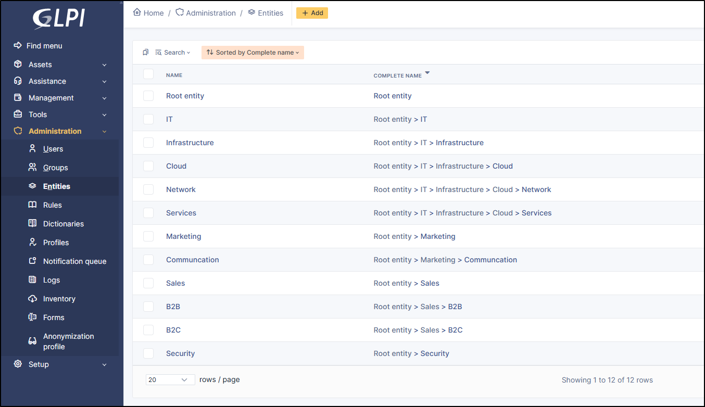
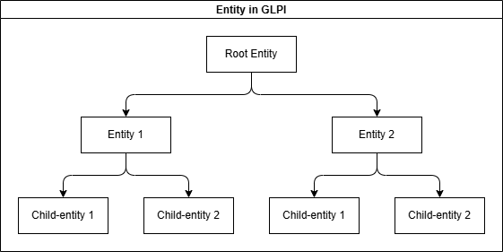
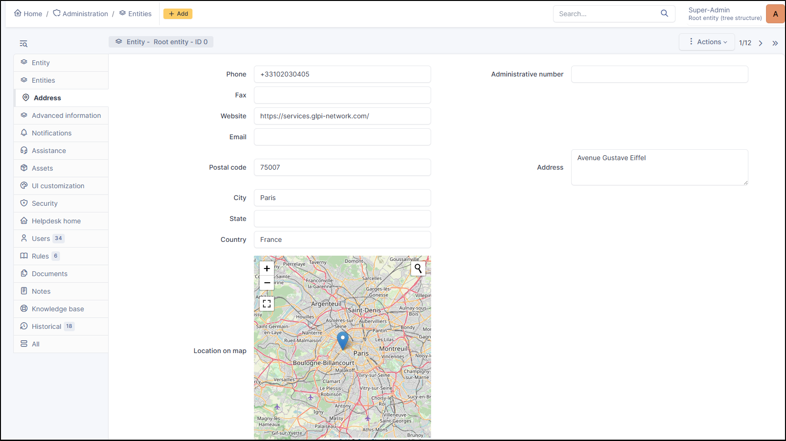
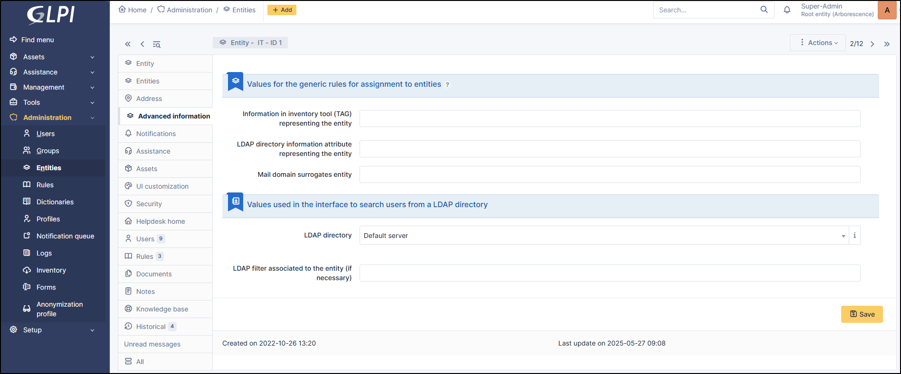
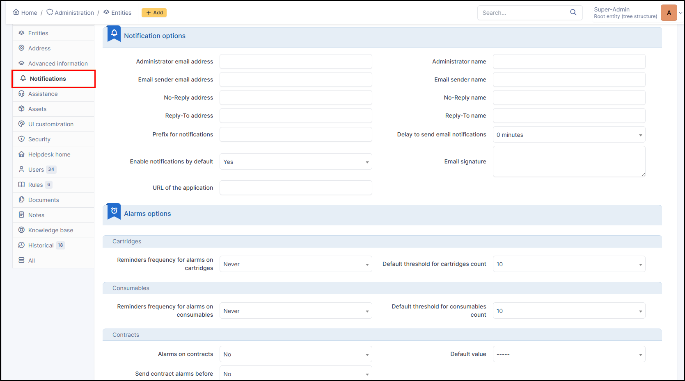
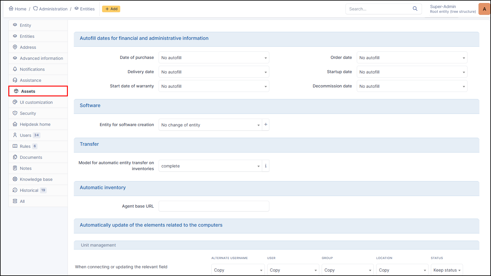
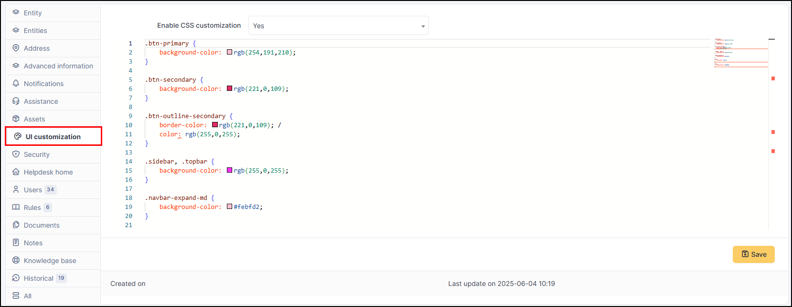
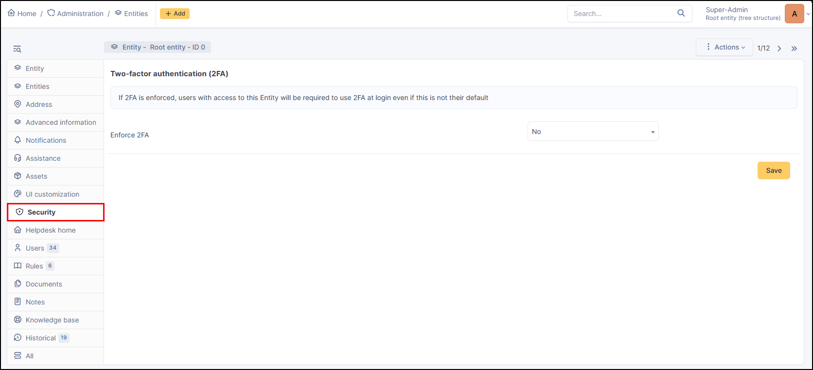
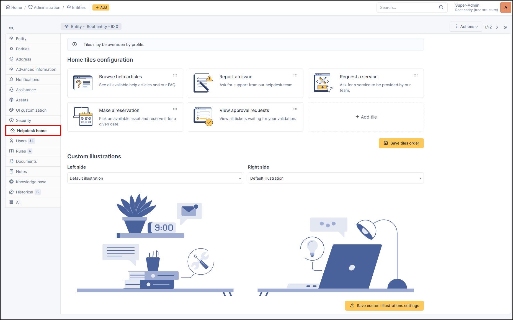
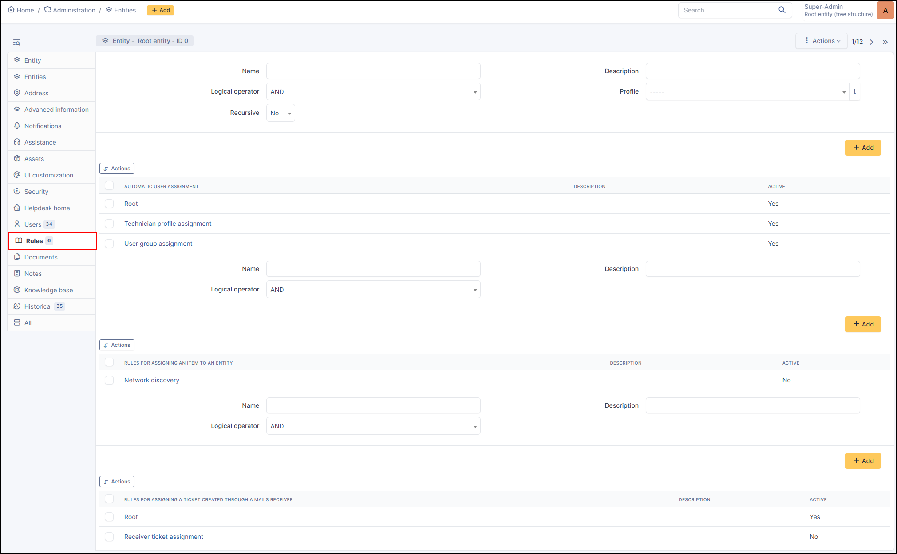

Entities
========

Entities are a **key concept in GLPI**. Having many similarities with a hierarchy or a division inside a company, it allows on a single instance of GLPI to isolate sets organized in a hierarchical manner. The chosen term is voluntarily neutral in order to adapt to many information systems.

A single instance (or installation) of GLPI, when composed of several entities, allows to consolidate common data and rules. Using entities allows to create a tight isolation between organizational units. 

.. hint:: When this isolation is not desired, it is better to use the functionalities offered by GLPI *Groups*.

Segmenting in entities can have several targets:

* isolate assets of each division in order to limit assets visibility for groups or users
* isolate assets of clients
* reproduce the existing hierarchy of the directory (LDAP, Active Directory...).

Using entities is very useful for a company where management is hierarchical and where employees must have access to the assets depending on the division they belong to.

One entities creating in GLPI, assets inventory, users, profiles and assistance service become dependent upon entities: a computer can be assigned to an entity,
a ticket can be declared on an entity, profiles and authorizations can be specific to entities...
Automatic entity assignment for users and assets are possible thanks to :doc:`rules management </modules/administration/rules/userauthorizations>`.

.. topic:: Example: entities inside a company

Root entity has two subsidiaries (Entity 1 and Entity 2) which in turn have two divisions each (Child-entity 1 et 2).
Each entity has access to its assets and subsidiary entities:

   * **Root entity** has access to its assets as well as to all assets of all entities
   * **Entity 1** has access to its assets as well as to child-entity 1 and 2 assets
   * **Child-entity 1** has only access to its own assets

A user can be attached to several entities with different authorizations in each entity, these authorizations being kept in child entities or not. For example a user will be able to open a ticket only inside user's division, the ticket applying only to the items of the same division.

On the contrary, a user being granted larger authorizations will be able to view all items, tickets and other objects, and this on all entities in which user's authorizations apply.

By default, GLPI has a single generic entity named *Root Entity*. This entity can be renamed at user's convenience.

Processes may vary depending upon entity; for this reason entities can have a delegate administration (authorization *Entities* in profile). This delegation must be granted to a very limited number of users who will be in charge of the complete management of the entity.

When using GLPI in multi-entities mode, management of some configuration parameters can apply in a different way in each entity.

Entities
--------

This tab lists existing sub-entities and allows to add a sub-entity to current entity.

Address
-------

This tab groups administrative information of current entity:

* Phone
* Administrative number
* Fax
* Website
* Email
* Postal code
* Address
* City
* State
* Country
* Location on map
* Longitude
* Latitude
* Altitude

Advanced information
--------------------

This tab groups technical identification data of the entity, those concerning generic entity assignment rules and those concerning users search interface.
This data will be used by rules for automatic assignment to the entity (hardware if coupled with an inventory tool, user or group if connected to a LDAP directory,
ticket if enabled ticket creation via mail collector) as well as for import and synchronization of users originating from a LDAP directory.

Values for the genric rules for assignment to entites
~~~~~~~~~~~~~~~~~~~~~~~~~~~~~~~~~~~~~~~~~~~~~~~~~~~~~

Three options are available for generic entity assignment rules:

* Information in inventory tool (TAG) representing the entity: coming from inventory tool
* LDAP directory information attribute representing the entity: for example the `DN` of the entity
* Mail domain surrogates entity: the email domain associated with the entity

Values used in the interface to search users from a LDAP directory
~~~~~~~~~~~~~~~~~~~~~~~~~~~~~~~~~~~~~~~~~~~~~~~~~~~~~~~~~~~~~~~~~~

In order to offer to an entity administrator the possibility to import users from a LDAP directory,

* LDAP directory: directory associated with the entity
* LDAP filter associated to the entity (if necessary): associated with the entity search filter

This search filter is meaningful only if entity definition is done by adding a
restriction on LDAP filter. It is also possible to define the email domain specific to the entity which can be used to assign users to this entity.

Notifications
-------------

Notification setting is done at entity level.

Notification options
~~~~~~~~~~~~~~~~~~~~

* Administrator email address
* Administrator name
* Email sender email address
* Email sender name
* No-reply address
* No-reply name
* Reply-to address
* Reply-to name
* Prefix for notifications
* Delay to send email notifications (inheritance of the parent entity or delay in minutes)
* Enable notifications by default (No/Yes/Inheritance of the parent entity)
* Email signature
* URL of the application

.. note:: For each entity, the delay applied before sending notification can be defined. This delay allows for instance in case of fast multiples modifications of a ticket
   to send only one notification email. The email followup of an actor can also be defined to Yes or No.

Alarms options
~~~~~~~~~~~~~~

.. note:: If refining notification at entity level is not desired, these parameters can be defined once at root entity level;
  Each entity will then by default get the values defined at parent entity level.

.. warning:: Each alert option is associated with an automatic action. If action is disable by GLPI administrator, no notification will be sent.

Cartridges
^^^^^^^^^^

* **Reminders frequency for alarms on consumables**: Inheritance of the parent entity/Never/Each day/Each week/Each month
* **Default threshold for cartridges count**: Inheritance of the parent entity/never/from 0 to 100

Consumables
^^^^^^^^^^^

* **Reminders frequency for alamrs on consumables**: Inheritance of the parent entity/Never/Each day/Each week/Each month
* **Default threshold for consumables count**: Inheritance of the parent entity/never/from 0 to 100

Contacts
^^^^^^^^

* **Alarms on contacts**: No/Yes/Inheritance of the parent entity
* **Default value**: Inheritance of the parent entity/End/Notice/End+notice/Period end/Period end + notice
* **Send contact alarms before**: No/Inheritance of the parent entity/from 1 to 365 days

Financial and administrative information
^^^^^^^^^^^^^^^^^^^^^^^^^^^^^^^^^^^^^^^^

* **Alarms on financial and administrative information**: No/Yes/Inheritance of the parent entity
* **Default value**: Inheritance of the parent entity/Warrantly expiration date
* **Send financial and administrative information alarms before**: No/Inheritance of the parent entity/from 1 to 365 days

Licenses
^^^^^^^^

* **Alarms on expired licenses**: No/Yes/Inheritance of the parent entity
* **Send license alarms before**: No/Inheritance of the parent entity/from 1 to 365 days

Certificates
^^^^^^^^^^^^

* **Alarms on expired certificates**: No/Yes/Inheritance of the parent entity
* **Send certificates alarms brefore**: No/Inheritance of the parent entity/from 1 to 365 days
* **Reminders frequency for alarms on certificates**: Inheritance of the parent entity/Never/Each day/Each week/Each month

Reservations
^^^^^^^^^^^^

* **Alerts on reservations**: No/Inheritance of the parent entity/from 1 to 365 hours

Tickets
^^^^^^^

* **Alerts on tickets which are not solved since**: No/Inheritance of the parent entity/from 1 to 365 days

Tickets / Changes
^^^^^^^^^^^^^^^^^

* **Approval reminder frequency**: Inheritance of the parent entity/Never/Each day/Each week/Each month

Domains
^^^^^^^

* **Alarms on domains expiries**: No/Yes/Inheritance of the parent entity
* **Domain closes expiries**: No/Inheritance of the parent entity/from 1 to 365 days
* **Domains expired**: No/Inheritance of the parent entity/from 1 to 365 days

Assistance
----------

This tab is visible if *Read or Modify Entity Parameters* authorization is granted in profile. The tab groups entity parameters applicable to tickets:

Templates configuration
~~~~~~~~~~~~~~~~~~~~~~~

* **Ticket template**: selected template will be used for each ticket creation;
* **Change tabemplate**: selected template will be used for each ticket creation;
* **Problem template**: selected template will be used for each ticket creation;

Tickets configuration
~~~~~~~~~~~~~~~~~~~~~

* **Calendar**: entity default calendar for computing tickets resolution time and target date shift; this calendar will be pre-selected when creating a SLA;
* **Ticket Default Type**: predefined type for ticket creation; useful for ticket creation via email collector;
* **Automatic assignment of tickets, changes and problems**: allows to assign automatically a ticket;

  * *No*
  * *based on item then on category*: if ticket has an associated item and this item has a technical manager or group, it will be assigned to this technician and/or group;otherwise if ticket has a defined category, it will be assigned to the technical manager or group of the category
  * *based on category then on item*: if ticket has a defined category and this category has a technical manager or group, it will be assigned to this technical manager or group;Sotherwise if ticket has an associated item, it will be assigned to this technician and/or group of the item
* **Mark followup added by a supplier though an email collector as private**: No/Yes/Inheritance of the parent entity
* **Anonymize support agents**:

  * *Inheritance of the parent entity*
  * *Disabled*
  * *Replace the agent and groupe name with a generic name*
  * *Replace the agent and group with a customisable nickname*
  * *Replace the agent's name with generic name*
  * *Replace the agent's name with customisable name*
  * *Replace the group's name with generic name*
* **Display initials for users without picture**: No/Yes/Inheritance of the parent entity
* **Default contract**: Inheritance of the parent entity/Contact in ticket entity

.. tip:: When you select the anonymization option to use a customized name, a new nickname field will appear in the group and/or user's profile (if you are in the entity in which you selected this option).
   This custom name will therefore be visible to users.

Automatic closing configuration
~~~~~~~~~~~~~~~~~~~~~~~~~~~~~~~

.. hint:: If the message ``Purge ticket action is disabled`` is present, go to Setup > Automatic actions and activate the ``purgeticket`` action .

* **Automatic closing of solved ticket after**: allows to perform a so-called "administrative" closure; if closure is set to *immediately*, ticket will be closed as soon as it is solved, which will block solution approval by requester. This closure is performed by an automatic action which must therefore be active. From never to 365 days
* **Automatic purge of closed tickets after**: allows closing tickets once they have been solved after a certain period of time. From never to 365 days

Configuring the satisfaction survey: Tickets
~~~~~~~~~~~~~~~~~~~~~~~~~~~~~~~~~~~~~~~~~~~~

* **Configuring the satisfaction survey**: External or internal (if external, a URL field will appear to indicate the URL of the survey)
* **Create survey after**: Send an email after the ticket has been solved (as soon as possible to 90 days)
* **Rate to trigger survey**: Disabled to 100%
* **Duration of survey**: Length of time the survey will be active (unspecified to 100 days)
* **Max rate**: Maximum score allowed (1 to 10)
* **Default rate**: Default number entered when receiving the survey
* **Comment required if score is <= to**: 1 to 10
* **For tickets closed after**: Indicate a date to start sending surveys

.. tip:: Survey can be internal (GLPI satisfaction form) or delegated to a third-party tool. For each entity, the survey date can be defined (delay after ticket closure) as well as to be generated survey rate.
   In order to avoid that old tickets are taken into account when activating survey, a field *For Tickets Closed After* contains the activation date to know which tickets must be taken into account.
   Indeed, if survey are reactivated after a deactivation time, this field must be set to exclude old tickets. For external survey, the URL of the survey can be generated automatically using tags defined below.

**List of available tags for survey URL:**

+-------------------------+----------------------------------------------------------+
|TAG                      | Name                                                     |
+=========================+==========================================================+
|``[TICKET_ID]``          | Ticket id                                                |
+-------------------------+----------------------------------------------------------+
|``[TICKET_NAME]``        | Ticket name                                              |
+-------------------------+----------------------------------------------------------+
|``[TICKET_CREATEDATE]``  | Ticket creation date                                     |
+-------------------------+----------------------------------------------------------+
|``[TICKET_SOLVEDATE]``   | Ticket resolution date                                   |
+-------------------------+----------------------------------------------------------+
|``[TICKET_PRIORITY]``    | Ticket priority ID                                       |
+-------------------------+----------------------------------------------------------+
|``[TICKET_PRIORITYNAME]``| Ticket name priority                                     |
+-------------------------+----------------------------------------------------------+
|``[ITILCATEGORY]``       | Category ITIL ID                                         |
+-------------------------+----------------------------------------------------------+
|``[ITILCATEGORY_NAME]``  | Category ITIL name                                       |
+-------------------------+----------------------------------------------------------+
|``[SOLUTIONTYPE_ID]``    | Solution type id                                         |
+-------------------------+----------------------------------------------------------+
|``[SOLUTIONTYPE_NAME]``  | Solution name                                            |
+-------------------------+----------------------------------------------------------+
|``[REQUESTTYPE_ID]``     | Request source id                                        |
+-------------------------+----------------------------------------------------------+
|``[REQUESTTYPE_NAME]``   | Request source name (phone, help desk...)                |
+-------------------------+----------------------------------------------------------+
|``[TICKETTYPE_ID]``      | Ticket type                                              |
+-------------------------+----------------------------------------------------------+
|``[TICKETTYPE_NAME]``    | Ticket type name (incident management or service request)|
+-------------------------+----------------------------------------------------------+
|``[SLA_TTO_ID]``         | TTO ID (Time To Own)                                     |
+-------------------------+----------------------------------------------------------+
|``[SLA_TTO_NAME]``       | TTO name (Time To Own)                                   |
+-------------------------+----------------------------------------------------------+
|``[SLA_TTR_ID]``         | TTR ID (Time To Resolve)                                 |
+-------------------------+----------------------------------------------------------+
|``[SLA_TTR_NAME]``       | TTR name (Time To Resolve)                               |
+-------------------------+----------------------------------------------------------+
|``[SLALEVEL_ID]``        | SLA level ID                                             |
+-------------------------+----------------------------------------------------------+
|``[SLALEVEL_NAME]``      | Name of SLA level                                        |
+-------------------------+----------------------------------------------------------+

.. note:: Another tab also allows you to view satisfaction surveys for changes, including the same options as for tickets.

Helpdesk
~~~~~~~~

* **Show tickets properties on helpdesk**: This option allows you to display or not the information linked to tickets visible by self-service profiles (urgent, category, assignment, etc.)

Assets
------

This tab allows to configure the different dates present in administrative and financial information and some other entity-level asset options.

Autofill dates for financial and administrative information
~~~~~~~~~~~~~~~~~~~~~~~~~~~~~~~~~~~~~~~~~~~~~~~~~~~~~~~~~~~

* **Date of purchase**
* **Order date**
* **Delivery date**
* **Startup date**
* **Start date of aarrantly**
* **Decommission date**

The possible automatic actions are:

* Filling when item gets a particular status;
* Filling by copying other date (warrantly, delivery, etc.);
* No automatic filling

Software
~~~~~~~~

The option *Entity for software creation* allows to redirect software creation to another entity at a higher level in the hierarchy.
This functionality applies on *all* software of the entity; if redirection must be defined only for some software, the :doc:`software dictionary</modules/administration/dictionnaries>` must be used.

Transfer
~~~~~~~~

* **Model for automatic entity transfer on inventories**
   GLPI also allows to transfer a computer in another entity if one of the criteria used for the assignment to an entity is modified.
   If the option Model for the automatic transfer of computers in another entity indicates an existing model, then each time a computer is updated from the inventory tool,
   the entity assignment rules engine will be replayed.
   If the resulting entity is different from the current entity, the computer will be transferred to the new entity.

**Possible choice** :

* *Complete*
* *No automatic transfer*

.. note::

   This configuration option is not present if you have only one entity in your instance.

Automatic inventory
~~~~~~~~~~~~~~~~~~~

This field is used if you have multiple GLPI servers. When this field is set, the agent will be able to retrieve the configuration of the deploy, collect and ESX inventory tasks from the specified server.
This avoids web server redirects if you don't want to use them.

Automatically update of the elements related to the computers
~~~~~~~~~~~~~~~~~~~~~~~~~~~~~~~~~~~~~~~~~~~~~~~~~~~~~~~~~~~~~

This field allows you to specify whether or not information about equipment (printers, peripherals, etc.) connected to PCs can be updated when a user logs in or the next inventory update.
You can also choose the behavior when the equipment is disconnected.

The information that can be managed

* Alternate username
* User
* group
* Location
* Status

You can **copy** or **not** **when connecting or updating the relevant field**
You can **delete** or **not** when **disconnecting**

UI Customization
----------------

This tab allows you to configure custom CSS rules on a per-entity basis, specify inheriting custom CSS from a parent entity, or disabling custom CSS completely.

.. note::

   For creating custom palettes, see :doc:`Create custom palettes</advanced/custom_palettes>`.

Security
--------

This tab allows you to force or not two-factor authentication (2FA).
You can consult the `dedicated article </first-steps/preferences.html#two-factor-authentication-tab>`_ for more information

Helpdesk home
-------------

This tab allows you to customize the home page (the self-service profile homepage) and the information it contains.

From the **+ Add tile** tile, you can add 3 types of tiles :

* **GLPI page**: eg service catalog, FAQ, etc.
* **External page**
* **Form**: allows you to select an existing form

For GLPI page and External page, you can choose :

* *A title*
* *A description*
* *An illustration* (existing or add a new one)

For forms, they can be created from *Administration > Forms*, see the :doc:`dedicated article <../forms/forms>` for more information

Users
-----

This tab allows to add a user to the current entity and to assign to the user a profile, recursive or not. The tab lists also, sorted by profile, the entity users.

Rules
-----

This tab allows to create rules

* **Automatic user assignment**
* **Assigning an item to an entity**
* **Assignment a ticket created through a mails receiver**;if the rule must be based on criteria, the newly created rule must be opened to define these criteria.
  Rules already applicable to the current entity are also displayed.

.. note:: For more information, go to :doc:`rules <../rules/rulesmanagement>`

.. include:: ../../tabs/documents.rst

.. include:: ../../tabs/notes.rst

.. include:: ../../tabs/historical.rst

.. include:: ../../tabs/all.rst
