Forms
=====

Since GLPI 11, forms are native, so the formcreator plugin is no longer required. Forms must be migrated from formcreator to forms.

Migration formcreator to forms
------------------------------

.. warning:: Form migration must be done from the GLPI 10 database. It is not possible to import forms from GLPI 10 to GLPI 11.

When migrating your instance to GLPI 11, the formcreator plugin must be installed.
Once the migration is complete, enter the command in :term:`CLI` mode from your GLPI folder:

``php bin/console migration:formcreator_plugin_to_core``

Forms by default
----------------

There are two pre-created forms by default:

* Report an issue
* Request a service

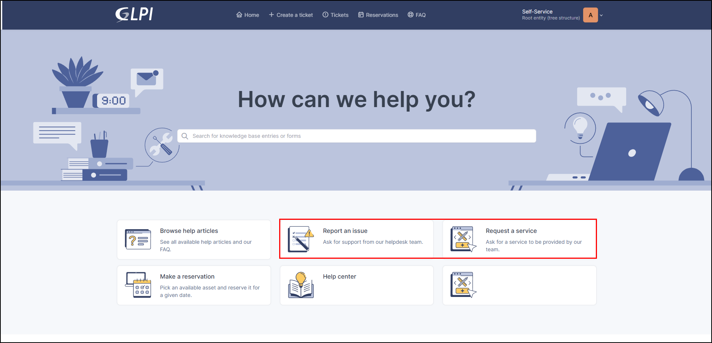

These 2 forms are accessible to everyone. They can be deactivated/deleted/modified

List of forms
-------------

The list of forms is available from **Administration** > **Forms**.
They will also be visible from **Assistance** > **Service catalog**. This tab refers to the self-service profile home page (see :doc:`Service catalog</modules/assistance/service-catalog>`).

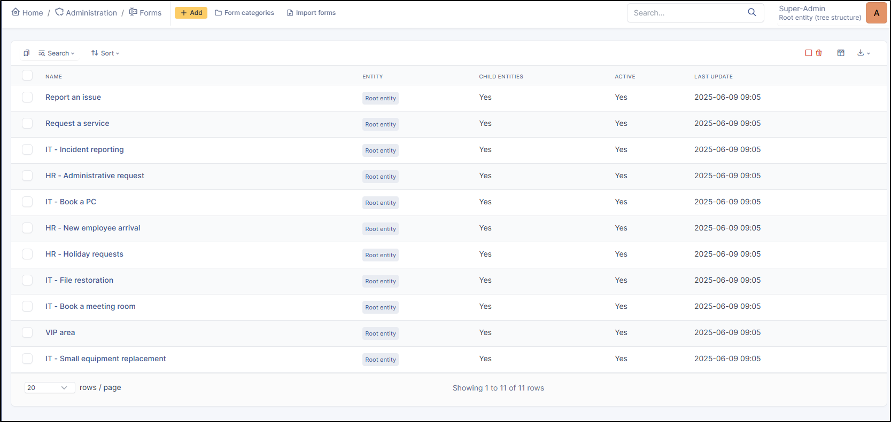

Forms options
-------------

When creating a form (by **+ Add**), several options will be available to customize and facilitate the user experience as much as possible.

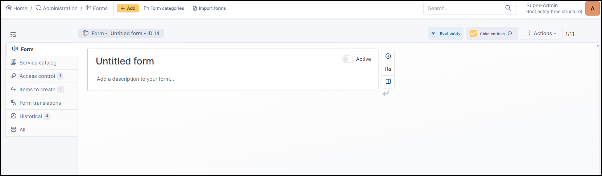

Customize the formatting
~~~~~~~~~~~~~~~~~~~~~~~~

Tools are available to customize the organization of the forms

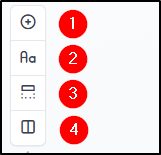

#. Add a new question
#. Add a comment
#. Add a new section
#. Add an horizontal layout

You can move the questions to reorganize the form

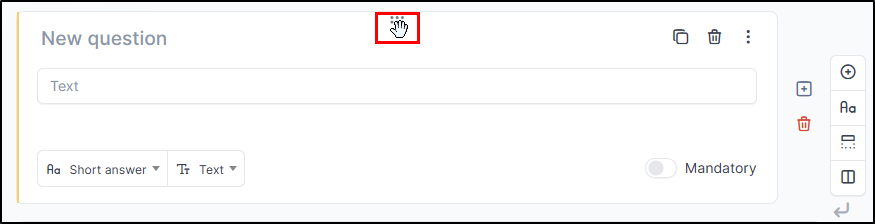

There are tools to reorganize an entire section

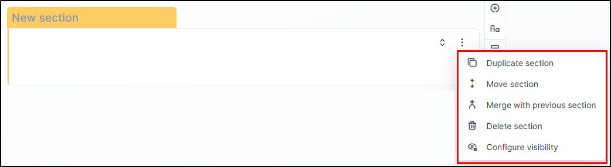

Basic information
~~~~~~~~~~~~~~~~~

* Modify the form's title in the **Underlined form** file (this title will be visible to people with access to the form)
* Add a **description** to simplify the use of the form (this description will be visible to people with access to the form)

Add questions
~~~~~~~~~~~~~

Each question has its own **title** field (identified by new question) and will be **visible to the user**.
Each question **can be made mandatory** so that the user must fill in the field to validate the form

There are actually several possible question types:

* **Short answer**: Text field with limited length and no formatting (bold, italics, color, etc.).

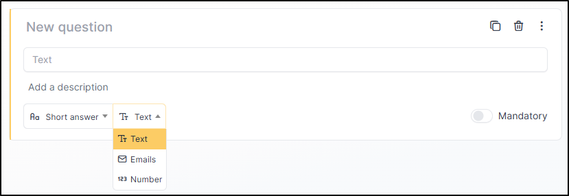

This field has additional options:

* *Text*: Allows you to enter text (alphanumeric)
* *Emails*: Allows you to enter email addresses only

* *Number*: Allows you to enter numeric characters only

* **Long answer**: field limited to 65,535 characters. The formatting of this field can be customized by the user (bold, italic, color, etc.)

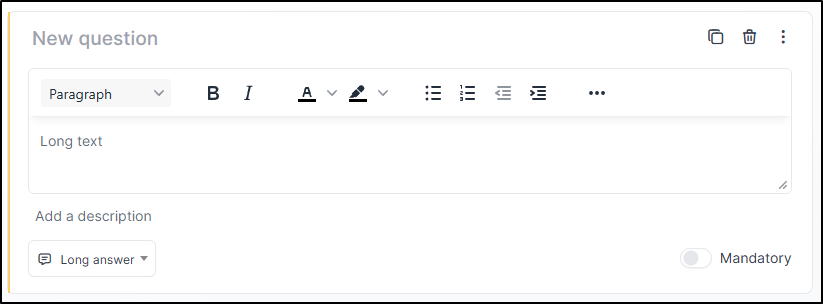

* **Date and time**: a date and/or time

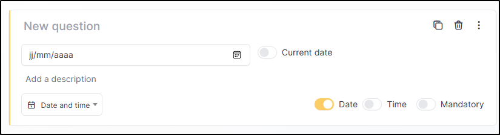

This field has additional options:

* *Current date/time*: Use the current date and/or time and not allow the user to change it (leave the box unchecked to allow the user to specify the date/time they want).

* *Date*: Specify the date only (without the time).
* *Time*: Specify the time of day.

.. tip: You can add a date only, a time only, or a combination of both.

* **Actors**: add one or more users/groups/suppliers referenced in GLPI

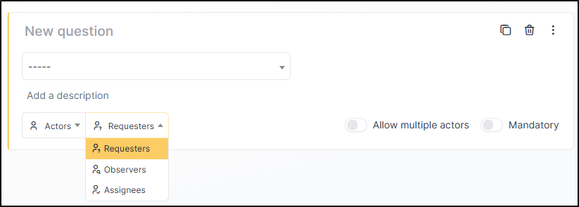

This field has additional options:

    * *Requesters / Observers / Assignees*: each users / groups / suppliers that will be added will be pre-filled in the ticket according to the type of actor that will be chosen.
      A user/group/provider can be preselected that the user can modify or not

    * *Allow multiple actors*: allow multiple selections (allows groups, users and suppliers in the same field)

     .. warning:: If you want to allow the user to select multiple actor types, you will need to create as many questions as desired actors. An actor question can only contain one actor type.

* **Urgency**: add an urgency (very low, low, medium, high, very high)

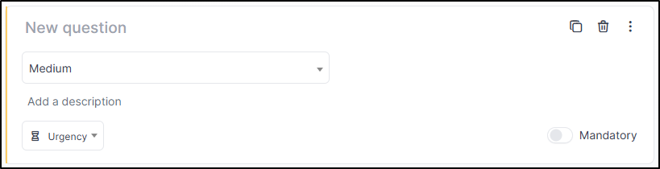

* **Request type**: select the type of request (incident or request)

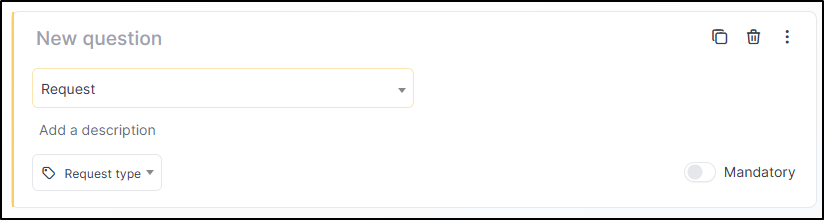

* **Document**: add a document

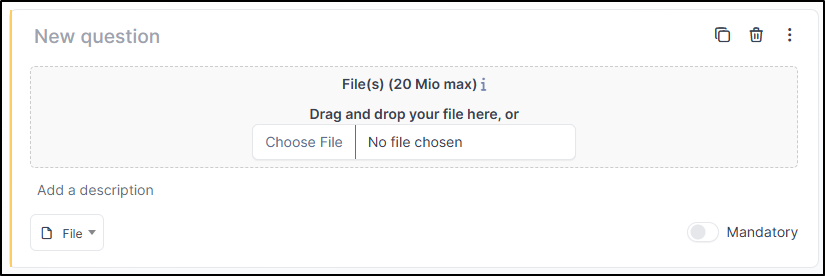

* **Radio**: set up a response list. The user will only be able to select one response.

An additional description can be added to make it easier for the user to choose.

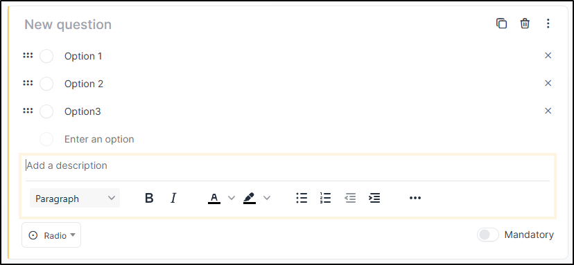

* **Checkbox**: set up a response list. The user will be able to select multiple answers.

An additional description can be added to make it easier for the user to choose.

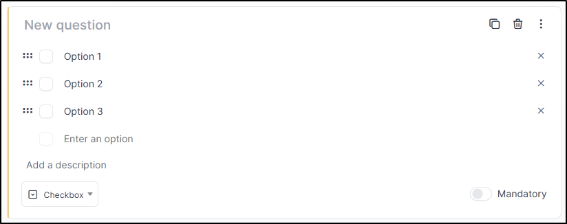

* **Dropdown**: set up a drop-down list to select one or more answers

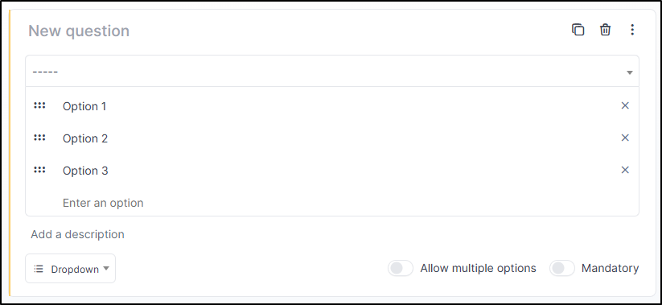

This field has an additional option:

  * *Allow muliple options*

* **Item**: Allows you to select differents GLPI's objects

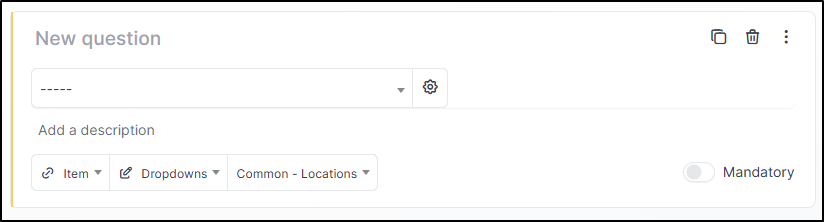

This field has additional options

**Users devices**: allows the user to select their own assets

**GLPI Objects** available :

.. collapse:: Assets

    * Computers
    * Monitors
    * Network devices
    * Peripherals
    * Phones
    * Printers
    * Licenses
    * Certificates
    * Unmanaged assets
    * Custom Assets
    * Software
    * Cartridge models
    * Consumable models
    * Phone lines
    * Passive devices
    * PDUs
    * Racks

.. collapse:: Assistance

    * Tickets
    * Changes
    * Problems
    * Recurrent tickets

.. collapse:: Management

    * Budgets
    * Suppliers
    * Contacts
    * Contracts
    * Documents
    * Projects
    * Certificates
    * Appliances
    * Databases
    * Clusters
    * Data centers

.. collapse:: Tools

    * Reminders
    * RSS Feed

.. collapse:: Administration

    * Users
    * Groups
    * Entities
    * Profiles

**Dropdowns** available:

.. collapse:: Common

    * Locations
    * Statuses of items
    * Manufacturers
    * Blacklists
    * Blacklisted mail content
    * Default filters

.. collapse:: Assistance

    * ITIL category
    * Task categories
    * Task templates
    * Solution types
    * Solutions templates
    * Approval templates
    * Request sources
    * Followup templates
    * Project states
    * Project types
    * Project tasks types
    * Project tasks templates
    * External events templates
    * Event categories
    * Pending reason
    * Service catalog categories
    * Approval steps

.. collapse:: Type

    * Computer types
    * Networking types
    * Printer types
    * Monitor types
    * Devices types
    * Phone types
    * License types
    * Cartrige types
    * Consumable types
    * Contract types
    * Contact types
    * Generic types
    * Sensor types
    * Memory types
    * Third party types
    * Interface types (Hard drive...)
    * Cases types
    * Phone power supply types
    * Files systems
    * Certificate types
    * Budget types
    * Simacard types
    * Line types
    * Rack types
    * PDU types
    * Passive device types
    * Cluster types
    * Database instance type
    * Custom Asset types

.. collapse:: Models

    * Computer models
    * Networking equipment models
    * Printer models
    * Monitor models
    * Peripheral models
    * Phone models
    * Device camera models
    * Device case models
    * Device control models
    * Device drive models
    * Device generic models
    * Device graphic card models
    * Device hard drive models
    * Device memory models
    * System board models
    * Network card models
    * Other component models
    * Device power supply models
    * Device processor models
    * Device sound card models
    * Device sensor models
    * Rack models
    * Enclosure models
    * PDU models
    * Passive device models
    * Custom Asset models

.. collapse:: Virtual machines

    * Virtualization systems
    * Virtualization models
    * States of the virtual machine

.. collapse:: Maangement

    * Document heading
    * Document types
    * Business criticies
    * Databse instance categories

.. collapse:: Tools

    * Knowledge base categories

.. collapse:: Calendars

    * Calendars
    * Close times

.. collapse:: Operating systems

    * Operating systems
    * Versions of the operating systems
    * Service packs
    * Operating systems architectures
    * Editions
    * Kernels
    * Kernels versions
    * Update sources

.. collapse:: Networking

    * Networking interfaces
    * Networks
    * Network port types
    * VLANs
    * Line operators
    * Domain types
    * Domain relations
    * Records types
    * Fiber types

.. collapse:: Cable management

    * Cables types
    * Cable strands
    * Socket models

.. collapse:: Internet

    * IP networks
    * Internet domains
    * Wifi networks
    * Networks names

.. collapse:: Software

    * Software categories

.. collapse:: User

    * Users titles
    * User categories

.. collapse:: Authorizations assignment rules

    * LDAP criteria

.. collapse:: Fields unicity

    * Ignored values for the unicity

.. collapse:: External authentications

    * Fields storage of the login in the HTTP request

.. collapse:: Power management

    * Plugs

.. collapse:: Appliance

    * Appliance types
    * Appliance environments

.. collapse:: Camera

    * Resolutions
    * Image formats

.. collapse:: Others

    * USB vendors
    * PCI vendors
    * Webhook categories

.. collapse:: Custom dropdowns

   * Custom dropdowns

Configure visibility
~~~~~~~~~~~~~~~~~~~~

Visibility conditions can be specified for a question based on the answer to a previous question.

For example, a user reports an issue with a printer.
Depending on the location (question type **Item** > **Dropdowns** > **Common - Locations**), the form could be conditional on displaying only a list of printers linked to that location.

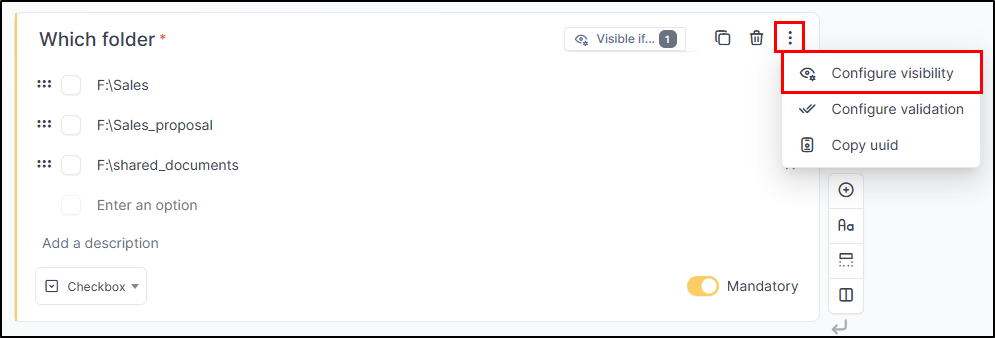

You can indicate whether the question should be shown or hidden based on chosen criteria.

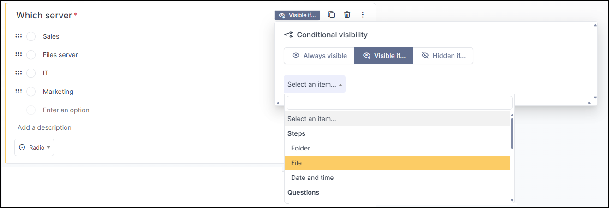

The available condition types:

* *Always visible*
* *Visible if...*
* *Hidden if...*

Select the question from the drop-down list

Select the condition:

* *Is visible*
* *Is not visible*
* *Is equal to*
* *Is not equal to*
* *Contains*
* *Do not contains*
* *Match regular expression*
* *Do not match regular expression*
* *Is empty*
* *Is not empty*
* *Length is greater than*
* *Length is greater than or equal to*
* *Length is less than*
* *Length is less than or equal to*
* *Is greater than*
* *Is greater than or equal to*
* *Is less than*
* *Is less than or equal to*
* *Is of itemtype*
* *Is not of itemtype*
* *At least one of itemtype*
* *All items of itemtype*

Enter the desired value as needed.

Conditionnal Approval
~~~~~~~~~~~~~~~~~~~~~~~

It is possible to set conditional Approval (only on short/longer answer fields) using a :term:`Regular expression`.
This forces the user to enter a conditional answer, such as a certain number of digits, a maximum of 30 characters, etc.

In this example, the expected response is a sequence of 6 numbers

.. image:: images/conditionnal_Approval.png
   :alt: Add a conditionnal Approval
   :scale: 71%

If the entered answer is not suitable, a red error message will appear during Approval.

.. image:: images/error_Approval.png
   :alt: Error conditionnal Approval
   :scale: 71%

Submit button visibility
~~~~~~~~~~~~~~~~~~~~~~~~

To ensure that the form is filled in as accurately as possible, it is also possible to specify conditions for the visibility of a form.
If certain conditions are not met, the send button will not be visible and the user will not be able to submit the form.

This can be used, for example, to prevent a field with a default choice from being left blank even though it is mandatory. 

Conditions can be created using the logical AND/OR operators.

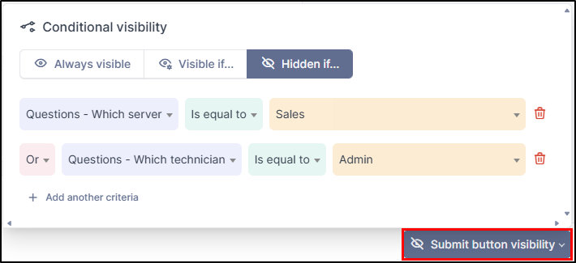

Service catalog
---------------

The service catalog allows you to make a form visible in the **Assistance** > **Service catalog** tab and from the home page of a self-service portal

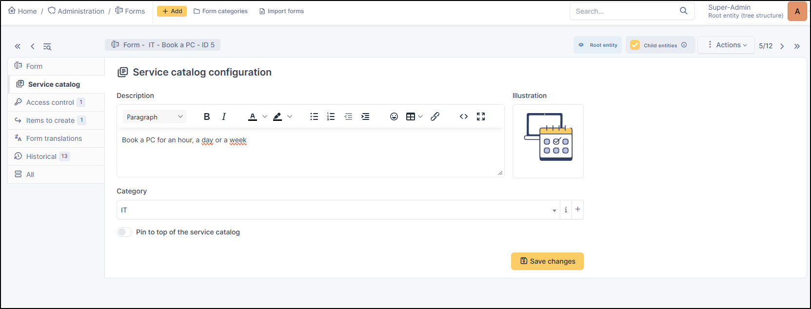

Customization
~~~~~~~~~~~~~

You can add:

* A description that will be visible on the form tile
* An illustration (from a catalog or you can upload one)

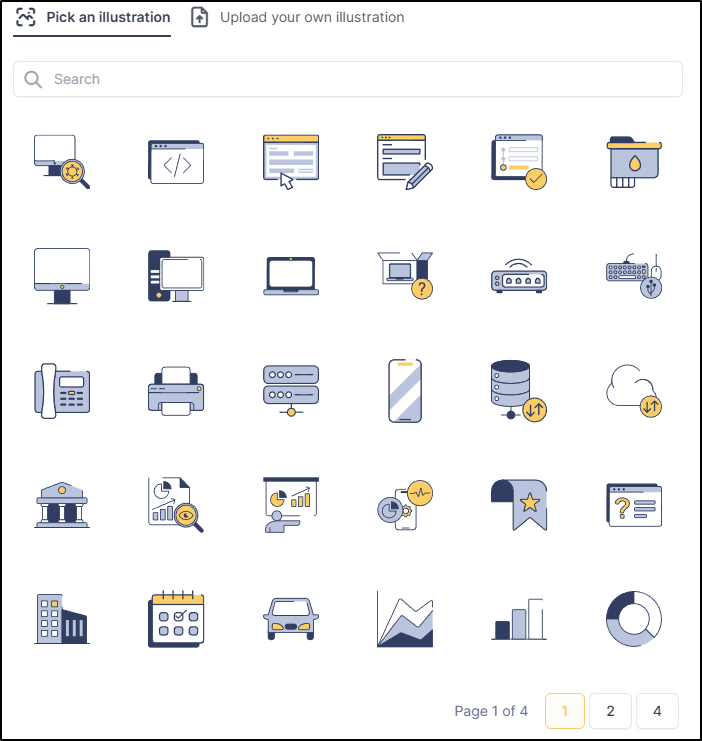

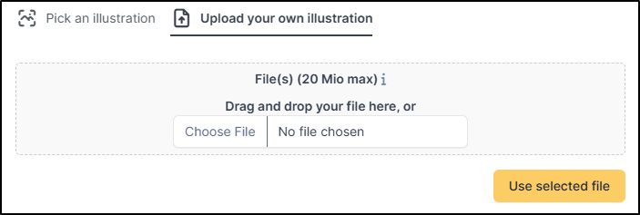

Category
~~~~~~~~

You can create a category (and child-categories) to make it easier to select a form (e.g., all IT forms, all HR forms, etc.)

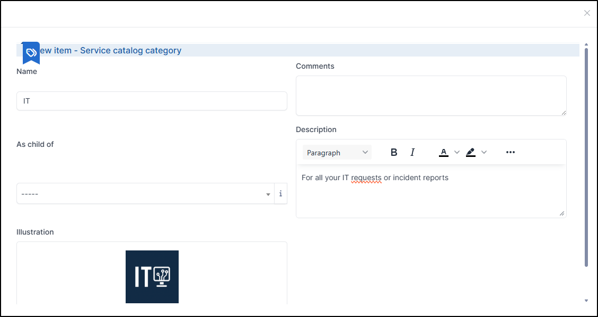

You can select the category in the dropdwon list or create a new one by clicking on **+**

.. tip:: Categories are manage in **Setup** > **Drowpdowns** > **Service catalog**

It is also possible to pin the form in the service catalog (with or without category) so that it is available directly to users

Access control
--------------

Access control allows you to determine who can use the form.
It can be public or private, visible to users, groups, or profiles.

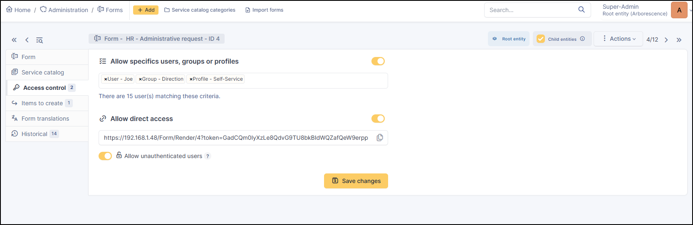

.. warning:: If you need to specify a visibility condition from an entity, you simply need to create the form in the desired entity

Public access
~~~~~~~~~~~~~

Public access allows all users with the form link to access it in order to submit their request.
If you check the ``allow unauthenticated users`` box, you can also allow users who do not have a GLPI account to use the form.

.. tip:: If the ``allow unauthenticated users`` box is checked, authenticated users will no longer see this form

Private access
~~~~~~~~~~~~~~

Private access allows you to filter the visibility of the form.
It can be conditioned to users and/or groups and/or profiles. Multiple selection is allowed.

If all users should have access to the form, you can use the all users option in the drop-down list.

.. tip:: When your selection is complete, you will be able to see the list of people who have access to the form

   .. image:: images/matching_criteria.png
      :alt: List of users allowed to see the form
      :scale: 85%

If you see this message, This means that unauthenticated users are not allowed to see certain GLPI objects contained in certain questions.
You must then check the question(s) in order to modify them and avoid an error when submitting the form by unauthenticated users.

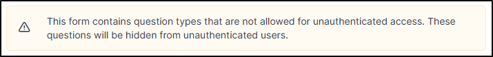

Item to create
--------------

This tab allows you to customize the various fields of the item to be created (entity, priority, actors, etc.).

You can create various items from the form:

* Tickets
* Changes
* Problems

You can allow the creation of multiple items from the same form.

Conditions
~~~~~~~~~~

It is possible to specify creation conditions.

For example, if the user answers **yes** to the question, "**Is this problem recurring?**", the form could create a problem instead of a ticket.

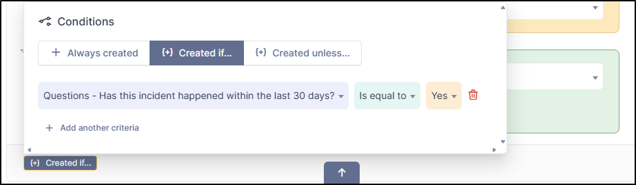

You need to click on **Always created** to create one or more conditions.

Custom fields
~~~~~~~~~~~~~

It is possible to customize the content of the item that will be created. By default, **autoconfig** is selected.
This will include all questions/answers in the ticket that will be created.

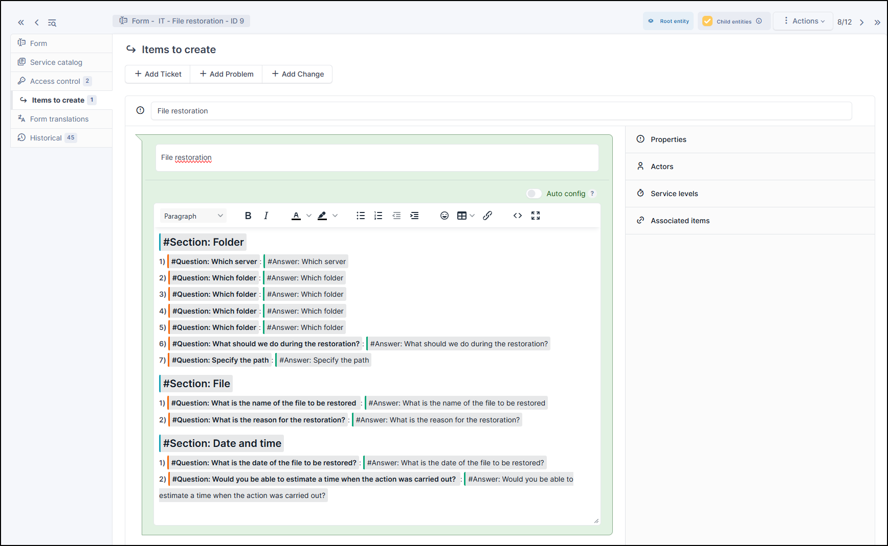

By clicking on ``#`` you can add answers for existing questions or delete them.

A formatting menu is available to improve the rendering display.

Followup / Task / Approval
~~~~~~~~~~~~~~~~~~~~~~~~~~~~

For each item created, you can add a follow-up, a task or request an approval

.. image:: images/add_followup_task_Approval.png
   :alt: Add a followup, task or approval

   :scale: 80%

For **followup** and **task**, you can:

* Not indicate one
* Choose from the template list
* Create a new template that you can then select

For Approval, you can:

* Not indicate one
* Add a specific actor (user, group or supplier, multiple selection is allowed)
* Answer from  specific questions (a question with a user object is required in the form)

Custom
------

You can customize the various fields of the item to be created (properties, actors, service levels, associated items).

Properties
~~~~~~~~~~

.. warning:: Please note that if business rules for tickets/changes/problems are implemented, some information may be modified.

Template
^^^^^^^^

You can choose a specific template to automatically implement certain elements.
For more information, go to `template <https://glpi-user-documentation.readthedocs.io/fr/latest/modules/overview/templates.html#ticket-templates>`_

.. warning:: Only unfilled elements will be included via a template. The template never takes precedence over field filling.

Entity
^^^^^^

Choose a specific entity in which the ticket must be created. A possible choice among several proposals:

* **Active in entity of the form filler**: uses the entity in which the user creates their ticket
* **From form**: uses the entity in which the form was created
* **Specific entity**: manually select the desired entity
* **Answer from a specific question**: if a question with the entity object is asked, forms will use that answer. If no such question is asked or the answer remains empty, forms will use the option
* **Answer to last "Entity" item question**: if multiple entity questions are asked, forms will use the last entity object type question. If no such question is asked or the answer remains empty, forms will use "active entity of the form filler".
  The entities offered in the form will be only those to which the user is authorized

Request type
^^^^^^^^^^^^

Allows you to select the ticket type (incident or request):

* **From template**: if a template is selected, the forms will use the requested types entered
* **Specific request type**: select request or incident
* **Answer from a specific question**: uses the answer to the question regarding the request type. If no question exists or the answer remains empty, forms will use **incident** by default
* **Answer to last Request type" question**: if multiple questions of the request type are asked, forms will use the last question.
  If no question exists or the answer remains empty, forms will use **incident** by default

ITIL Category
^^^^^^^^^^^^^

Allows you to select a specific category:

* **Specific category**: choose a category that already exists in the dropdown list
* **Answer from a specific category**: uses the answer to the question referring to the category. If no question is asked or the answer remains empty, the category will not be populated.
* **Answer to last "ITIL Category" dropdown question**: if multiple questions of ITIL category are asked, forms will use the last question.
  If no question exists or the answer remains empty, the category will not be entered

Status
^^^^^^

Define the status of the ticket:

* **Default**: use the behavior by default (**new** if no actor is assigned, **processing (assigned)** if a actor is assigned, **processing (planned)** if a task is scheduled)
* **Closed**: ticket will be directly closed

Request source
^^^^^^^^^^^^^^

* **From template**: use the template's specific source. The template uses the default value specified in **Setup** > **General** > **Assistance** > **Request sources by default**
* **From a specific source**: select a source from the dropdown list

Urgency
^^^^^^^

* **From template**: if a template is selected, the forms will use the urgency entered. If no emergency is entered, this field will remain empty
* **Specific urgency**: select the urgency from the dropdown list
* **Answer from a specific question**: uses the answer to the question referring to the urgency. If no question is asked or the answer remains empty, the emergency will not be entered
* **Answer to last "Urgency" question**: if multiple questions of urgency are asked, forms will use the last question.
  If no question exists or the answer remains empty, the urgency will not be entered

Location
^^^^^^^^

* **From template**: if a template is selected, the forms will use the location entered. If no location is entered, this field will remain empty
* **Specific location**: select the location from the dropdown list.
* **Answer from a specific question**: uses the answer to the question referring to the location. If no question is asked or the answer remains empty, the location will not be entered
* **Answer to last "Location" dropdown question**: if multiple questions of loaction are asked, forms will use the last question.
  If no question exists or the answer remains empty, the location will not be entered

Actors
~~~~~~

Requesters / Observers / Assignees
^^^^^^^^^^^^^^^^^^^^^^^^^^^^^^^^^^

.. tip:: For each type of actor, it is possible to combine several criteria by clicking on **+ Combine with another option**

   .. image:: images/combine_options.png
      :alt: Combine option with another option
      :scale: 100%

* **User who filled the form**
* **Supervisor of the user who filled the form**: use the person entered as supervisor in **Administration** > **Users** > *User* > **Supervisor**
  If no supervisor is entered, the **User who filled the form** option will apply
* **From template**: if a template is selected, the forms will use the user entered. If no user is entered, the **User who filled the form** option will apply
* **Specific actors**: select user/group/supplier in the dropdwon list. Mutliple selection is allowed
* **Answer from a specific questions**: use the actor of the question that uses a users object. If no user is entered, the **User who filled the form** option will apply
* **Answer from the last "Requesters" question**: if multiple questions of user are asked, forms will use the last question
  If no question exists or the answer remains empty, the **User who filled the form** option will apply
* **User from GLPI object answer**: this option is used to retrieve the user assigned to an asset (asset **user** field). A question of type *object GLPI* > *asset* must therefore be present
* **Tech from GLPI object answer**: this option is used to retrieve the technician assigned to an asset (asset **technician in charge** field). A question of type *object GLPI* > *asset* must therefore be present
* **Group from GLPI object answer**: this option is used to retrieve the group assigned to an asset (asset **group** field). A question of type *object GLPI* > *asset* must therefore be present
* **Tech group from GLPI object answer**: this option is used to retrieve the group(s) of technician assigned to an asset (asset **group in charge** field). A question of type *object GLPI* > *asset* must therefore be present.
  If multiple groups are present in the field, they will all be assigned to the ticket

Service levels
~~~~~~~~~~~~~~

:term:`TTO` / :term:`TTR` / Internal TTO / Internal TTR
^^^^^^^^^^^^^^^^^^^^^^^^^^^^^^^^^^^^^^^^^^^^^^^^^^^^^^^

* **From template**: if a template is selected, the forms will use the SLA entered. If no SLA is entered, this field will remain empty
* **Specific location**: select the SLA from the dropdown list

Associated items
~~~~~~~~~~~~~~~~

Items include:

* Computers
* Databases
* Enclosures
* Monitors
* Network devices
* Peripherals
* Phones
* Printers
* Rack
* Server rooms
* Software

**Possible choices**:

* **Specific items**: select the item from the dropdown list.
* **Answer from a specific questions**: use the item of the question that uses an item object. If no item is entered, the item will not be entered
* **Answer from the last assets item question**: if multiple questions of item are asked, forms will use the last question
  If no question exists or the answer remains empty, the item will not be entered
* **All valid "Item" answers**: includes all valid items entered

Form translations
-----------------

You can translate your forms. Displaying the form in another language is based on the language set in the user's preferences.

When you click on **+Add language**, you can select the language you want to translate your form.

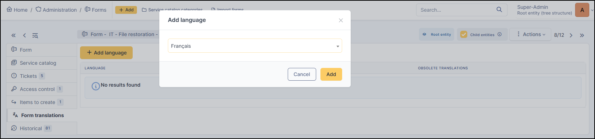

Each field is displayed in the language the form was created in, along with another translation field.

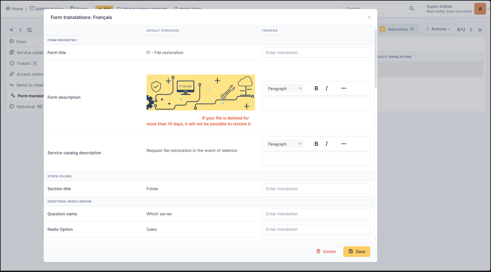

A progress bar shows you the progress of the form translation

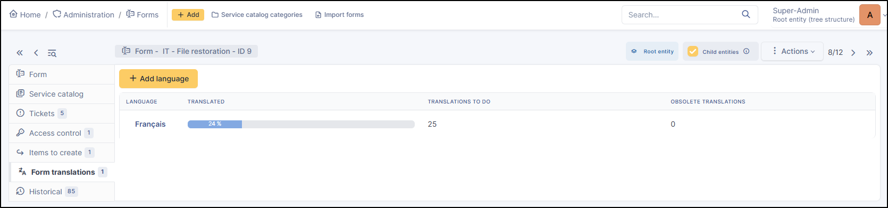

Import / Export
---------------

Forms allows exporting and importing forms between instances of GLPI.

.. warning:: This feature is designed to let administrators develop forms on a testing environment and copy them on a production environment.

Export
~~~~~~

To export forms, you need to use the massive actions

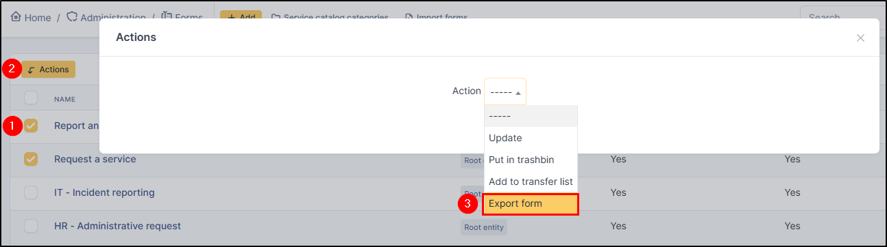

Import
~~~~~~

To import forms, you need to click on **Import Forms** at the top of the screen

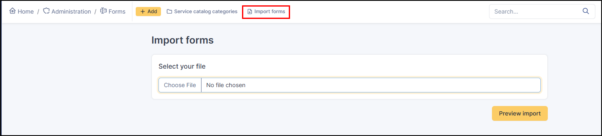

If your import is correct, you can click on import

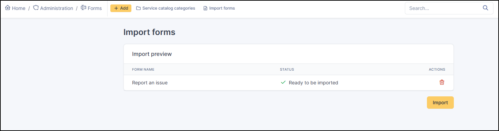

Import behavior
^^^^^^^^^^^^^^^^

Forms allows field reconciliation.
If some information is missing (entity, user, group, etc.) from the instance where the form is imported,
Forms will offer you to either select a different existing value or create a new value for each field in conflict.
Click on "Resolve issues" to display the conflicts.

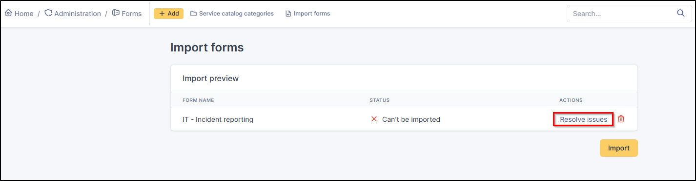

1. displays the field found during import
2. the value with which you wish to replace it

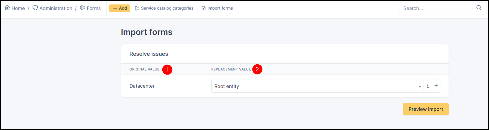