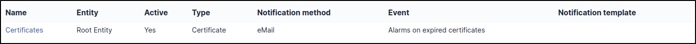

Groups
======

Groups tab allows to add, modify, delete, search, export groups.

Groups can be defined in a hierarchical structure in order to ease navigation and search.

.. topic:: Example: groups

   ::
    Management > Division > Service
    or
    N3 Support > Network > LAN

Groups can be used in several way to group users by:
* *skills*: for the helpdesk, for example network technicians, or database administrators,
* *organizational groups*: for example all the computers of the management or the accounting department but also set of persons to be notified.

The options available to adjust these behaviors are:
* **Visible in a ticket**: requesting group and/or assignment to this group;
* **Can be notified**: recipient of notifications;
* **Can be supervisor**: only for a :doc:`project </modules/tools/projects>`;
* **May contain**: assets and/or users.

In an item form, 2 notions of groups are available:
* *technical group* which indicates which group of people is in charge of the asset (equivalent for a group of the technical manager)
* *group* which indicates to which group of items it belongs.

.. note:: the technical group can allow the automatic assignment of a ticket to a group of technicians, see the ticket categories in the chapter: doc: `Configure dropdowns </modules/configuration/dropdowns/assistance.rst>`. Likewise, it can be used in :doc:`Business rules for tickets </modules/administration/rules/ticketbusinessrules>`.

.. hint:: if all options are set to *No*, the group will not appear in any selection list; this can be useful for a group that is deleted and kept for history or for adding empty groups in the hierarchical structure.

A group can have one or more supervisors, concept which can then be used for notifications, for example to send an email to the supervisor(s) of the group when a ticket is opened, see :ref:`notification management <configure_notifications>`.

A **delegation** mechanism allows a user to declare incidents not for himself but for one of the members of this group.

.. topic:: Example: delegation

   an assistant declaring incidents for all persons of the management

The concepts of delegation and supervisor can be configured in the "Users" tab (see below).

Assigning a user o a group is either static and done using the GLPI interface, or dynamic when this is automatically extracted from the LDAP directory.

A group is attached to the entity in which it is created and can then be visible in sub-entities.

From the list of groups, a group can be imported from a LDAP directory via the *LDAP directory link* button if external authentication is used and the "Auth and sync update" authorization is granted in profile. The assignment of users to groups will be automatic, see :doc:`Profiles </modules/administration/profiles/profiles>`. If several directories are configured, the choice between directories is proposed, otherwise the search form is directly accessible.

Depending on how you search for groups (see: doc: `Authenticating users from LDAP directories </modules/configuration/authentification/ldap>`), a **Search filter in groups** and/or a **User search filter** appear: these allow to refine the list to be imported. If GLPI is used in multi-entities, it is necessary to select the destination entity of the group as well as its visibility in the sub-entities.

.. note:: importing groups cannot be filtered by entity. In addition, no group synchronization function is available. The only way to refresh from a directory the list of group members is to resynchronize users, see :doc:`Import users from an external source </modules/administration/users/usersimport>`.

.. warning:: when migrating from a version of GLPI lower 0.80, any manual connection previously carried out on a group coming from the LDAP directory will be lost.

The different tabs
------------------

Sub-groups
~~~~~~~~~~

This tab allows to add a subgroup to the selected group and lists the existing subgroups.

Used items
~~~~~~~~~~

This tab lists the elements for which the *Group* field corresponds to the current group. The search can be extended to sub-groups as well as to the members of the group (*User* field of the item).

See :doc:`Tab "Used Items" </Les_différents_onglets/Onglet_Eléments>`

Managed items
~~~~~~~~~~~~~

This tab lists the elements for which the *Technical Group* field corresponds to the current group. The search can be extended to sub-groups as well as to the members of the group (*Technical manager* field of the item).

See :doc:`Tab "Managed Items" </Les_différents_onglets/Onglet_Eléments>`

LDAP directory link
~~~~~~~~~~~~~~~~~~~

This tab only appears if the "Auth and sync update" authorization is granted in profile; it gathers the information allowing GLPI to find the group and its users in the LDAP directory.

Users
~~~~~

This tab allows to add a user to this group by defining whether the added user is *delegatee* and/or *supervisor* of the group. It also lists the users of this group with possible search by criteria (delegatee or supervisor) and also in the subgroups of the current group.

Notifications
~~~~~~~~~~~~~

   List of notifications for which destination is group or group supervisor

.. include:: /modules/tabs/tickets.rst

For groups, this tab allows to list as well sub-groups tickets.

.. include:: /modules/tabs/historical.rst

.. include:: /modules/tabs/debug.rst

.. include:: /modules/tabs/all.rst
