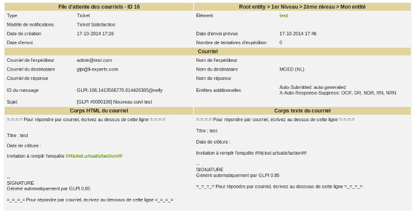

Mailing queue
=============

All notification emails go through a queue before actual delivery. This allows keeping a history and a list of the various emails sent.

An automatic action (``queuedmail``) allows the sending of pending emails (see :doc:`Configure automatic actions </modules/configuration/crontasks>`). Another automatic action (``queuemailclean``) cleans the queue by keeping only recent emails.

The delay applied for sending notifications can be defined at entity level, see :doc:`administration by entity </modules/administration/entities>`). This allows for example in the case of rapid multiple modifications of an object to send only one notification.

.. warning:: using the queue does not work for a change, problem or ticket itself, only for a sub-object. For example, when changing the impact of a ticket, the email will be sent immediately; on the other hand, in the event of addition or modification of a follow-up, a task, a validation request... the email will be placed in the queue.

   Example of queue

In the example above, the deadline for sending email notifications has been set to 20 minutes in the configuration of the entity; as a consequence the sending date is set at 20 minutes after the creation date.

Once the notification has been sent, the queue is placed in the recycle bin with the date sent.

.. note:: there will be as many queues in the recycle bin as there are recipients, each with its own sending date. 

