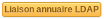

.. not included in any toctree, but "included" with link

:orphan:

Droits Administration
---------------------

.. |addUserExt| image:: ../images/addUserExt.png

Les 7 droits standard ne seront pas listés (voir :doc:`Explication des droits </modules/administration/profiles/profiles>`).

Avant de commencer le détail des droits de la partie Administration, il faut bien faire attention à la couleur des zones de droits. En effet, comme indiqué dans la légende ??? certains droits s'appliquent globalement dans GLPI et d'autres peuvent être délégués localement.  Exemple : les profils définis le sont pour toutes les entités. Par contre les règles métier peuvent varier d'une entité à une autre.

.. figure:: ../images/legendedroits.png
   :alt:
   :align: center

   legende droits

Droits Utilisateurs
~~~~~~~~~~~~~~~~~~~

.. figure:: ../images/admin.png
   :alt: droits utilisateurs
   :align: center

   droits utilisateurs

* **Lecture auth** : ajoute un champ dans la fiche utilisateur indiquant la méthode d'authentification ainsi que la date de dernière synchronisation

* **Mise à jour auth et sync** :

  * affiche un onglet *Synchronisation* dans l'utilisateur permettant de changer sa méthode d'authentification et de forcer sa synchronisation ;
  * ajoute un bouton |addUserLdap| avant la liste des groupes ;
  * affiche un onglet *Liaison annuaire LDAP* dans le groupe regroupant les informations permettant à GLPI de retrouver le groupe et ses utilisateurs dans l'annuaire LDAP.

* **Ajout externe** :

  * permet l'import ou la synchronisation d'un utilisateur
  * ajoute un bouton |addUserExt| avant la liste des utilisateurs.

Droits Entités
~~~~~~~~~~~~~~

* **Mise à jour paramètres** : permet de modifier les données de l'onglet *Assistance* dans l'entité.

* **Lecture paramètres** : permet de visualiser les données de l'onglet *Assistance* dans l'entité.

Droits Maintenance
~~~~~~~~~~~~~~~~~~

* **Vérifier la présence de mises à jour** : ajoute un bouton |checkVersion| dans le menu **Administration > Maintenance** qui permet de contrôler si vous avez la dernière version stable de GLPI.

Droits Règles métier pour les tickets (entité)
~~~~~~~~~~~~~~~~~~~~~~~~~~~~~~~~~~~~~~~~~~~~~~

.. image:: ../images/regles.png
   :alt:
   :align: center

* **Règles métiers (parent)** : affiche un onglet **règles appliquées (nom entité)** dans les règles métier pour les tickets. Cet onglet liste toutes les règles des entités parentes jouées.

Les éléments de la partie *Dictionnaires* rentrent dans les 7 droits standard.

.. image:: ../images/dico.png
   :alt:
   :align: center

