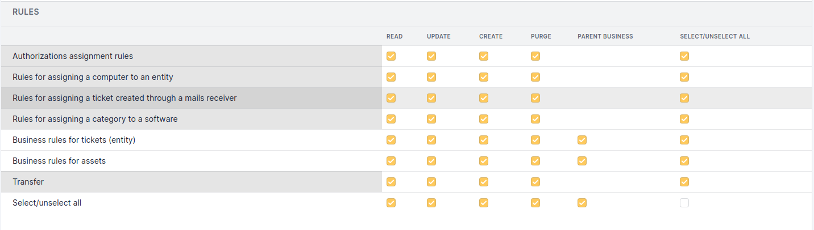

.. not included in any toctree, but "included" with link

:orphan:

Administration permissions
--------------------------

.. |addUserExt| image:: ../images/addUserExt.png

The 7 standard permissions will not be listed (see :doc:`Permissions description </modules/administration/profiles/profiles>`).

.. warning::

   Some permissions apply globally to GLPI, other permissions may be delegated locally. This is indicated by the color of permissions zones, as described in image below.

   For example, profiles are defined for all entities; on the other hand, business rules may vary from one entity to another.

   Permissions zones

User permissions
~~~~~~~~~~~~~~~~

.. figure:: ../images/administration.png
   :alt: User permissions
   :align: center

   User permissions

* **Read Auth**: adds a field in the user form indicating the authentication method as well as the date of the last synchronization

* **Update auth & sync**:

  * Displays a *Synchronization* tab in the user allowing to change authentication method and force synchronization;
  * Adds a *LDAP directory link* button before the group list;
  * Displays a *LDAP directory link* tab in the group containing the information allowing GLPI to find the group and its users in the LDAP directory.

* **Add External**:

  * Allows the import or synchronization of a user
  * Adds a *...From an external source* button before the list of users

Entity permissions
~~~~~~~~~~~~~~~~~~

* **Update Parameters**: allows to modify the data of the *Assistance* tab in the entity.

* **Read Parameters**: allows to view the data in the *Assistance* tab in the entity.

Business rules for tickets (entity) permissions
~~~~~~~~~~~~~~~~~~~~~~~~~~~~~~~~~~~~~~~~~~~~~~~

   Rules permissions

* **Parent Business**: displays a **applied rules (entity name)** tab in the business rules for tickets. This tab lists all the played rules of the parent entities.

The elements of the *Dictionaries* part fall within the 7 standard permissions.

   Dictionaries permissions

