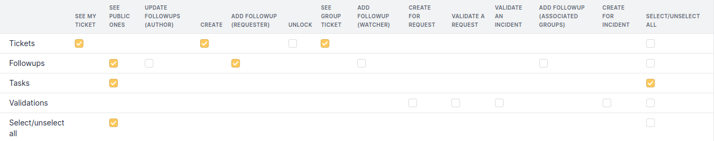
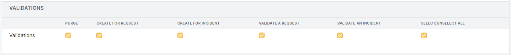
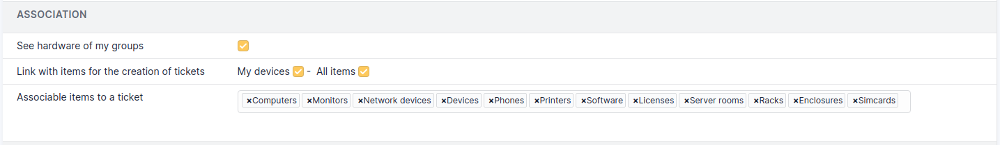
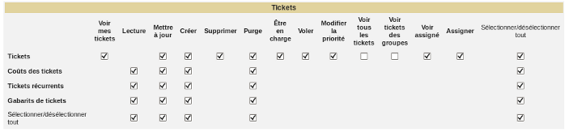
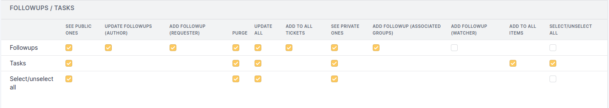
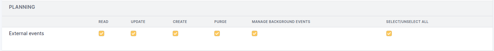
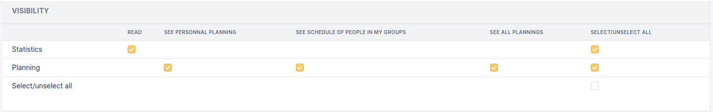
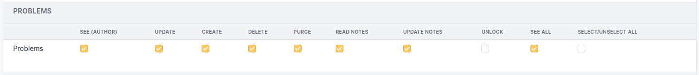
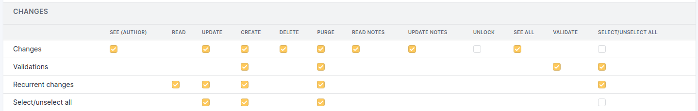

.. not included in any toctree, but "included" with link

:orphan:

Assistance permissions
----------------------

Simplified interface
~~~~~~~~~~~~~~~~~~~~

Tickets permissions
+++++++++++++++++++

* **See My Ticket**: see all the tickets for which I am the writer, the requester or the observer as well as their public follow-ups

* **Create**: adds a **Create Ticket** menu. If you do not have this permission, when you log in, you will be directed to the list of tickets. Otherwise, you will be redirected to the home page which displays my tickets, sorted by status, with the **Create ticket** menu as the table title.

* **See Group Ticket**: see the tickets created which have one of my groups as an requester or observer. For example, if I am a member of the *Management* group, I will see all the tickets having a requester in group *Management*.

Followup permissions
++++++++++++++++++++

* **See Public Ones**: see all followups typed as public followups.

* **Update followups (author)**: modify the follow-ups you have created.

* **Add followup (requester)**: add a follow-up to a ticket for which I am a writer or requester. This right also allows you to add a document to a ticket.

* **Add followup (associated groups)**: add a follow-up to a ticket for which the requesting group is one of the groups of which I am a member.

Tasks permissions
+++++++++++++++++

* **See Public Ones**: see all the tasks typed as a public task. This right also allows the display of the *Tasks* tab of a ticket.

Validations permissions
+++++++++++++++++++++++

   Validations permissions

* **Validate an Incident**: respond to a validation request concerning an Incident type ticket. Having this right makes you appear in the list of people who can validate.

* **Validate a Request**: respond to a validation request concerning a Request type ticket. Having this right makes you appear in the list of people who can validate.

* **Create for Request**: send a validation request for a Request type ticket.

* **Create for Incident**: send a validation request for an Incident type ticket.

The *Validation* tab will only appear in the ticket if you have one of the validation creation permission. Otherwise, it will only be displayed if you have one of the validation permissions and only if the type of the ticket corresponds to the permission.

Associations permissions
++++++++++++++++++++++++

   Associations permissions

* **Link with items for the creation of tickets**: 
  * **My Devices**: assets whose type is authorized and for which I am the user;
  * **All Items**: all assets of my entity whose type is authorized

* **Associable items to a ticket**: types of asset on which a ticket can be associated. To add a type, just click in the white area and choose the authorized type or *All* if you want to authorize all types. To delete a type, simply click on the cross to the left of its name or on *None* if you do not want to allow any associated element

* **Default ITIL templates**: default templates for Tickets, Changes and Problems that will apply for profile.

  .. warning:: the template being applied to the profile which is an element of the general configuration, the list contains only the recursive templates of the root entity.

  .. figure:: ../images/assistance_general.png
     :alt: Default ITIL templates
     :align: center

     Default ITIL templates

* **See hardware of my groups**: asset whose type is authorized and for which I am a member of the group.

Standard interface
~~~~~~~~~~~~~~~~~~

Common fields with the simplified interface will not be detailed.  The 7 standard permissions will not be listed (see :doc:`Permissions description </modules/administration/profiles/profiles>`).

Tickets permissions
+++++++++++++++++++

   Tickets permissions

* **Assigned Tickets**: be assigned to a ticket. All the users of this profile having this option enabled will be present in the list of technicians who can be assigned to a ticket.

* **Steal**: become the technician assigned to the ticket. In this case, the list of technicians who can be assigned to the ticket will only include the name of the person connected.

* **Change the Priority**: change the priority in order to make an incident a Major priority, among other things. Modifying the priority therefore cancels the automatic calculation defined in the general configuration.

* **See All Tickets**: see all tickets created in the entity.

* **See Assigned**: see tickets for which I am the technician or having one of my groups as group of technicians.

* **Assign**: add a technician, a group of technicians or a supplier to a ticket.

Followups permissions
+++++++++++++++++++++

   Followups permissions

* **See Private Ones**: see all followups typed as private follow-up.

* **Update All**: modify all followups, regardless of the author.

  .. note:: a technician assigned to a ticket or member of the assigned group, can also modify all follow-ups.

* **Add to all tickets**: add a follow-up to all tickets of the entity.

Tasks permissions
+++++++++++++++++

* **See Private Ones**: see all the tasks typed as private task.

* **Update All**: modify all tasks, regardless of the author.

  .. note:: a technician assigned to a ticket or member of the assigned group, can also modify all tasks.

* **Add to all tickets**: add a task to all tickets of the entity.

Planning permissions
++++++++++++++++++++

   Planning permissions

   Planning visibility permissions

* **See personal planning**: only see my planning data.

* **See all plannings**: see the data of all plannings

* **See schedule of people in my groups**: see the data of the plannings of the members of my groups.

Depending on the permissions of the profile, you can see the notes published in the planning as well as the tasks of a ticket, a problem or a change.

Problems permissions
++++++++++++++++++++

* **See (author)**: view problems for which I am a requester, or a member of the requesting group, or an observer, or a member of the observer group, or the assigned technician, or member of the assigned group.
  
  This permission allows also to:

    * see the *Costs* tab,
    * see the *Tasks* tab,
    * create a task if I am the assigned technician or member of the assigned group 
    * resolve the problem if I am the assigned technician or assigned group member.

**See All**: see all the data of a problem.

Changes permissions
+++++++++++++++++++

   Changes permissions

* **See (author)**: see the changes for which I am the requester, or member of the requesting group, or observer, or member of the observer group, or the assigned technician, or member of the assigned group.

  This permission also allows to:

    * see the *Costs* tab,
    * see the *Tasks* tab,
    * create a task if I am the assigned technician or member of the assigned group 
    * resolve the change if I am the assigned technician or assigned group member.

* **See All**: see all the data of a change.

*Validation permission*:

* **Create**: send a validation request

* **Purge**: delete a validation request

* **Validate**: respond to a validation request. Having this right makes you appear in the list of people who can validate.

The *Validation* tab will only be displayed in the ticket if you have one of the *Validation* permissions.

