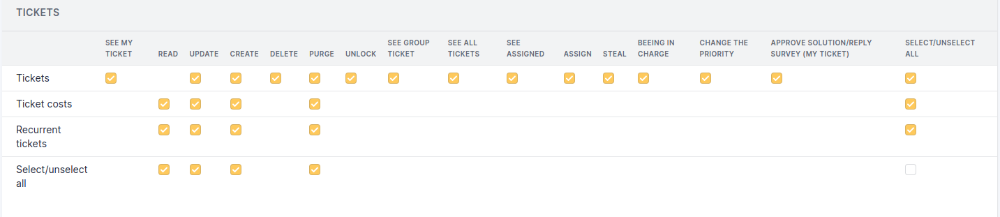

.. not included in any toctree, but "included" with link

:orphan:

Droits Assistance
-----------------

Interface simplifiée
~~~~~~~~~~~~~~~~~~~~

.. figure:: ../images/assistancePO.png
   :alt: image

Droits Tickets
++++++++++++++

* **See My Ticket**: voir tous les tickets pour lesquels je suis le rédacteur, le demandeur ou l'observateur ainsi que leurs suivis publics.

* **Create**: ajoute un menu Créer un ticket. Si vous n'avez pas ce droit, lors de la connexion vous arrivez directement sur la liste des tickets. Dans le cas contraire, vous arriver sur la page d'accueil qui affiche mes tickets, classés par statut, avec le menu Créer un ticket en titre de tableau.

* **See Group Ticket**: voir les tickets créés ayant en groupe demandeur ou observateur un de mes groupes. Exemple, je suis membre du groupe Direction ; je verrai tous les tickets ayant en demandeur de groupe Direction.

Droits Suivis
+++++++++++++

* **See Public Ones**: voir tous les suivis typés en suivi public.

* **Update followups (author)**: modifier les suivis que vous avez créés.

* **Add followup (requester)**: ajouter un suivi à un ticket pour lequel je suis rédacteur ou demandeur. Ce droit permet également d'ajouter un document à un ticket.

* **Add followup (associated groups)**: ajouter un suivi à un ticket pour lequel le groupe demandeur est un des groupes dont je suis membre.

Droits Tâches
+++++++++++++

* **See Public Ones**: voir toutes les tâches typées en tâche publique. Ce droit permet également l'affichage de l'onglet *Tâches* d'un ticket.

Droits Validations
++++++++++++++++++

.. figure:: ../images/validations.png
   :alt: Validations permissions
   :align: center

   Validations permissions

* **Validate an Incident**: répondre à une demande de validation concernant un ticket de type Incident. Le fait d'avoir ce droit vous fait apparaitre dans la liste des personnes pouvant valider.

* **Validate a Request**: répondre à une demande de validation concernant un ticket de type Demande. Le fait d'avoir ce droit vous fait apparaitre dans la liste des personnes pouvant valider.

* **Create for Request**: envoyer une demande de validation pour un ticket de type Demande.

* **Create for Incident**: envoyer une demande de validation pour un ticket de type Incident.

L'onglet Validation ne s'affichera dans le ticket que si vous avez un des droits de création de validation. Dans le cas contraire, il ne s'affichera que si vous avez un des droits de validation et uniquement si le type du ticket correspond au droit.

Droits Associations
+++++++++++++++++++

.. figure:: ../images/associationsPO.png
   :alt: Associations permissions
   :align: center

   Associations permissions   

* **Link with items for the creation of tickets**: 
  * **My Devices**: matériels dont le type est autorisé et pour lesquels je suis l'utilisateur.
  * **All Items**: tous les matériels de mon entité dont le type est autorisé

* **Associable items to a ticket**: types de matériels sur lesquels pourront porter un ticket. Pour ajouter un type il suffit de cliquer dans la zone blanche et de choisir le type autorisé ou Tous si vous voulez autoriser tous les types. Pour supprimer un type, il suffit de cliquer sur la croix à gauche de son nom ou sur Aucun si vous ne voulez autoriser aucun élément associé

* **Default Tickets template**: gabarit qui sera appliqué au profil.

  .. warning:: le gabarit étant appliqué au profil qui est un élément de la configuration générale, la liste ne contient que les gabarits récursifs de l'entité racine.

  .. figure:: ../images/assistance.png
     :alt: Default Tickets template 
     :align: center

     Default Tickets template 

* **See hardware of my groups**: matériels dont le type est autorisé et pour lesquels je suis membre du groupe.

Interface standard
~~~~~~~~~~~~~~~~~~

Les champs communs avec l'interface simplifiée ne seront pas détaillés.  Les 7 droits standard ne seront pas listés (voir :doc:`Explication des droits </modules/administration/profiles/profiles>`).

Droits Tickets
++++++++++++++

   Tickets permissions

* **Assigned Tickets**: être assigné à un ticket. Tous les utilisateurs de ce profil ayant cette option validée seront présents dans la liste des techniciens pouvant être assignés à un ticket.

* **Steal**: devenir le technicien assigné au ticket. Dans ce cas, la liste des techniciens pouvant être assignés au ticket ne comportera que le nom de la personne connectée.

* **Change the Priority**: modifier la priorité afin de passer, entre autre, un incident en priorité Majeure. Modifier la priorité annule donc le calcul automatique défini dans la configuration générale.

* **See All Tickets**: voir de tous les tickets créés dans l'entité.

* **See Assigned**: voir les tickets pour lesquels je suis le technicien ou ayant en groupe de techniciens un de mes groupes.

* **Assign**: ajouter un technicien, un groupe de techniciens ou un fournisseur à un ticket.

Droits Suivis
+++++++++++++

.. figure:: ../images/suivisTaches.png
   :alt: Followups permissions
   :align: center

   Followups permissions

* **See Private Ones**: voir tous les suivis typés en suivi privé.

* **Update All**: modifier tous les suivis, quel que soit l'auteur.

  .. note:: un technicien assigné à un ticket ou membre du groupe assigné, peut également modifier tous les suivis.

* **Add to all tickets**: ajouter un suivi à tous les tickets de l'entité.

Droits Tâches
+++++++++++++

* **See Public Ones**: Voir interface simplifiée.

* **See Private Ones**: voir toutes les tâches typées en tâche privée.

* **Update All**: modifier toutes les tâches, quel que soit l'auteur.

  .. note:: un technicien assigné à un ticket ou membre du groupe assigné, peut également modifier toutes les tâches.

* **Add to all tickets**: ajouter une tâches à tous les tickets de l'entité.

Droits Planning
+++++++++++++++

.. figure:: ../images/visibilite.png
   :alt: Planning permissions
   :align: center

   Planning permissions

* **See personnal planning**: ne voir que les données de mon planning.

* **See all plannings**: voir les données de tous les plannings

* **See schedule of people in my groups**: vois les données des plannings des personnes membres de mes groupes.

Suivant les droits du profil, vous pouvez voir les notes publiées dans le planning ainsi que les tâches d'un ticket, d'un problème ou d'un changement.

Droits Problèmes
++++++++++++++++

.. figure:: ../images/problemes.png
   :alt: image

* **See (author)**: voir les problèmes pour lesquels je suis demandeur ou membre du groupe demandeur, ou observateur ou membre du groupe observateur, ou le technicien assigné ou membre du groupe assigné. Ce droit permet également de:

  * voir l'onglet Coûts,
  * voir l'onglet Tâches,
  * créer une tâche si je suis le technicien assigné ou membre du groupe assigné 
  * résoudre le problème si je suis le technicien assigné ou membre du groupe assigné.

**See All**: voir toutes les données d'un problème.

Droit Changements
+++++++++++++++++

.. figure:: ../images/changements.png
   :alt: Changes permissions
   :align: center

   Changes permissions

* **See (author)**: voir les changements pour lesquels je suis demandeur ou membre du groupe demandeur, ou observateur ou membre du groupe observateur, ou le technicien assigné ou membre du groupe assigné. Ce droit permet également de :
  * voir l'onglet Coûts,
  * voir l'onglet Tâches,
  * créer une tâche si je suis le technicien assigné ou membre du groupe assigné
  * résoudre le changement si je suis le technicien assigné ou membre du groupe assigné.

* **See All**: voir toutes les données d'un changement.

*Droit Validation*:

* **Create**: envoyer une demande de validation

* **Purge**: supprimer une demande de validation

* **Validate**: répondre à une demande de validation. Le fait d'avoir ce droit vous fait apparaitre dans la liste des personnes pouvant valider.

L'onglet Validation ne s'affichera dans le ticket que si vous avez un des droits Validation.

