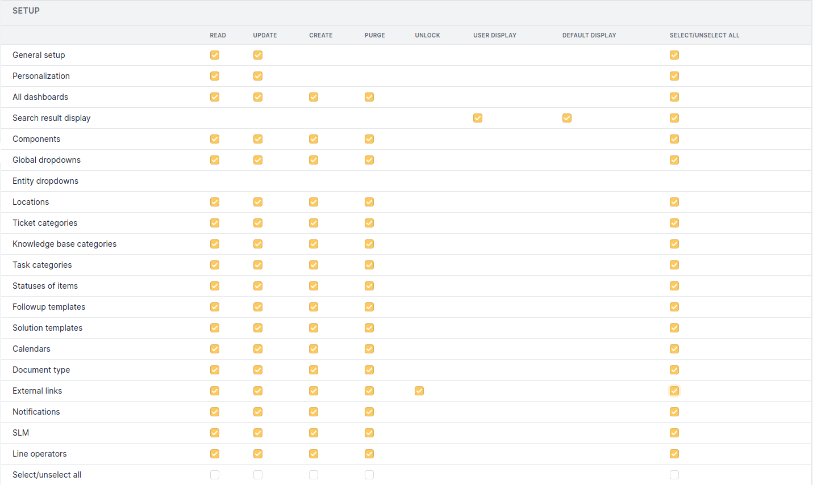

.. not included in any toctree, but "included" with link

:orphan:

.. |options_search| image:: ../images/options_search.png

Setup permissions
-----------------

The 7 standard permissions will not be listed (see :doc:`Permissions description </modules/administration/profiles/profiles>`).

All Configuration Permissions
~~~~~~~~~~~~~~~~~~~~~~~~~~~~~

   All Configuration Permissions

The **Search result display** permission allows to configure the displayed columns in the GLPI search engine..

* **User Display**: display a *Personal view* tab allowing display customization for the user, the customization being done object by object.

* **Default Display**: allows to modify standard display that will apply to each user not having a personal view.
