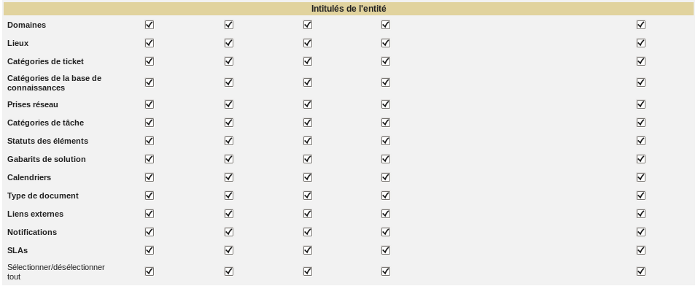

.. not included in any toctree, but "included" with link

:orphan:

.. |options_search| image:: ../images/options_search.png

Setup permissions
-----------------

The 7 standard permissions will not be listed (see :doc:`Permissions description </modules/administration/profiles/profiles>`).

Search Result Display permissions
~~~~~~~~~~~~~~~~~~~~~~~~~~~~~~~~~

.. figure:: ../images/config.png
   :alt: Search Result Display permissions
   :align: center

   Search Result Display permissions

This permissions allows to parameterize display via |options_search| in GLPI search engine..

* **User Display**: display a *Personal view* tab allowing display customization for the user, the customization being done object by object.

* **Default Display**: allows to modify standard display that will apply to each user not having a personal view.

Entity Dropdowns permissions
~~~~~~~~~~~~~~~~~~~~~~~~~~~~

   Entity Dropdowns permissions

The elements of *Entity Dropdowns permissions* fall within the 7 standard permissions. These elements allow to refine setup at entity level and can therefore be applied to entity administrator.
