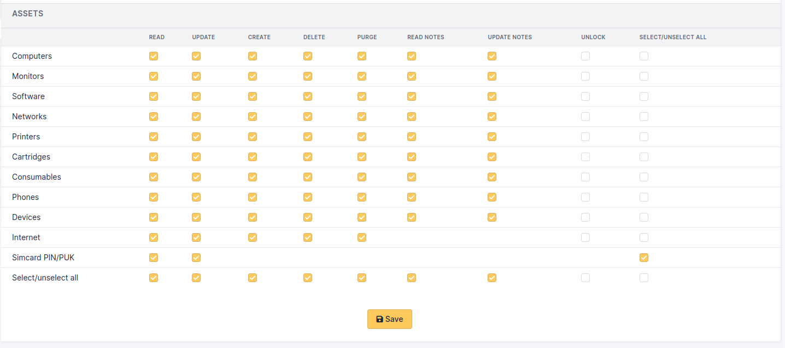
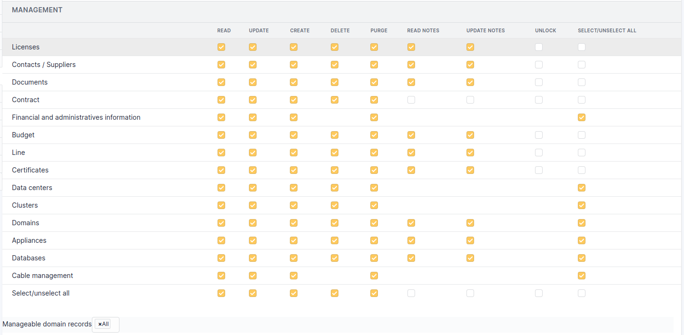

User profiles
=============

Profile is central in GLPI configuration: profile is the key for users permissions granting and for securing and isolating data.

A profile is associated with :

* a user
* an entity, in a **recursive** or **dynamic** manner

In order to enable permissions to be passed to child entities, the profile must be associated recursively.

.. todo:: old version: Pour répercuter les droits liés à ce profil, à toutes les entités filles de l'entité enregistrée, il faut associer le profil de manière récursive. C'est là tout le principe de la récursivité.

Different profiles can be associated with the same user, based on entities and whatever the relation between these entities: this can be achieved by adding the profile to the user for each entity where user profile must be different.

By default, 7 profiles are pre-registered in GLPI:

* **Super-Admin**: This profile is granted **all** permissions!
  .. warning :: if the super-admin profile is deleted or if the **simplified interface** is associated with this profile, access to the GLPI configuration may be permanently lost.

* **Admin**: This profile has administration rights for all GLPI. Some restrictions are applied to it at the level of the configuration of rules, entities as well as other items which may alter the behavior of GLPI.

* **Supervisor**: This profile incorporates the elements of the *Technician* profile by adding elements allowing management of a team and its organization (allocation of tickets, etc.).

* **Technician**: This profile corresponds to the one used for a maintenance technician, having read access to the inventory and to the help desk in order to process tickets.

* **Hotliner**: This profile corresponds to the one that could be given for a hotline service; it allows to open tickets and follow them but not to be in charge of them as a *Technician* can be.

* **Observer**: This profile has read permission to all inventory and management data. In terms of assistance, it can open a ticket or be assigned one, but cannot administer this section (assign a ticket, steal a ticket...).

* **Self-Service**: This profile is the most limited. It is also the only one to have a different interface, the :doc:`simplified interface</first-steps/interfaces>`, as opposed to the **standard interface**. However, it can declare a ticket, add a follow-up, consult the FAQ or reserve asset. This profile is set as the default profile.

Permissions description
-----------------------

Once the profile has been created, it will be possible to establish the permissions on the various functionalities of GLPI. Seven tabs corresponding to the different menus of GLPI are then available to manage this set of permissions and are described below.

The different permissions of an object are listed on the line of its name. To activate an permission, the corresponding box must be checked and vice versa to delete an permission the box must be unchecked.

.. warning:: no permission deduction is done; for example in order to be able to modify an object, read permission must also be granted.

Permissions after migration: migration takes over old permissions in full, regardless of the purpose, and activates the corresponding values ​​in the new system. Previous *Write* permission is transformed into *Read*, *Update*, *Create*, *Delete* and *Purge* for most objects and must then be refined if needed. For others, the permissions are grouped by object, for example, FAQ permission are permissions of the Knowledge Base object.

Some permissions are standards for all objects:

* **Read**: allows to display an object, it is also often this permission which displays or not the object in the different menus
* **Update**: allows to display an object data
* **Create**: allows to create a new element of the type of the object
* **Delete**: allows you to place the object in the trash bin. If this permission is not present, it means that the object does not have a trash bin.
* **Purge**: deletes the object from the trash bin and therefore permanently from the database. The permissions can therefore be refined between temporary deletion (placing in the trash bin) and permanent deletion (purging the trash bin)
* **Read notes**: allows to display the *Notes* tab, if object has one
* **Update notes**: allows to modify the content of a note or to delete it

The different tabs
------------------

.. note:: the display of profile management depends on the profile of connected user. It can therefore vary depending on the profile.

Assets
~~~~~~
The 7 standard permissions described above apply to the elements of tab **Assets**.

   Permissions on assets

The **Internet** permission applies to:

* IP field of a network port
* association or disassociation of a network name to a network port
* Internet part of dropdowns (IP networks, internet domains, WiFi networks, network names)

Assistance
~~~~~~~~~~
This tab manages permissions on tickets, follow-ups, tasks, validations, associations, problems and changes. It also manages the visibility of statistics and schedules as well as the assignment of a template to the profile.

See :doc:`Tab "Assistance" </modules/administration/profiles/assistancetab>`

Life cycle
~~~~~~~~~~
This tab manages the permissions on the status life cyle of tickets, problems and changes.

See :doc:`Tab "Life cycle" </modules/assistance/lifecyclematrix>`

Management
~~~~~~~~~~
The 7 standard permissions described above apply to the elements of tab **Management**.

   Permissions on management

.. warning:: 
   The permissions on **Financial and administrative information** applies also to objects containing financial information; for instance it is not allowed to purge a computer containing financial information if profile is not granted with *Purge* permission on financial information.

Tools
~~~~~
This tab manages permissions on notes, RSS feeds, public bookmarks, reports, reservations, knowledge base as well as projects and tasks of a project.

See :doc:`Tab "Tools" </modules/administration/profiles/toolstab>`

Administration
~~~~~~~~~~~~~~
This tab manages permissions on users, entities and business rules on tickets.

See :doc:`Tab "Administration" </modules/administration/profiles/administrationtab>`

Configuration
~~~~~~~~~~~~~
See :doc:`Tab "Configuration" </modules/administration/profiles/configurationtab>`

Users
~~~~~
This tab lists the entities in which this profile is assigned. To see the corresponding users, click on the concerned entity. *"D"* means the permissions have been assigned dynamically, *"R"* means the permissions are recursive from the assignment entity.

Historical
~~~~~~~~~~
See :doc:`Tab "Historical" </modules/tabs/historical>`

All
~~~
See :doc:`Tab "All" </modules/tabs/all>`
