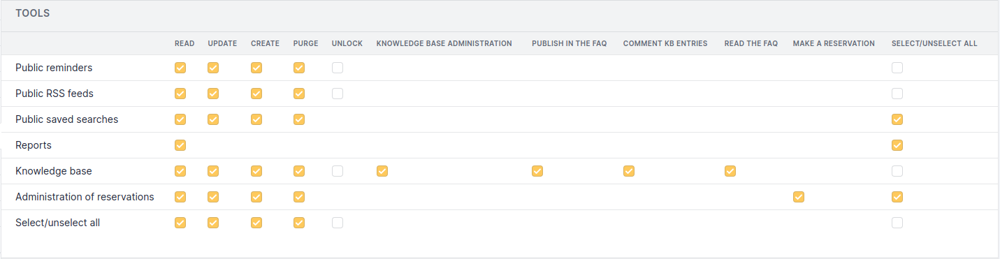
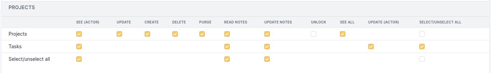

.. not included in any toctree, but "included" with link

:orphan:

Tools Permissions
-----------------

The 7 standard permissions will not be listed (see :doc:`Permissions descriptions </modules/administration/profiles/profiles>`).

Simplified Interface
~~~~~~~~~~~~~~~~~~~~

.. figure:: ../images/toolsPO.png
   :alt: Tools permissions (simplified interface)
   :align: center

* **Read the FAQ**: see the knowledge base articles which are published in the FAQ.

* **Make a Reservation**: reserve an asset.

Standard Interface 
~~~~~~~~~~~~~~~~~~

Common fields with the simplified interface will not be detailed.

   Tools permissions

Knowledge Base Permissions
++++++++++++++++++++++++++

* **Knowledge Base Administration**: administer knowledge base access.

* **Publish in the FAQ**: add or remove an article from the FAQ.

Projects Permissions
++++++++++++++++++++

* **See (Actor)**: see the projects I have created or for which I am the supervisor or member of the supervisor group.

* **See All**: see all the entity's projects.

Tasks Permissions
+++++++++++++++++

* **See (Actor)**: see the tasks I created.

* **Update (Actor)**: modify the tasks that I have created or for which I am a member of the team.

