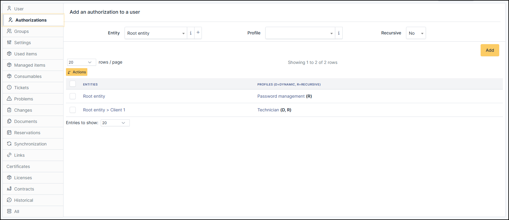
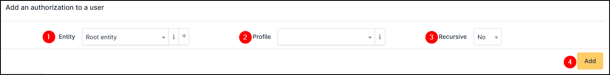
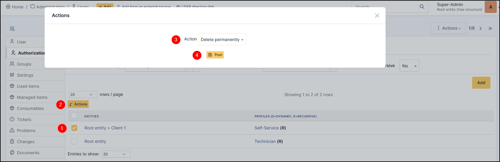

Authorizations
--------------

Authorizations correspond to the rights and permissions assigned to users or groups to access different features or modules.
They allow you to precisely define who can view, create, modify, or delete data (tickets, assets, budgets, etc.).
Authorizations are managed via profiles and ensure security, confidentiality, and the proper distribution of responsibilities in the management of the GLPI environment.

.. note:: For details on authorization, go to :doc:`profiles <../../profiles/profiles>`

.. note:: **Information on abbreviations**

    You will be able to see in the "*profiles*" section as in the example above the letters R and D.

    **R** = Recursive

    This means that the profile has access to all attached child entities.

    **D** = Dynamic

    This means that the authorization was added through an authorization rule. If this rule is modified, the authorization will also be changed the next time the user logs in.

Add an authorization
~~~~~~~~~~~~~~~~~~~~

To add an authorization, select :

* the entity
* the profile
* the recursion

Delete an authorization
~~~~~~~~~~~~~~~~~~~~~~~

To delete an authorization use the massive action.

