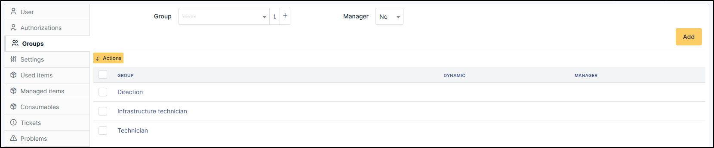
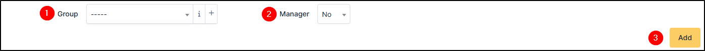
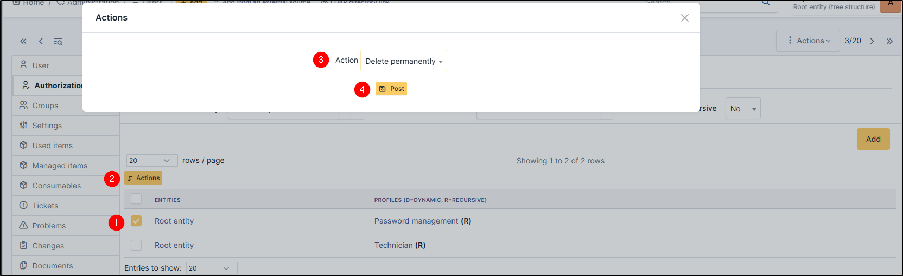

Groups
------

This tab allows you to manage groups for a user (if your own permissions allow it).

Add a group
~~~~~~~~~~~

To add a group :

* select the group in the dropdown list
* if the user can manage the group
* click on Add

.. note:: If the user is a manager of a group, he has the right to modify the group. He can therefore add and delete users from this group.

Delete a group
~~~~~~~~~~~~~~

To delete a group, use massive actions

