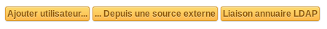

Administrer les utilisateurs
============================

Il est possible d'ajouter, modifier, supprimer des utilisateurs ou rechercher et exporter la liste des utilisateurs. La liste des utilisateurs enregistrés fonctionne de la même façon que la liste des éléments de l'inventaire.

En plus des informations de l'utilisateur, il est possible de le désactiver si besoin (champ Actif). Dans ce cas, l'utilisateur n'est plus sélectionnable dans les menus déroulants des tickets ou de l'inventaire, mais il conserve ses matériels et tickets associés. Des dates de validité permettent également de définir la période d'activité de l'utilisateur ; le compte de l'utilisateur ne sera alors considéré comme actif qu'après la date de début et/ou avant la date de fin (les 2 valeurs sont optionnelles et peuvent être définies indépendamment).

Une photo peut être associée manuellement ou importée automatiquement depuis un annuaire (voir :doc:`Authentifier des utilisateurs à partir d'annuaires LDAP </modules/configuration/authentification/ldap>`).

Depuis la liste des utilisateurs, 3 options sont proposées pour :doc:`importer un utilisateur |image| </modules/administration/users/usersimport>`.

.. toctree::
   :maxdepth: 1

   usersimport

The different tabs
------------------

* **Onglet "Habilitations"** Permet d'administrer les habilitations dont dispose l'utilisateur ; Pour cela, sélectionner l'entité sur laquelle les droits doivent être donnés, puis le droit (profil) à donner. L'option **Récursif** permet d'associer également le profil à toutes les sous-entités de l'entité sélectionnée. Un tableau récapitulatif regroupe les droits déjà attribués à cet utilisateur.

* **Onglet "Groupes"** Liste les groupes associés à l'utilisateur. Ce tableau liste le nom du groupe, si le groupe est remonté directement depuis un annuaire (dynamique), si l'utilisateur est délégataire ou superviseur du groupe.(voir :doc:`Gérer les groupes </modules/administration/groups>`). Si vous avez le droit de modifier un utilisateur, vous pouvez également lui affecter un groupe depuis cet onglet.

* **Onglet "Préférences"** Permet l'édition des préférences de l'utilisateur. Voir :doc:`Gérer ses préférences </first-steps/preferences>`.  Pour modifier les données de cet onglet vous devez avoir les droits de modifier la configuration générale.

* **:doc:`Onglet "Eléments utilisés" </Les_différents_onglets/Onglet_Eléments>`** L'utilisateur est défini dans le champ *Utilisateur* de l'objet ou est membre du groupe défini dans le champ *Groupe* de l'objet.

* **:doc:`Onglet "Eléments gérés" </Les_différents_onglets/Onglet_Eléments>`** L'utilisateur est défini dans le champ *Responsable technique* de l'objet ou est membre du groupe défini dans le champ *Groupe technique* de l'objet.

.. include:: ../../tabs/tickets.rst

Pour les utilisateurs, en plus de lister les tickets créés par l'utilisateur, vous pouvez directement créer un ticket d'incident depuis cet onglet. Dans ce cas, l'utilisateur sera défini automatiquement comme Demandeur.

.. include:: ../../tabs/documents.rst

* **:doc:`Onglet "Réservations" </Les_différents_onglets/Onglet_Réservations>`** Liste les réservations passées, en cours et à venir de l'utilisateur.  Vous devez avoir le droit de lecture sur l'administration des réservations pour voir cet onglet.

* **Onglet "Synchronisation"** Cet onglet apparaît si vous avez les droits "Mise à jour auth et sync" dans votre profil. Il permet de changer la méthode d'authentification d'un utilisateur et de forcer sa synchronisation.

* **:doc:`Onglet "Liens" </Les_différents_onglets/Onglet_Liens>`** Cet onglet liste les liens externes définis pour les utilisateurs.

* :doc:`Onglet "Historique" </commontabs/item_historique>`

.. include:: ../../tabs/debug.rst

.. include:: ../../tabs/all.rst

The different actions
---------------------

* :doc:`Add a utilisateur </modules/administration/users/usersimport>`
* :doc:`Modifier les données d'un utilisateur </Les_différentes_actions/modifier_un_objet>`
* **Modifier la méthode d'authentification d'un utilisateur** S'effectue depuis l'onglet "Synchronisation" (voir ci-dessus)
* :doc:`Delete a utilisateur </Les_différentes_actions/supprimer_un_objet>`
* :doc:`Attach a document to a utilisateur </Les_différentes_actions/associer_un_document_a_un_objet>`
* :doc:`Attach a élément to a utilisateur </Les_différents_onglets/Onglet_Eléments>`
* :doc:`Attach a ticket to a utilisateur </commontabs/item_tickets>`

