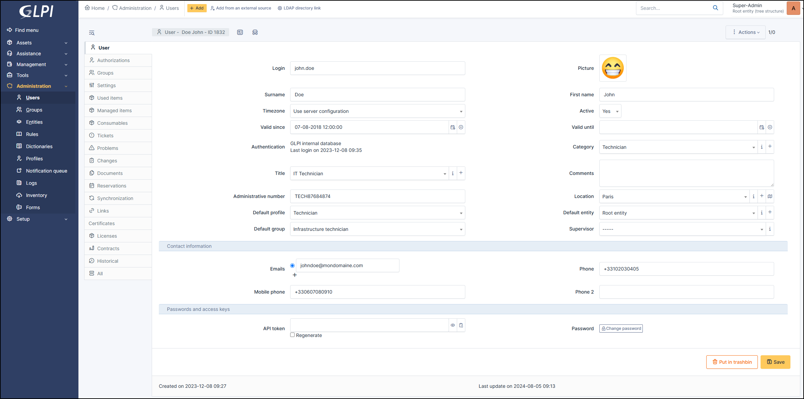

Users
=====

The Users tab allows you to manage their information (mail, name, authorization, etc.).

.. warning:: Some information may not be editable depending on how the user was imported. For example, the email address of a user imported from an LDAP(S) cannot be modified.

.. tip::
   You can import users. You can refer to :doc:`import users <usersimport>`

It is possible to deactivate a user if needed. If deactivated, the user can no longer be selected in drop-down menu for tickets or inventories, but keeps associated items and tickets. Validity dates can also define the activity time slot of user: the user account will be considered as active only after the start date and/or before the end date. Both dates can be defined independently.

A photo can be added manually or imported automatically from a directory (see :doc:`Authenticate users with LDAP </modules/configuration/authentication/ldap>`).

Impersonate
-----------

For debugging or administrative purposes, it's possible for a “super-admin” account (or any profile with the configuration rights) to temporarily take the ownership of another user’s account without knowing its password.
An icon is available at the top of the user´s form to perform this action.

.. image:: /modules/administration/images/impersonate_icon.png
   :alt: Impersonate user icon
   :align: center
   :scale: 76%

To note:

* A special banner will show permanently as long as the function is active and will allow you to exit this mode.
* After the exit, the user will retrieve its session as it was before using the feature.
* The history of actions taken by the administrator will appear with a special note: “user (xxx) impersonated by admin (yyy)”.

.. image:: /modules/administration/images/impersonate_banner.png
   :alt: Impersonate banner
   :scale: 43%

.. warning:: Impertonate allows users whose current profile is higher or equally privileged as every profile of the other user.
   For example, a technician with this right could impersonation self-service users but not admins. This is mainly to avoid privilege escalation.

Vcard
-----

You can download a user vcard by this icon :

.. image:: /modules/administration/users/images/vcard_user.png
   :alt: Download a user vcard
   :scale: 76%

In a display form, the following information is available:

User Information
~~~~~~~~~~~~~~~~

- **Login*** : Used to log in to GLPI.
- **Surname***
- **Firstname**
- **Timezone**: by default "*use server configuration*". If timezone are not active, go to `timezone <https://glpi-install.readthedocs.io/en/latest/timezones.html#timezones>`_
- **Active**
- **Valid since**
- **Valid until**
- **Authentication*** : Indicates the authentication source (internal database, LDAP or other)
- **Category**
- **Title**
- **Comments**
- **Administrative number**
- **Location**
- **Default profile**
- **Default entity**
- **Default group**
- **Supervisor**

Contact information
~~~~~~~~~~~~~~~~~~~

- **Emails***
- **Phone**
- **Mobile phone**
- **Phone2**

Password and access keys
~~~~~~~~~~~~~~~~~~~~~~~~

- **API token**
- **Password**

(*) If the user was imported by a provider (LDAP, SCIM, etc.), this information cannot be modified manually.

Authorizations
--------------

This tab allows to manage user :doc:`authorizations <tabs/authorizations>`.
A summary tab displays already attributed authorizations for the user.

Groups
------

This tab lists the :doc:`groups <tabs/groups>` associated to the user. Table includes group name, whether the group is dynamic (i.e. linked to a directory service),
whether the user is delegatee or manager for the group.

If modify user authorization is granted, it is also possible from this tab to assign a group to the user.

For more details, go to :doc:`Manage groups </modules/administration/groups>`

Settings
--------

This tab allows to edit user's settings (see :doc:`Manage settings </first-steps/preferences>`). In order to be able to modify data in this tab, general configuration modification authorization must be granted.

Information modified from this tab takes priority over the :doc:`general configuration </modules/configuration/general/default_values>` of glpi

Used items
----------

:doc:`Used items </tabs/common_fields/user>` lists the items for which user is defined in field *User* of the item (computer, monitor, peripheral, etc.) por for which user is member of the group defined in field *Group* of the item.

Managed items
-------------

:doc:`Managed items </tabs/common_fields/technician_in_charge>` lists the items for which user is defined in field *Technician in Charge* of the item or for which user is member of the group defined in field *Group in Charge* of the item.

Consumables
-----------

:doc:`Consumables <../../../tabs/consumables>` lists all items assigned to the user.

Created tickets
---------------

:doc:`Tickets <../../assistance/tickets/ticketopening>` references all tickets created by the user.

Probems
-------

:doc:`Problems <../../assistance/problems>` references all problems created and assigned to the user.

Changes
-------

:doc:`Changes <../../assistance/changes>` references all changes created and assigned to the user.

Documents
---------

It is possible to add :doc:`documents <../../management/documents>` to user files

Reservations
------------

This tab lists passed, current and future :doc:`reservations <../../tools/reservations>` of the user. In order to see this tab, read authorization on reservation management must be granted.

Synchronization
---------------

This tab is displayed if *Update Authentication and Synchronization* right is granted. It allows to change authentication method for the user and to force its synchronization.

Links
-----

This tab list :doc:`external <../../configuration/external_links>` links defined for users.

Certificates
------------

:doc:`Certificates <../../management/certificates>` allows you to bind a certificate to a user. This is for informational purposes only.

Licenses
--------

:doc:`Licenses <../../management/licenses>` allows you to bind a lincence to a user. This is for informational purposes only.

Contracts
---------

:doc:`Contracts <../../management/contacts>` allows you to bind a certificate to a user. This is for informational purposes only.

Historical
----------

:doc:`Historical <../tabs/historical>` lists all the actions carried out on the object in question

.. include:: ../../../tabs/all.rst