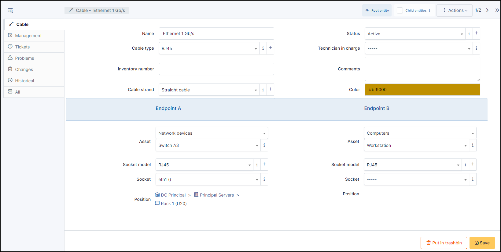
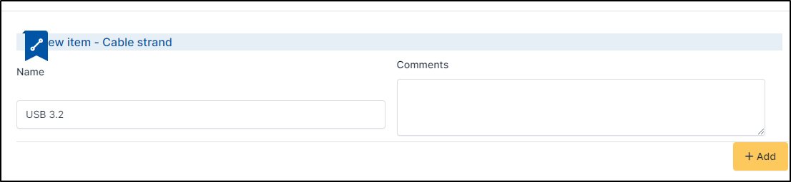

Cables
======

Any type of cable can be managed (ethernet, USB, HDMI, etc.). You can link a cable between 2 devices,
and indicate the physical location where the cable is plugged into a device. You can also create tickets, problems, etc.
from this cable for complete management

Add a cable
-----------

* To add a cable on **+ Add** at the top of the screen,
* Add a :

  * Name
  * `Status <../../../common_fields.html#status>`_
  * `Cable Type <cables.html#id1>`_
  * `Technicien in charge <../../../common_fields.html#technician-in-charge>`_
  * `Inventory number <../../../common_fields.html#inventory-number>`_
  * `Comments <../../../common_fields.html#comments>`_
  * `Cable strand <cables.html#id2>`_
  * `Color <../../../common_fields.html#color>`_

Cable Type
~~~~~~~~~~

You can add the type of cable that links the hardware (USB, ethernet, HDMI, etc.).
* Select the **type of cable** required
* You can create a new one by clicking on **+**

.. note:: You can see the list of cable types in **setup** > **dropdowns** > **cable management**

   .. image:: images/cable-view-type.png
      :alt: manage cable type
      :scale: 100%

Cable Strand
~~~~~~~~~~~~

Enpoint
~~~~~~~

You can link 2 devices together to find out which cable connects them and on which :doc:`socket <../../tabs/sockets>`
To be linked to a socket, it must be specified on the hardware concerned

* To link two material by a cable, select the first object in endpoint A

 * Type of asset
 * The asset
 * The socket model
 * The socket
 * If it is entered for the equipment in question, the position will be added.
 * Do the same with endpoint B

Management
----------

If you have activated them, you can manage :doc:`financial and administrative information <../tabs/management>`

Tickets
-------

This tab lists all the tickets created for this object. You can not link a ticket here or create a new ticket. 
To link a object to a cable, go to Assistance > :doc:`Ticket <../assistance/tickets>`