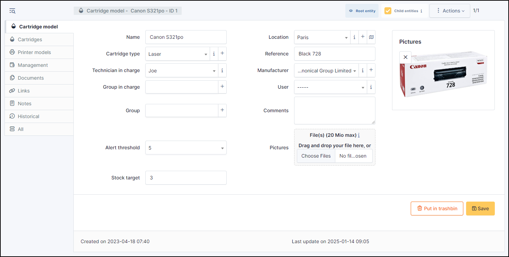

Cartridges
==========

This functionality of `Asset` module allows to create cartridges models and corresponding cartridges.

In a cartridge form, the following information is available:

* Name
* :doc:`Location </tabs/common_fields/location>`
* :doc:`Cartridge type </tabs/common_fields/computer_type>`
* :doc:`Reference </tabs/common_fields/reference>`
* :doc:`Technician in charge </tabs/common_fields/technician_in_charge>`
* :doc:`Manufacturer </tabs/common_fields/manufacturer>`
* :doc:`Group in charge </tabs/common_fields/group_in_charge>`
* :doc:`Comments </tabs/common_fields/comments>`
* :doc:`Alert threshold </tabs/common_fields/alert_threshold>`
* :doc:`Stock target </tabs/common_fields/stock_target>`
* :doc:`Pictures </tabs/common_fields/pictures>`

Cartridges
----------

:doc:`Cartridges <../../tabs/cartridges>` allows adding as many cartridges as needed by the model.
It is also possible to add several cartridges at once.

Printer models
---------------

:doc:`Printer model <../../tabs/printer_models>` allows cartridges to be shared between several compatible printer models

Management
----------

:doc:`Management <../../modules/tabs/management>` of financial and administrative information,
this information is visible in the 'Management' tab on the computer's form.

Documents
---------

The :doc:`document <../management/documents>` tab lets you link different types of file to a material (PDF, txt, png, etc.)
You can attach a document already uploaded to GLPI or add a new one directly from this tab.

Links
-----

:doc:`Links <../configuration/external_links>` offer several possibilities.
Send the GLPI object file to another URL of your choice, or generate an RDP file, for example.

Notes
-----

:doc:`Note </modules/tabs/notes>` lets you add enriched text and attach a document.

Historical
----------

:doc:`Historical <../tabs/historical>` lists all the actions carried out on the object in question

.. include:: ../tabs/all.rst
