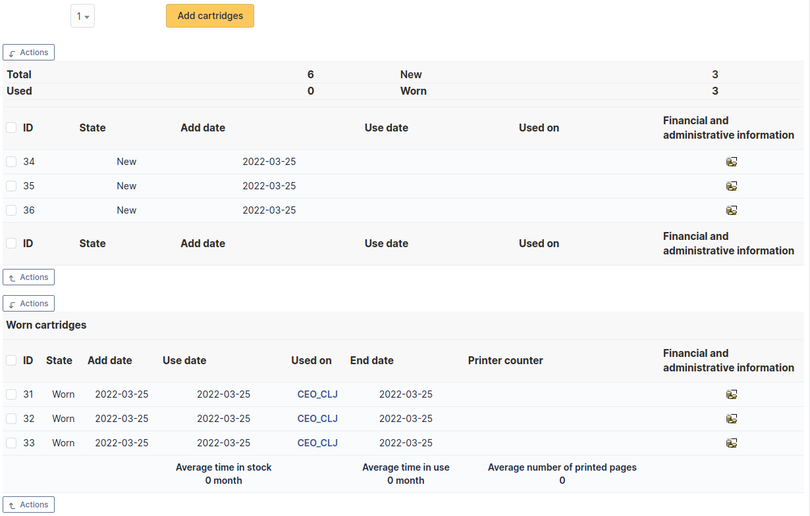

Cartridges
==========

This functionality of `Asset` module allows to create cartridges models and corresponding cartridges.

In a cartridge form, the following information is available:

* General characteristics of the cartridge:

  * Vendor
  * Type
  * Reference
  * ...

* Printer management:

  * Technical person in charge
  * Storage site
  * ...

The alert threshold is the minimal value at which an alert is triggered.
A restock threshold which represents the amount you wish to have in stock after ordering.

For example, you want to have 10 of a certain cartridge in stock but it isn't worth ordering them until you have 2 or less in stock (due to bulk discounts, process overhead, etc).
You can set your alarm threshold to 2 and your restock value to 10.
When you receive the alarm notification, it will let you know what the restock value is and plainly say how many need to be ordered to meet that value (configurable in notification templates).

.. note:: For alerts to be effective, notifications must be activated; see :ref:`notification management <configure_notifications>`.

For a cartridge to be installable on a printer, it must be declared as compatible with this printer.

Management of shared stock is possible by defining the element as recursive on an entity. The elements will then be available for all sub-entities.

The different tabs
------------------

- **Tab "Cartridges"**
  This tab allows adding as many cartridges as needed by the model. It is also possible to add several cartridges at once.

A first table lists the new or unused cartridges, the second table lists used cartridges.

- **Tab "Printer models"**
  This tab allows to declare the printer models that are compatible with the cartridge.

.. include:: ../tabs/management.rst

.. include:: ../tabs/documents.rst

.. include:: ../tabs/external-links.rst

.. include:: ../tabs/notes.rst

.. include:: ../tabs/historical.rst

.. include:: ../tabs/debug.rst

.. include:: ../tabs/all.rst
