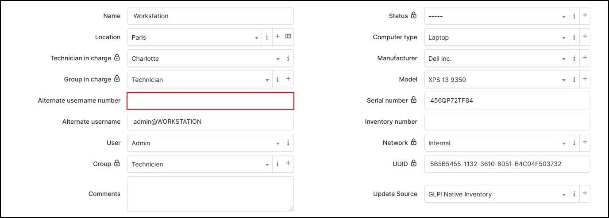
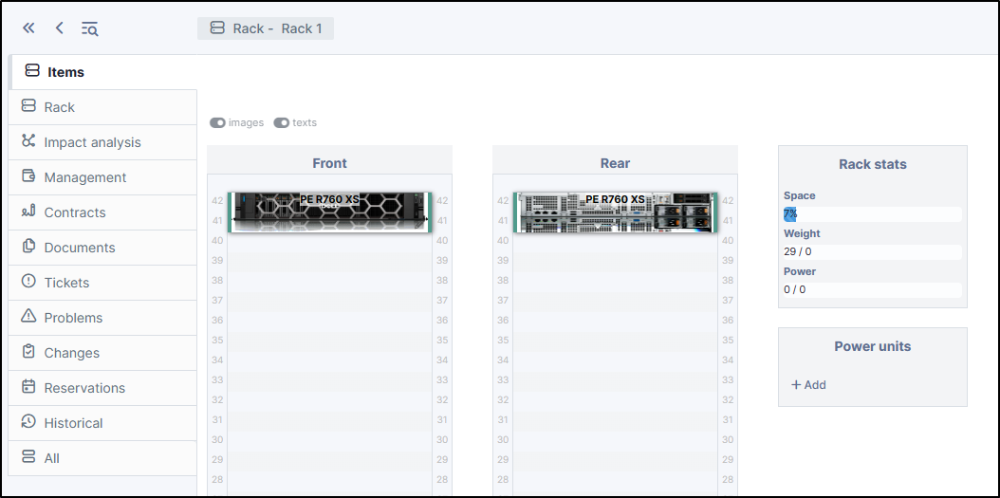

Computers
=========

Each computer has its own information and related hardware (monitor, components, etc.).
All this information is divided into tabs? You can find your computers in **Assets > Computers**:

Computer
--------

Computer tab, includes basic information about the machine :

.. image:: images/computer-view.png
   :alt: module assets - computer
   :align: center
   :scale: 31 %

* Name
* Location
* Technician in charge
* Group in charge
* Alternate usernmame number
* Alternate usernmame
* User
* Group
* Comments
* Status
* Computer type
* Technician in charge
* Manufacturer
* Model
* Serial number
* Inventory numberNetwork
* UUID
* Update source

If your computer has been inventoried by the automatic inventory, you can find informtions about the `Agent GLPI <https://glpi-agent.readthedocs.io/en/latest/>`_

* Agents
* Public contact address
* Agents Status
* Useragent
* Last contact
* Request inventory
* Inventory tag
* Last inventory update

Location
~~~~~~~~

.. image:: images/location.png
   :alt: module assets - location
   :align: center
   :scale: 50%

You can add location manually or dynamically.

.. warning:: Depending on your needs, pay attention to the entity you are in and its recursivity, so that it is visible or not to other entities.

.. Note:: All locations your created here are available for other GLPI objects depending on the entity in which you created it

To add a location **manually** :

If your have already entered locations :

* Select the one that is right for you in the drop-down list.

If you have not previously entered a location :

* Click on **+**
* In the new box, enter the informations that you need :

  * Name
  * Code
  * As child of
  * Postal code
  * state
  * Building number
  * Longitude
  * Latitude
  * Altitude
  * Comments
  * Aliras
  * Address
  * Town
  * Country
  * Room number

* Click **+ Add**
* After saving, you can add a new location or close this window
* Now, select the location for your computer

To add a location **automatically** :

You need to create **location rules** to affect a location to a computer. Before, you need to define the criteria which will trigger the rule (a tag inventory, a subnet, a domain, etc.)
In our example, we're going to create a rule that takes the `inventory tag <https://glpi-agent.readthedocs.io/en/latest/man/glpi-agent.html#execution-mode-options>`_ into account. If the tag is France, then apply the Paris location

* In **administration > Rules > Location Rules**
* Click **+ Add**
* You can add differents informations (name, logical operator, comments, description, active)
.. Warning:: **Logical operator AND / OR**

   - **"OR"** the rule will then apply from the 1st corresponding criterion. It will ignore all subsequent criteria.
   - **"AND"**, on the other hand, will have to take all the criteria into account for the rule to be applied.
* **Active** your rule
* Clik **+ Add**
* In **Criteria**, click **Add a new criterion**
* Select **Agent > Inventory tag**
* Enter **France**
* Click **+ Add**

.. image:: images/add-rule-location-criteria.png
   :alt: module assets - add rule location
   :align: center
   :scale: 48%

* In **Actions** tab, click **Add a new action**
* Select the location to assign
* Click **+ Add**

.. image:: images/add-rule-location-action.png
   :alt: module assets - add rule location
   :align: center
   :scale: 48%

You can test the rule location by clicking on **Test rules engines** in **Administration > Locations rules**

Technician in charge
~~~~~~~~~~~~~~~~~~~~

A technician in charge can modify the information of the computer and his elements (status, computer type, etc.)

.. Note:: A technician is a person with a technician profile or higher

- In **Technician in charge** tab, select the technician you require.

.. image:: images/asset-technician-in-charge-1.png
   :alt: module assets - technician in charge
   :align: center
   :scale: 51%

A technician in charge can see the material that he can manage in **Administration > Users** in the **managed items** in the user file

.. image:: images/asset-technician-in-charge.png
   :alt: module assets - technician in charge user file
   :align: center
   :scale: 44%

Group in charge
~~~~~~~~~~~~~~~

A group in charge can modify the information of the computer and his elements (status, computer type, etc.)

- To create a group, click on **+ Add**
- If it's necessary, check the box **Child entities** (this group will be visible in the sub-entity of the one you are in)
- Enter a **Name**
- A **Code** (optionnal)
- Choose if this group is **Child of**
- Select yes or no to **Recursive membership** (if enabled, members of this group will also become implicit members of its children groups)
- You can define whether this group can be **visible in a ticket** (as a requester, observer, assigned to, task, can be notified)
- Define if the group can be a **manager in a project**
- Select if this group **can contain** **Items** and/or **Users**
- Click **+ Add**

- In this window, you need to add users. In **Users** tab, select those you wish to associate with the group (prefer users with a technical or higher profile)

.. image:: images/add-users-in-group-charge.png
   :alt: module assets - add user in group in charge
   :align: center
   :scale: 43%

1. Select **user**
2. Define it this user can be **Manage** group (add/modify memebers, name, etc.)
3. whether or not to authorise **Delegatee** rights (can open ticket for the group)
4. **Add** your group

Once the group has been created, you can add another or select it from the drop-down list.

.. Note:: If you cant another option with groups, see :doc:`../administration/groups`

Alternate username number
~~~~~~~~~~~~~~~~~~~~~~~~~

In this field, you can manually enter a user identification number. This field is not updated by the inventory.

Alternate username
~~~~~~~~~~~~~~~~~~

The alternate username is a field returned by the inventory. It is filled in by the user who opened the session on the machine concerned.
This field can be updated if, during the next inventory, another user logs on to the machine.It takes the form ``user@machine_name``. This field can be changed manually,
but it will be locked (by default) to prevent it being updated at a later date. See the article on :doc:`locks`

.. image:: images/alternate-username.png
   :alt: module assets - alternate username number
   :align: center
   :scale: 51%

User
~~~~

If the user who opened the session on the machine is also present in the GLPI database (either in the internal database or any other external data source),
this field will be filled in. It will remain empty if the user does not exist in the database. You can add a user manually
but it will be locked (by default) to prevent it being updated at a later date. See the article on :doc:`locks`

.. image:: images/user.png
   :alt: module assets - user
   :align: center
   :scale: 51%

Group
~~~~~
You can add a group manually or create a group directly by this field.

- To create a group, click on **+ Add**
- If it's necessary, check the box **Child entities** (this group will be visible in the sub-entity of the one you are in)
- Enter a **Name**
- A **Code** (optionnal)
- Choose if this group is **Child of**
- Select yes or no to **Recursive membership** (if enabled, members of this group will also become implicit members of its children groups)
- You can define whether this group can be **visible in a ticket** (as a requester, observer, assigned to, task, can be notified)
- Define if the group can be a **manager in a project**
- Select if this group **can contain** **Items** and/or **Users**
- Click **+ Add**

- In this window, you need to add users. In **Users** tab, select those you wish to associate with the group (prefer users with a technical or higher profile)

.. image:: images/add-users-in-group.png
   :alt: module assets - add user in group in charge
   :align: center
   :scale: 43%

1. Select **user**
2. Define it this user can be **Manage** group (add/modify memebers, name, etc.)
3. whether or not to authorise **Delegatee** rights (can open ticket for the group)
4. **Add** your group

Once the group has been created, you can add another or select it from the drop-down list.

Comments
~~~~~~~~

It's just a text field in which you can indicate what you want.

Status
~~~~~~

The status provides information about the state of the machine.
By default, there is no status. You can create as many statuses as you like, which can be used by rules.

.. Note:: some plugins may add statuses such as `Uninstall <https://glpi-plugins.readthedocs.io/en/latest/uninstall/index.html>`_

* To create a status, click on **+**
* If it's necessary, check the box **Child entities** (this status will be visible in the sub-entity of the one you are in)
* Add a **Name** (the one that will appear on the computer's file)
* Choose if this status is **Child of**
* Define if the **item with this status can be showed in assistance**
* Select the visibility of the status in :

  * Computers
  * Monitors
  * Network devices
  * Devices
  * Phones
  * Printers
  * Licences
  * Certificates
  * Enclosures
  * PDUs
  * Lines
  * Racks
  * Versions
  * Clusters
  * Contracts
  * Appliances
  * Database instances
  * Cables
  * Unmanaged devices
  * Passivces devices
  * System board items
  * Firmware items
  * Processor items
  * Memory items
  * Hard drive items
  * Network card items
  * Drive items
  * Battery items
  * Graphical card items
  * Soudncard items
  * Controller items
  * PCI device items
  * Case items
  * Power supply items
  * Generic device items
  * Simcar items
  * Sensor items
  * Camera items

* Click **+ Add**

Once the status has been created, you can add another or select it from the drop-down list.

Computer type
~~~~~~~~~~~~~

The type of computer allows you to specify whether the machine is a laptop, a server, a workstation, etc.
There is no predefined type; the different types must be created.

.. image:: images/computer-type.png
   :alt: module assets - computer-type
   :align: center
   :scale: 50%

- To create a **computer type**, click **+**
- Enter a **Name**
- Enter a comment if it's necessary
- Click **+ Add**

The computer will be available for all entities. You can use **templates** or **rules** with computer type

.. image:: images/add-computer-type.png
   :alt: module assets - computer-type
   :align: center
   :scale: 64%

Manufacturer
~~~~~~~~~~~~~

Manufacturers are automatically retrieved by the automatic inventory and assigned to the computer. you can also create/add them manually.

- To create a manufacturer, click **+**
- Add a **Name**
- You can add a registrered ID issued by `PCI-SIG <https://pcisig.com/developers/integrators-list>`_ for USB or/and PCI. You can add more by clicking **+**.

Once the manufacturer has been created, you can add another or select it from the drop-down list.

.. image:: images/add-manufacturer.png
   :alt: module assets - add computer manufacturer
   :align: center
   :scale: 63%

Model
~~~~~

When the inventory is uploaded, the template field is filled in automatically. You can also create/add templates manually.
Modeles can also be used by templates and rules.

- To create a model, click **+**
- Add a **Name**
- Add a **Product number** if it's necessary
- You can specify the **Weight** and the **Depth**, the **Required units** (in the case of a rack server)
- You can indicate the **Power connections** and the **Power consumption**
- Indicate whether it is a half rack
- Add pictures (front, rear, other)

Example with picture :

If you insert a machine with photos in a rack, the photos will be visible in that rack

Example of a server in a rack with photo :

Serial number
~~~~~~~~~~~~~

This information is automatically retrieved by the automatic inventory. You can add/modify this information manually. By default, if you add or modify this field
it will be locked, the automatic inventory will not modify this information. You can unlock the field.

Inventory number
~~~~~~~~~~~~~~~~

**Inventory number** is information added manually. It is generally managed internally by the company.

Network
~~~~~~~

**Network** is information added manually. you can pre-fill this information using a template.

- To create a network, click **+**
- Enter a **Name**
- Enter a **Comment** (optionnal)
- Click **+ Add**
- You can add another one or close this window
- Then select the network you want from the drop-down list

UUID
~~~~

The **UUID** (Universally Unique IDentifier) is automatically update by the automatic inventory. This UUID is the unique identifier of the motherboard.
You can add/modify this information manually. By default, if you add or modify this field it will be locked, the automatic inventory will not modify this information. You can unlock the field.

You can retrieve this value using :

- Linux : ``dmidecode``
- Winodws : ``wmic path win32_computersystemproduct get uuid``
- MAC : **Apple Logo > About This MAC > System report > Hardware UUID**

Update source
~~~~~~~~~~~~~

Update source is the way in which the machine has been incremented in the inventory.
If it was done by the agent, GLPI Native Inventory will be indicated. For a manual entry, this field will remain empty. You can add manual sources

.. image:: images/update-source.png
   :alt: module assets - update source
   :align: center
   :scale: 50%

- To create update source, click **+**
- Enter a **Name**
- Enter a comment (optionnal)
- Close the window and select the value in the drop-down list

Impact Analysis
---------------

Impact analysis enables an infrastructure diagram to be drawn up, showing the dependencies and impacts in the event of equipment loss.
This can be saved and exported

.. Note:: We'll take a simple example. A router is connected to a switch to which a rack containing a server is attached.

   .. image:: images/analysis_impact-1.png
      :alt: module assets - example analysis imapct
      :align: center
      :scale: 60%

Notions
~~~~~~~

2 concepts need to be understood:

- **Impact**: represented by default by a red arrow. If this element encounters a problem, it will impact all linked elements.
- **Dependency**: represented by default by a blue arrow. A dependency is an element which will be directly affected by the impact. A dependency does not necessarily affect the elements linked to it.

.. Note:: An important element to understand is that you need to place yourself in the context of the element in question. If you select a switch, the impacts and dependencies will be different if you select an element linked to the switch.

Create an impact analysis
~~~~~~~~~~~~~~~~~~~~~~~~~

Your equipment must be powered up before you can use the impact analysis.

If we go back to our example given above, we'll start from the 1st item, i.e. the router.

- Go to **Assets > Network devices**
- Select the network hardware you require
- In the **impact analysis** tab, the hardware you are on will appear
- On the right-hand bar, click on **+**
- The list of categories appears, choose the one that suits you (here network hardware to link our switch to our router)
- Drag and drop the hardware you want.
- Do the same with all the hardware you want

You'll get a result like this (depending on how you've placed your items)

Adding links
~~~~~~~~~~~~

Now that our materials have been placed, we need to add the links in order to check their impact and dependencies (or both).

- From the right-hand menu, click on the icon **diagonal line**
- Your mouse will then appear with a **+**
- Hold your mouse over the 1st element, and release the mouse over the element to be linked.
- Repeat the operation for all the desired elements

.. image:: images/analysis_impact-1.png
   :alt: module assets - add connection
   :align: center
   :scale: 62%

Explanation of links
~~~~~~~~~~~~~~~~~~~~

As mentioned above, you need to understand the context of the selected element. What we see in the diagram above is that all the links are in red. This means that if the router were to fail, all the following elements would be affected.

If we position ourselves on **Rack 1**, the behaviour will not be the same:

.. image:: images/analysis_impact-3.png
   :alt: module assets - explain connection
   :align: center
   :scale: 42%

In this example, **from the point of view of Rack 1**, the only hardware that would impact the infrastructure if it were to fail is **SRV-GLPI**.
**Rack 1** depends on **Router EDGE-51** and **Switch A3**. They are in blue (dependency) because they would not be impacted if Rack 1 were to experience a problem.

Dependency and impact on the same hardware
~~~~~~~~~~~~~~~~~~~~~~~~~~~~~~~~~~~~~~~~~~

We can add a router to our example, which will be linked to the 1st original router:

- To do this, create a relationship in one direction and then in the other using the **diagonal line** option seen above.

The purple arrows mean that they are dependent on each other and that they would both be affected if one of them were to encounter a problem. They are therefore both dependent and impacted.

No impact
~~~~~~~~~

There is one last type of link, those that have no dependency or impact:

.. image:: images/analysis_impact-5.png
   :alt: module assets - No impact
   :align: center
   :scale: 43%

The black arrows mean that from the element you are on, there will be no imapct if that element were to fail. In our example, we are on **Rack 1**. This does not communicate with **Rack 2**, so there will be no dependency or impact in the event of a failure.

Groups
~~~~~~

Groups can be created using the :fontawesome-regular-object-group: icon in the right-hand menu.

Groups allow you to see all the elements that depend on another piece of equipment. You can create a name for the group and choose a background colour.

.. image:: images/analysis_impact-6.png
   :alt: module assets - Groups
   :align: center
   :scale: 47%

To delete a group, right-click on it and select delete. This only deletes the group, not the items it contains.

Save your imapct analysis
~~~~~~~~~~~~~~~~~~~~~~~~~

Remember to save your project with the **floppy** icon

Deleting elements
~~~~~~~~~~~~~~~~~

You can delete an element using **trashbin** icon. This deletes the element and the link.

Download your project
~~~~~~~~~~~~~~~~~~~~~

You can download your impact analysis using the **downloading** icon. The download format is PNG.

Enlarge your analysis
~~~~~~~~~~~~~~~~~~~~~

Use the **maximize** icon to make your analysis full screen.

You can also use your mouse wheel to zoom in and out.

Link configuration
~~~~~~~~~~~~~~~~~~

You can configure certain options using the **adjustments** icon:

Visibility
~~~~~~~~~~

In visibility, you can choose to show only impacts and/or dependencies.

Colours
~~~~~~~

In the colours tab, you can change the colours of dependencies, impacts and impacts and dependencies.

Maximum depth
~~~~~~~~~~~~~

The maximum depth is the number of elements that can be displayed on your imapct analysis. If you select "infinity", there will be no display limit.

Operating system
----------------

Operating system includes information about your machine's OS :

* Name
* Architecture
* Kernel
* Product ID
* Company
* Installation date
* Version
* Service pack
* Edition
* Serial number
* Owner
* Host ID

Components
----------

This tab lists the PC's components :

* BIOS
* Processor
* Memory
* Hard Drive
* Network card
* Drive
* Battery
* Graphics card
* Soundcard
* Controller

Each item has its own information (name, model, brand, memory capacity, number of cores/threads, etc.).

Lines
-----

You can add telephone lines created in :doc:`Lines <../management/lines>`

Volumes
-------

Summarises all the volumes present (hard disk, DVD) as well as the partitions present on the workstation
(virtual disks such as Google Cloud may appear if they are installed as a network drive).

* Name
* Automatic inventory (Yes /No)
* partition
* Mount point
* File system
* Global size
* Free size
* Free percentage
* Encryptation (if the disk is encrypted, a padlock will be displayed)

Software
--------

Lists all the applications brought up during the inventory and those added manually

**-------------------OLD DOCUMENTATION-----------------**

In a computer form, the following information is available:

* Operating system:

  * Name
  * Version
  * Service pack
  * Serial number
  * Product ID
  * ...

* General characteristics:

  * Manufacturer
  * Model
  * Type
  * Serial number
  * ...

* Management information:

  * Technical manager
  * Status
  * Location
  * ...

* Users:

  * Computer users, either known by GLPI or not

Other fields are informative, such as `Network` (connexion type) and `Update source` (where are computer updates coming from (Windows update, yum, apt...).

It is possible to use :doc:`templates with computers <../overview/templates>`.

.. note::

   * when GLPI is used with an inventory tool, various information provided by the tool itself are also available
   * a computer can be a server, a desktop computer or a laptop; to differentiate them, it is possible to use the `type` field

The different tabs
------------------

.. include:: tabs/os.rst

.. include:: tabs/components.rst

.. include:: tabs/volumes.rst

.. include:: tabs/softwares.rst

.. include:: tabs/connexions.rst

.. include:: tabs/network-ports.rst

.. include:: ../tabs/management.rst

.. include:: ../tabs/contracts.rst

.. include:: ../tabs/documents.rst

.. include:: tabs/virtualization.rst

.. include:: tabs/antivirus.rst

.. include:: ../tabs/tickets.rst

.. include:: ../tabs/problems.rst

.. include:: ../tabs/changes.rst

.. include:: ../tabs/external-links.rst

.. include:: ../tabs/notes.rst

.. todo::
   Fix this reference (include or link???)
   **[Onglet "Réservations"](Les_différents_onglets/Onglet_Réservations.rst)**
   Gestion des réservations pour un objet d'inventaire

.. include:: ../tabs/historical.rst

.. include:: ../tabs/debug.rst

.. include:: ../tabs/all.rst

The different actions
---------------------

Apart from :doc:`common actions <../overview/actions>`, some actions are specific to computers:

* **Install a software with a license on a computer**
  From the tab *Softwares*, add a license by choosing the name of the software followed by the name of the license.
  From the *Mass actions* of summary table, choose **Install**

.. warning::

   A software can only be installed if its license has a version in use or a purchase version.
