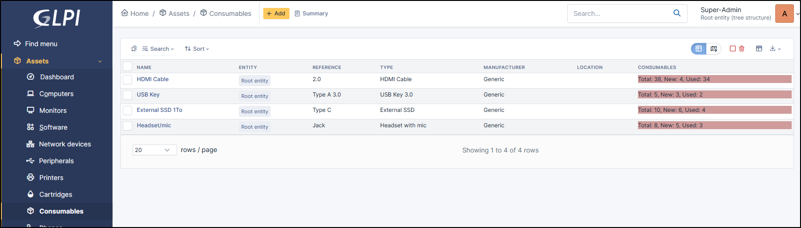

Consumables
===========

Consumables are items relating to resources or supplies intended to be used, loaned or entrusted as part of maintenance operations
or the day-to-day running of an IT estate.
These consumables generally include items such as USB sticks, HDMI cables or spare parts for hardware.

Apart from :doc:`common actions <../overview/actions>`, some actions are specific to consumables:

* :ref:`Add new consumables to a model <add-consumables-model>` ;
* List allocated consumables:
  The *Summary* menu button allows you to see a summary of allocated consumables

In a consumable form, the following information is available:

.. note:: Consumables cannot be managed by the agent or automatic inventory

* Name
* :doc:`Consumable type </tabs/consumable_type>`
* :doc:`Technician in charge </tabs/common_fields/technician_in_charge>`
* :doc:`Group in charge </tabs/common_fields/group_in_charge>`
* :doc:`User </tabs/common_fields/user>`
* :doc:`Comments </tabs/common_fields/comments>`
* :doc:`Picture </tabs/common_fields/pictures>`
* :doc:`Location </tabs/common_fields/location>`
* :doc:`Reference </tabs/common_fields/reference>`
* :doc:`Manufacturer </tabs/common_fields/manufacturer>`
* :doc:`Inventory number </tabs/common_fields/inventory_number>`
* :doc:`Group </tabs/common_fields/group>`
* :doc:`Alert threshold <tabs/common_fields/alert_threshold>`
* :doc:`Stock target </tabs/common_fields/stock_target>`

Consumables
-----------

In the :doc:`Consumables <../../tabs/consumables>` tab, you can manage the quantities of consumables, allocate them to users/groups,
put them back into stock, etc.

Management
----------

:doc:`Management <../../modules/tabs/management>` of financial and administrative information,
this information is visible in the 'Management' tab on the computer's form.

Documents
---------

The :doc:`document <../management/documents>` tab lets you link different types of file to a material (PDF, txt, png, etc.)
You can attach a document already uploaded to GLPI or add a new one directly from this tab.

Links
-----

:doc:`Links <../configuration/external_links>` offer several possibilities.
Send the GLPI object file to another URL of your choice, or generate an RDP file, for example.

Notes
-----

:doc:`Note </modules/tabs/notes>` lets you add enriched text and attach a document.

Historical
----------

:doc:`Historical <../tabs/historical>` lists all the actions carried out on the object in question

.. include:: ../tabs/all.rst
