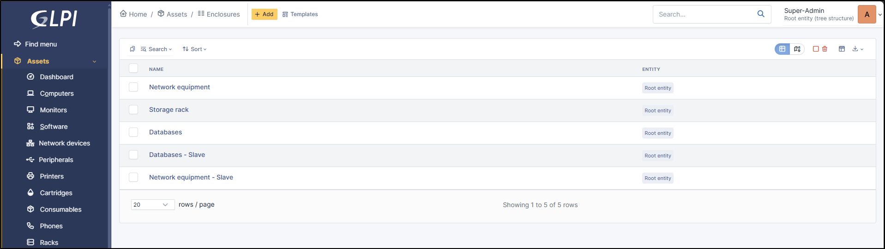

Enclosures
==========

In GLPI, an enclosure is a type of equipment used to manage modular infrastructures, such as blade servers, storage bays or certain network equipment.

It enables several physical elements to be grouped together in the same box, while retaining individual management of the components.

.. note:: It is possible to use :doc:`templates with enclosure <../overview/templates>`.

When you add an enclosure (by **+ Add** at the top of the screen), you can add certain information:

* Name
* :doc:`Location </tabs/common_fields/location>`
* :doc:`Technician in charge </tabs/common_fields/technician_in_charge>`
* :doc:`Manufacturer </tabs/common_fields/manufacturer>`
* :doc:`Serial number </tabs/common_fields/serial_number>`
* :doc:`User </tabs/common_fields/user>`
* Power Supplies (number of power supplies)

* :doc:`Status </tabs/common_fields/status>`
* :doc:`Technician in charge </tabs/common_fields/technician_in_charge>`
* :doc:`Model </tabs/common_fields/model>`
* :doc:`Inventory number </tabs/common_fields/inventory_number>`
* :doc:`Comments </tabs/common_fields/comments>`

Impact Analysis
---------------

:doc:`Impact analysis <../../tabs/impact_analysis>` enables an infrastructure diagram to be drawn up, showing the dependencies and impacts in the event of equipment loss.
This can be saved and exported

Items
-----

:doc:`Items <tabs/items>` lists all the elements present in the chassis. This operation must be carried out manually.

Components
----------

Enclosure has specific :doc:`Setup > Components <../../configuration/components>` compared with other equipment since this is rather passive equipment that contains no software, firmware, etc.

You can add a :

* Generic device
* PCI device
* Power supply.

Network Ports
-------------

This tab allows to manage the :doc:`network ports <../../tabs/network_ports>` attached to an equipment.
The information that can be viewed is:

* Name
* Port number
* MTU
* Speed
* Internal status
* Last change
* Number of I/O bytes
* Number of I/O errors
* Duplex
* VLAN
* Connected to
* Connection
* Deleted

Management
----------

:doc:`Management <../../modules/tabs/management>` of financial and administrative information, this information is visible in the 'Management' tab on the computer's form.

Contracts
---------

GLPI supports :doc:`contracts <../management/contract>` management, in order to manage contract types such as loan, maintenance, support...

Contracts management allows to:

* make an inventory of all contracts related to the organization assets
* integrate contracts in GLPI financial management
* anticipate and follow contract renewal.

Documents
---------

The :doc:`document <../management/documents>` tab lets you link different types of file to a material (PDF, txt, png, etc.)
You can attach a document already uploaded to GLPI or add a new one directly from this tab.

Tickets
-------

View all :doc:`tickets <../tabs/tickets>` linked to the computer

Problems
--------

This tab refers to all hardware-related :doc:`problems <../assistance/problems>`.
Problems can also be linked to tickets, projects, etc. This allows you to have a complete scenario when necessary.

Changes
-------

:doc:`Changes <../assistance/changes>` lists all changes related to a material. From this tab, you can't link a change directly, you can do it from **Assistance** > **Changes** > **Items**.
You can create a new change from this page, which will be linked to the material you have selected.

.. include:: ../tabs/historical.rst

.. include:: ../tabs/all.rst

