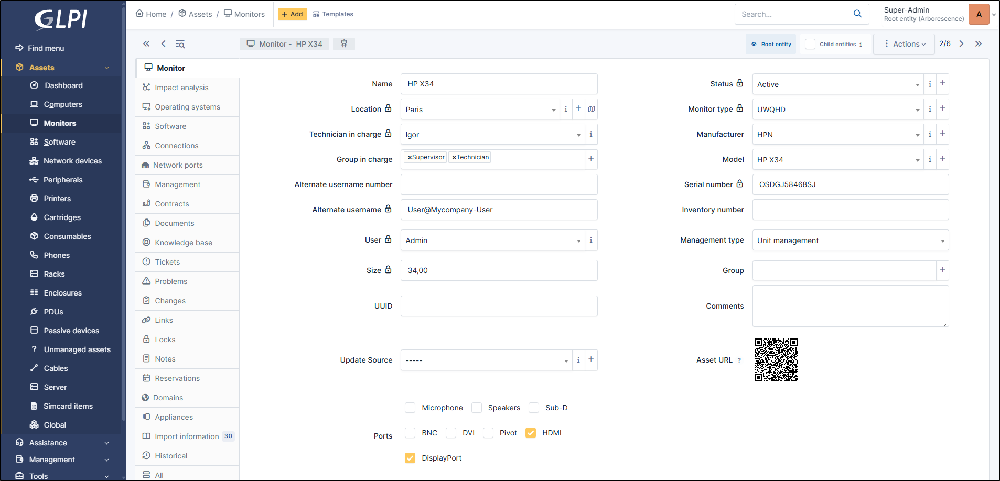

Monitors
========

Each monitor has its own information (connections, contrats, network ports, etc.).
All this information is divided into tabs. You can find your computers in **Assets > Monitors**:

In a display form, the following information is available:

* Name
* :doc:`Location </tabs/common_fields/location>`
* :doc:`Technician in charge </tabs/common_fields/technician_in_charge>`
* :doc:`Group in charge </tabs/common_fields/group_in_charge>`
* :doc:`Alternate usernmame number </tabs/common_fields/alternate_username>`
* :doc:`Alternate usernmame </tabs/common_fields/alternate_user>`
* :doc:`User </tabs/common_fields/user>`
* :doc:`Group </tabs/common_fields/group>`
* Size
* :doc:`UUID </tabs/common_fields/uuid>`
* :doc:`Update source </tabs/common_fields/update_source>`
* :doc:`Status </tabs/common_fields/status>`
* :doc:`Monitor type </tabs/common_fields/monitor_type>`
* :doc:`Manufacturer </tabs/common_fields/manufacturer>`
* :doc:`Model </tabs/common_fields/model>`
* :doc:`Serial number </tabs/common_fields/serial_number>`
* :doc:`Inventory number </tabs/common_fields/inventory_number>`
* :doc:`Network </tabs/common_fields/network>`
* :doc:`Management type </tabs/common_fields/management_type>`
* :doc:`Comments </tabs/common_fields/comments>`
* :doc:`Ports </tabs/common_fields/ports>`

**Management type:**

It is possible to manage displays either unitary or globally.

Unitary management corresponds to one display per computer while global management make the printer a virtual global element that will be connected to several computers.

Global management allows to limit the number of elements to manage when these elements are not a strategic data in the assets management.

It is possible to use :doc:`templates with displays <../overview/templates>`.

Impact Analysis
---------------

:doc:`Impact analysis <../../tabs/impact_analysis>` enables an infrastructure diagram to be drawn up, showing the dependencies and impacts in the event of equipment loss.
This can be saved and exported

Operating systems
----------------

:doc:`Operating systems <../../tabs/operating_systems>`  includes information about your machine's OS :

* Name
* Version
* Architecture
* Service Pack
* Kernel
* Edition
* Product ID
* Serial number
* Company
* Owner
* Host ID
* Installation date

Software
--------

Lists all the :doc:`software <../../tabs/software>` brought up during the inventory and those added manually

It is possible to install (in the logical sense) software on a PC manually.

To add new :doc:`software <../../modules/assets/softwares>`  to the list of applications, you need to go to the Assets > Software tab,
which will then be visible from the software tab of the various elements of the installed base.

Connections
-----------

The :doc:`connections <../../tabs/connections>`  are all the other hardware connected to the machine :

* `Computer <computer.html>`_
* Other asset you have created

These items can be updated by the automatic inventory, but you can also connect them manually.

Network Ports
-------------

This tab allows to manage the :doc:`network ports <../../tabs/network_ports>` attached to an equipment.
The information that can be viewed is:

* Name
* Port number
* MTU
* Speed
* Internal status
* Last change
* Number of I/O bytes
* Number of I/O erros
* Duplex
* VLAN
* Connected to
* Connection
* Deleted

Management
----------

:doc:`Management <../../modules/tabs/management>` of financial and administrative information, this information is visible in the 'Management' tab on the computer's form.

Contracts
---------

GLPI supports :doc:`contracts <../management/contract>` management, in order to manage contract types such as loan, maintenance, support...

Contracts management allows to:

* make an inventory of all contracts related to the organization assets
* integrate contracts in GLPI financial management
* anticipate and follow contract renewal.

Documents
---------

The :doc:`document <../management/documents>` tab lets you link different types of file to a material (PDF, txt, png, etc.)
You can attach a document already uploaded to GLPI or add a new one directly from this tab.

Knowledge Base
--------------

Lists all the articles in the :doc:`knowledge base <../../tabs/knowledgebase>` relating to the material.

Tickets
-------

View all :doc:`tickets <../tabs/tickets>` linked to the computer

Problems
--------

This tab refers to all hardware-related :doc:`problems <../assistance/problems>`.
Problems can also be linked to tickets, projects, etc. This allows you to have a complete scenario when necessary.

Changes
-------

:doc:`Changes <../assistance/changes>` lists all changes related to a material. From this tab, you can't link a change directly, you can do it from **Assistance** > **Changes** > **Items**.
You can create a new change from this page, which will be linked to the material you have selected.

Links
-----

:doc:`Links <../configuration/external_links>` offer several possibilities. Send the GLPI object file to another URL of your choice, or generate an RDP file, for example.

Locks
-----

:doc:`Locks </modules/assets/tabs/locks>` are used to prevent a field from being modified when the inventory is uploaded.
You can lock/unlock the fields you wish in a GLPI object.

Notes
-----

:doc:`Note </modules/tabs/notes>` lets you add enriched text and attach a document.

Reservations
------------

The :doc:`reservation </modules/tools/reservations>` tab lets you reserve equipment, view the reservation schedule, or cancel the possibility of reserving this equipment.
By default, equipment cannot be reserved; you must first authorize this action manually.

Domains
-------

You can attach :doc:`Domains </modules/management/domains>` to your computer. Domains are also linked to other objects such as records, problems, etc.

Appliances
----------

:doc:`Appliances </modules/management/appliance>` includes all business applications managed within GLPI.
They can be linked to another GLPI object (computer, application, etc.) as well as to another appliance.

Databases
---------

:ref:`Databases </modules/management/databases>` list databases discovered by automatic inventory and those entered manually

Import information
------------------

Import information is information that is uploaded and governed by equipment import rules
(administration > rules > Rules for import and link equipments)

The different actions
---------------------

Apart from :doc:`common actions <../overview/actions>`, some actions are specific to displays:

* :doc:`connect a display to a monitor <../../commontabs/item_connexions>`
