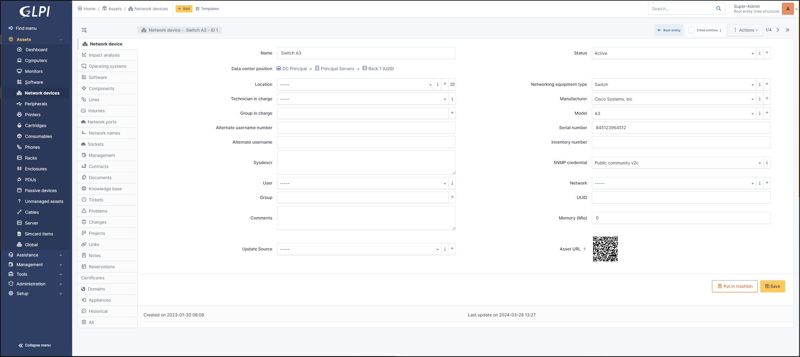

Network equipments
==================

Network equipment represent the hardware that manages, transmits and route network between several other equipments (computers, printers...).

A network equipment can be a switch, an Ethernet hub, a router, a firewall or a WiFi access point.

It is possible to use :doc:`templates with network equipments <../overview/templates>`.

.. tip:: Note that if you modify a field manually, it will be considered locked.
          This will prevent it from being modified the next time the automatic inventory is uploaded.

          For more information, see :doc:`lock </modules/configuration/locks>`

Network device
--------------

Network device tab, includes basic information about the material :

* Name
* :doc:`Data center position </tabs/common_fields/location>`
* :doc:`Location </tabs/common_fields/data_center_position>`
* :doc:`Technician in charge </tabs/common_fields/technician_in_charge>`
* :doc:`Group in charge </tabs/common_fields/group_in_charge>`
* :doc:`Alternate usernmame number </tabs/common_fields/alternate_username>`
* :doc:`Alternate usernmame </tabs/common_fields/alternate_user>`
* :doc:`User </tabs/common_fields/user>`
* :doc:`Group </tabs/common_fields/group>`
* :doc:`Comments </tabs/common_fields/comments>`
* :doc:`Status </tabs/common_fields/status>`
* :doc:`Computer type </tabs/common_fields/computer_type>`
* :doc:`Manufacturer </tabs/common_fields/manufacturer>`
* :doc:`Model </tabs/common_fields/model>`
* :doc:`Serial number </tabs/common_fields/serial_number>`
* :doc:`Inventory number </tabs/common_fields/inventory_number>`
* :doc:`Network </tabs/common_fields/network>`
* :doc:`UUID </tabs/common_fields/uuid>`
* :doc:`Update source </tabs/common_fields/update_source>`

If your computer has been inventoried by the automatic inventory, you can find informtions about the `Agent GLPI <https://glpi-agent.readthedocs.io/en/latest/>`_

* Agents
* Public contact address
* Agents Status
* Useragent
* Last contact
* Request inventory
* Inventory tag
* Last inventory update

Impact Analysis
---------------

:doc:`Impact analysis <../../tabs/impact_analysis>` enables an infrastructure diagram to be drawn up, showing the dependencies and impacts in the event of equipment loss.
This can be saved and exported

Operating systems
----------------

:doc:`Operating systems <../../tabs/operating_systems>`  includes information about your machine's OS :

* Name
* Version
* Architecture
* Service Pack
* Kernel
* Edition
* Product ID
* Serial number
* Company
* Owner
* Host ID
* Installation date

Software
--------

Lists all the :doc:`software <../../tabs/software>` brought up during the inventory and those added manually

It is possible to install (in the logical sense) software on a device manually.

To add new :doc:`software <../../modules/assets/softwares>`  to the list of applications, you need to go to the *Assets > Software* tab,
which will then be visible from the software tab of the various elements of the installed base.

Components
----------

This tab lists the PC's :doc:`compenents <../../tabs/components>` :

* BIOS
* Processor
* Memory
* Hard Drive
* Network card
* Drive
* Battery
* Graphics card
* Soundcard
* Controller

Each item has its :doc:`own information <../../tabs/components>` (name, model, brand, memory capacity, number of cores/threads, etc.).

Lines
-----

You can add telephone lines created in `Lines <../management/lines.html>`_

Volumes
-------

Summarises all the :doc:`volumes <../../tabs/volume>` present (hard disk, DVD) as well as the partitions present on the workstation
(virtual disks such as Google Cloud may appear if they are installed as a network drive).

* Name
* Automatic inventory (Yes /No)
* partition
* Mount point
* File system
* Global size
* Free size
* Free percentage
* Encryptation (if the disk is encrypted, a padlock will be displayed)

Network Ports
-------------

This tab allows to manage the :doc:`network ports <../../tabs/network_ports>` attached to an equipment.
The information that can be viewed is:

* Name
* Port number
* MTU
* Speed
* Internal status
* Last change
* Number of I/O bytes
* Number of I/O erros
* Duplex
* VLAN
* Connected to
* Connection
* Deleted

Network Name
------------

:doc:`Network names <tabs/network_name>` are used to organise and identify network devices in a more structured way.
They usually appear as a dropdown list and are useful for defining specific network categories or contexts.

The visible fields are :

* Network name
* IP addresses
* IP networks

The different tabs
------------------

.. include:: tabs/components.rst

.. include:: tabs/network-ports.rst

- **Tab "Network names"**
  Summary of IP address and IP networks for each network name

.. include:: ../tabs/management.rst

.. include:: ../tabs/contracts.rst

.. include:: ../tabs/documents.rst

.. include:: ../tabs/tickets.rst

.. include:: ../tabs/problems.rst

.. include:: ../tabs/external-links.rst

.. include:: ../tabs/notes.rst

.. todo::
   Fix this reference (include or link???)
   **[Tab "Reservations"](Les_différents_onglets/Onglet_Réservations.rst)**
   Management of reservations for an inventory object

.. include:: ../tabs/historical.rst

.. include:: ../tabs/debug.rst

.. include:: ../tabs/all.rst

The different actions
---------------------

Network equipments do not have specific actions; report to :doc:`common actions <../overview/actions>`.
