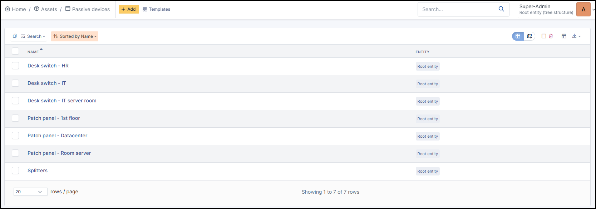
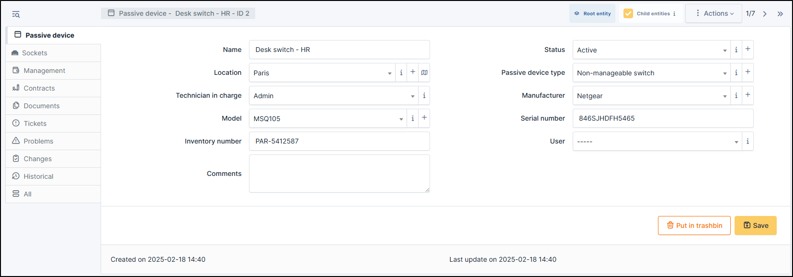

Passives devices
================

Passives peripherals list equipment that does not actively process data but plays an essential role in the IT infrastructure,
often for connectivity or signal transmission (like a patch panel, a non-manageable swith, etc.)

.. note:: Passives devices cannot be added to the automatic inventory.

.. note:: It is possible to use :doc:`templates with passives devices <../overview/templates>`.

In a passive device form, the following information is available:

* Name
* :doc:`Location </tabs/common_fields/location>`
* :doc:`Technician in charge </tabs/common_fields/technician_in_charge>`
* :doc:`Model </tabs/common_fields/model>`
* :doc:`Inventory number </tabs/common_fields/inventory_number>`
* :doc:`Comments </tabs/common_fields/comments>`
* :doc:`Status </tabs/common_fields/status>`
* :doc:`Passive device type </tabs/common_fields/asset_type>`
* :doc:`Manufacturer </tabs/common_fields/manufacturer>`
* :doc:`Serial number </tabs/common_fields/serial_number>`
* :doc:`User </tabs/common_fields/user>`

Sockets
-------

:doc:`Sockets <../../tabs/sockets>` are the list of physical sockets present on the hardware. These sockets can be Ethernet, USB, HDMI, etc.

It enables hardware to be linked by cables. Socket is also linked to the :doc:`cables <../modules/assets/cables>` object

Management
----------

:doc:`Management <../../modules/tabs/management>` of financial and administrative information, this information is visible in the 'Management' tab on the items's form.

Contracts
---------

GLPI supports :doc:`contracts <../management/contract>` management, in order to manage contract types such as loan, maintenance, support...

Contracts management allows to:

* make an inventory of all contracts related to the organization assets
* integrate contracts in GLPI financial management
* anticipate and follow contract renewal.

Documents
---------

The :doc:`document <../management/documents>` tab lets you link different types of files to the current item (PDF, txt, png, etc.)
You can attach a document already uploaded to GLPI or add a new one directly from this tab.

Tickets
-------

View all :doc:`tickets <../tabs/tickets>` linked to the current item.

Problems
--------

This tab refers to all hardware-related :doc:`problems <../assistance/problems>`.
Problems can also be linked to tickets, projects, etc. This allows you to have a complete scenario when necessary.

Changes
-------

:doc:`Changes <../assistance/changes>` lists all changes related to the current. From this tab, you can't link a change directly, you can do it from **Assistance** > **Changes** > **Items**.
You can create a new change from this page, which will be linked to the item you have selected.

.. include:: ../tabs/historical.rst

.. include:: ../tabs/all.rst
