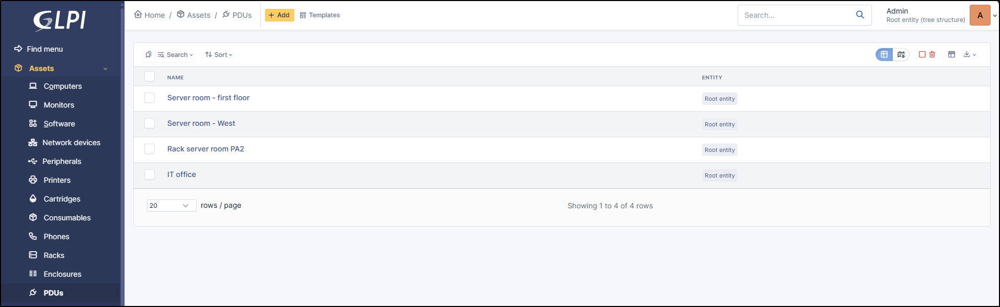
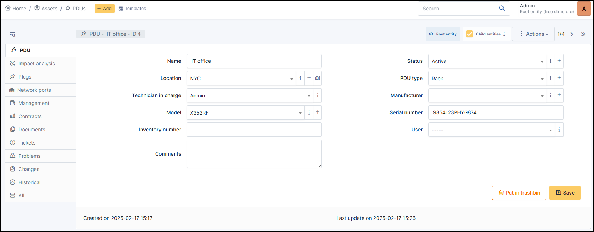

PDUs
====

PDU (Power distribution unit)  lists all the equipment used to manage and monitor electrical distribution in a rack or datacenter.

In a PDUs form, the following information is available:

.. Note:: It is possible to use :doc:`templates with PDUs <../overview/templates>`.

* Name
* :doc:`Location </tabs/common_fields/location>`
* :doc:`Technician in charge </tabs/common_fields/technician_in_charge>`
* :doc:`Model </tabs/common_fields/model>`
* :doc:`Inventory number </tabs/common_fields/inventory_number>`
* :doc:`Comments </tabs/common_fields/comments>`
* :doc:`Status </tabs/common_fields/status>`
* :doc:`Device type </tabs/common_fields/computer_type>`
* :doc:`Manufacturer </tabs/common_fields/manufacturer>`
* :doc:`Serial number </tabs/common_fields/serial_number>`
* :doc:`User </tabs/common_fields/user>`
