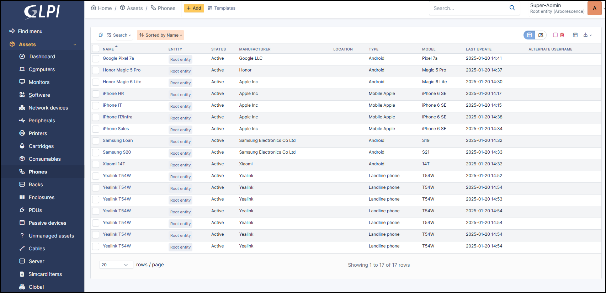

Phones
======

Phones can be registered manually or uploaded using the Android agent (not currently compatible with Apple terminals).

.. tip:: Note that if you modify a field manually, it will be considered locked.
          This will prevent it from being modified the next time the automatic inventory is uploaded.

          For more information, see :doc:`lock </modules/configuration/locks>`

In a phone form, the following information is available:

* Name
* :doc:`Location </tabs/common_fields/location>`
* :doc:`Technician in charge </tabs/common_fields/technician_in_charge>`
* :doc:`Group in charge </tabs/common_fields/group_in_charge>`
* :doc:`Alternate usernmame number </tabs/common_fields/alternate_username>`
* :doc:`Alternate usernmame </tabs/common_fields/alternate_user>`
* :doc:`User </tabs/common_fields/user>`
* :doc:`Group </tabs/common_fields/group>`
* :doc:`Comments </tabs/common_fields/comments>`
* :doc:`Status </tabs/common_fields/status>`
* :doc:`Phone type </tabs/common_fields/phone_type>`
* :doc:`Manufacturer </tabs/common_fields/manufacturer>`
* :doc:`Model </tabs/common_fields/model>`
* :doc:`Serial number </tabs/common_fields/serial_number>`
* :doc:`Inventory number </tabs/common_fields/inventory_number>`
* :doc:`Management type </tabs/common_fields/management_type>`
* :doc:`UUID </tabs/common_fields/uuid>`
* :doc:`Brand </tabs/common_fields/brand>`
* :doc:`Number of lines <tabs/common_fields/number_of_lines>`
* :doc:`Update source </tabs/common_fields/update_source>`
* :doc:`Ports </tabs/common_fields/ports>`

Impact Analysis
---------------

:doc:`Impact analysis <../../tabs/impact_analysis>` enables an infrastructure diagram to be drawn up, showing the dependencies and impacts in the event of equipment loss.
This can be saved and exported

Operating systems
-----------------

:doc:`Operating systems <../../tabs/operating_systems>`  includes information about your machine's OS :

* Name
* Version
* Architecture
* Service Pack
* Kernel
* Edition
* Product ID
* Serial number
* Company
* Owner
* Host ID
* Installation date

Components
----------

This tab lists the phone's :doc:`components <../../tabs/components>` :

* BIOS
* Processor
* Memory
* Hard Drive
* Network card
* Drive
* Battery
* Graphics card
* Soundcard
* Controller

Each item has its :doc:`own information <../../tabs/components>` (name, model, brand, memory capacity, number of cores/threads, etc.).

Lines
-----

You can add telephone lines created in `Lines <../management/lines.html>`_

Volumes
-------

Summarises all of the :doc:`volumes <../../tabs/volume>` present (hard disk, DVD) as well as the partitions present on the workstation
(virtual disks such as Google Cloud may appear if they are installed as a network drive).

* Name
* Automatic inventory (Yes /No)
* partition
* Mount point
* File system
* Global size
* Free size
* Free percentage
* Encryption (if the disk is encrypted, a padlock will be displayed)

Connections
-----------

It is possible to create a :doc:`connections <../../tabs/connections>` with a telephone using the following element:

* `Computer <computers.html>`_

Network Ports
-------------

This tab allows to manage the :doc:`network ports <../../tabs/network_ports>` attached to an equipment.
The information that can be viewed is:

* Name
* Port number
* MTU
* Speed
* Internal status
* Last change
* Number of I/O bytes
* Number of I/O errors
* Duplex
* VLAN
* Connected to
* Connection
* Deleted

Sockets
-------

:doc:`Sockets <../../tabs/sockets>` are the list of physical sockets present on the hardware. These sockets can be Ethernet, USB, HDMI, etc.
This information cannot be returned by the automatic inventory, so you have to add it manually.

It enables hardware to be linked by cables. Socket is also linked to the :doc:`cables <../modules/assets/cables>` object

Remote management
-----------------

:doc:`Remote management <../../tabs/remote-management>` is used to reference the remote access software installed on the workstation, such as Teamviewer, Anydesk, etc.
It is possible to add software manually if required, but the information can be fed back via the automatic inventory.

Management
----------

:doc:`Management <../../modules/tabs/management>` of financial and administrative information, this information is visible in the 'Management' tab on the computer's form.

Contracts
---------

GLPI supports :doc:`contracts <../management/contract>` management, in order to manage contract types such as loan, maintenance, support...

Contracts management allows to:

* make an inventory of all contracts related to the organization assets
* integrate contracts in GLPI financial management
* anticipate and follow contract renewal.

Documents
---------

The :doc:`document <../management/documents>` tab lets you link different types of file to a material (PDF, txt, png, etc.)
You can attach a document already uploaded to GLPI or add a new one directly from this tab.

Antiviruses
-----------

:doc:`Antiviruses <tabs/antivirus>` lists all the antivirus programs detected on the computer.
For Windows, it must be detected in the Windows Security Center in order to be listed in this tab.

Knowledge Base
--------------

Lists all the articles in the :doc:`knowledge base <../tabs/knowledgebase>` relating to the material.

Tickets
-------

View all :doc:`tickets <../tabs/tickets>` linked to the computer

Problems
--------

This tab refers to all hardware-related :doc:`problems <../assistance/problems>`.
Problems can also be linked to tickets, projects, etc. This allows you to have a complete scenario when necessary.

Changes
-------

:doc:`Changes <../assistance/changes>` lists all changes related to a material. From this tab, you can't link a change directly, you can do it from **Assistance** > **Changes** > **Items**.
You can create a new change from this page, which will be linked to the material you have selected.

Links
-----

:doc:`Links <../configuration/external_links>` offer several possibilities. Send the GLPI object file to another URL of your choice, or generate an RDP file, for example.

Notes
-----

:doc:`Note </modules/tabs/notes>` lets you add enriched text and attach a document.

Reservations
------------

The :doc:`reservation </modules/tools/reservations>` tab lets you reserve equipment, view the reservation schedule, or cancel the possibility of reserving this equipment.
By default, equipment cannot be reserved; you must first authorize this action manually.

Domains
-------

You can attach :doc:`Domains </modules/management/domains>` to your computer. Domains are also linked to other objects such as records, problems, etc.

Appliances
----------

:doc:`Appliances </modules/management/appliance>` includes all business applications managed within GLPI.
They can be linked to another GLPI object (computer, application, etc.) as well as to another appliance.

Historical
----------

:doc:`Historical <../tabs/historical>` lists all the actions carried out on the object in question

.. include:: ../tabs/all.rst

