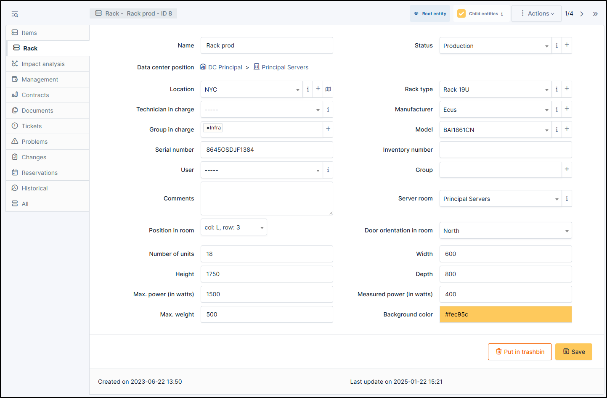

Racks
=====

A rack is a piece of equipment such as a patch bay or computer cabinet used to organize,
host and physically connect different network equipments and servers in a datacenter or technical room.

A rack is a dedicated object in GLPI that virtually represents the physical structure of a rack or cabinet.
It is designed to :

* **Organize equipment**: A rack is used to visualize and manage the physical equipment (servers, switches, routers, UPS, etc.)
* installed in it.
* **Facilitate physical management**: It enables you to track where equipment is installed in a physical space (technical room, datacenter, etc.).
* **Optimize space**: Racks help ensure that space is used efficiently, and that there's still room for new equipment.

When you add a rack (by **+ Add** at the top of the screen), you can add certain information:

* Name
* :doc:`Data center position </tabs/common_fields/data_center_position>`
* :doc:`Location </tabs/common_fields/location>`
* :doc:`Technician in charge </tabs/common_fields/technician_in_charge>`
* :doc:`Group in charge </tabs/common_fields/group_in_charge>`
* :doc:`Serial number </tabs/common_fields/serial_number>`
* :doc:`User </tabs/common_fields/user>`
* :doc:`Comments </tabs/common_fields/comments>`
* Position in room
* Number of units
* Height
* Max. Power (in watts)
* Max. weight
* :doc:`Status </tabs/common_fields/status>`
* :doc:`Rack type </tabs/common_fields/asset_type>`
* :doc:`Manufacturer </tabs/common_fields/manufacturer>`
* :doc:`Model </tabs/common_fields/model>`
* :doc:`Inventory number </tabs/common_fields/inventory_number>`
* :doc:`Group </tabs/common_fields/group>`
* `Server room </modules/management/data-centers.html#server-room>`_
* Door orientation in room (North, East, South, West)
* Width
* Depth
* Measured power (in watts)
* Background color

Items
-----

The :doc:`Item <tabs/rack_items>` tab shows the position of each element in the rack.
You can modify, add or remove an item from your park to your rack.

Impact Analysis
---------------

:doc:`Impact analysis <../../tabs/impact_analysis>` enables an infrastructure diagram to be drawn up, showing the dependencies and impacts in the event of equipment loss.
This can be saved and exported

Contracts
---------

GLPI supports :doc:`contracts <../management/contract>` management, in order to manage contract types such as loan, maintenance, support...

Contracts management allows to:

* make an inventory of all contracts related to the organization assets
* integrate contracts in GLPI financial management
* anticipate and follow contract renewal.

Documents
---------

The :doc:`document <../management/documents>` tab lets you link different types of file to a material (PDF, txt, png, etc.)
You can attach a document already uploaded to GLPI or add a new one directly from this tab.

Tickets
-------

View all :doc:`tickets <../tabs/tickets>` linked to the computer

Problems
--------

This tab refers to all hardware-related :doc:`problems <../assistance/problems>`.
Problems can also be linked to tickets, projects, etc. This allows you to have a complete scenario when necessary.

Changes
-------

:doc:`Changes <../assistance/changes>` lists all changes related to a material. From this tab, you can't link a change directly, you can do it from **Assistance** > **Changes** > **Items**.
You can create a new change from this page, which will be linked to the material you have selected.

Reservations
------------

The :doc:`reservation </modules/tools/reservations>` tab lets you reserve equipment, view the reservation schedule, or cancel the possibility of reserving this equipment.
By default, equipment cannot be reserved; you must first authorize this action manually.

Historical
----------

:doc:`Historical <../tabs/historical>` lists all the actions carried out on the object in question

.. include:: ../tabs/all.rst
