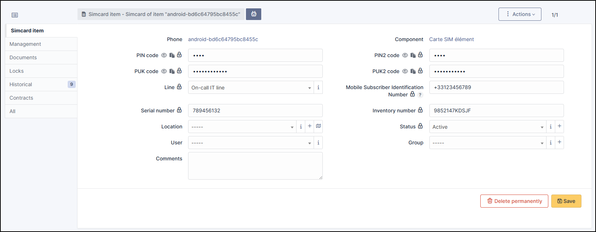

SIM
===

A :abbr:`SIM (Subscriber Identity Module)` represents a SIM card used in mobile equipment such as telephones, tablets, 4G/5G modems, etc.
You can manage these SIM cards as specific objects to track their use and allocation.

.. tip:: Note that if you modify a field manually, it will be considered locked.
          This will prevent it from being modified the next time the automatic inventory is uploaded.

          For more information, see :doc:`lock </modules/configuration/locks>`

In a display form, the following information is available:

* Code PIN
* Code PIN2
* Code PUK
* Code PUK2
* :doc:`Line <../management/lines>`
* Mobile Subscriber Identification Number (MSIN is last 8 or 10 digits of IMSI)
* :doc:`Serial number </tabs/common_fields/serial_number>`
* :doc:`Inventory number </tabs/common_fields/inventory_number>`
* :doc:`Location </tabs/common_fields/location>`
* :doc:`Status </tabs/common_fields/status>`
* :doc:`User </tabs/common_fields/user>`
* :doc:`Group </tabs/common_fields/group>`
* :doc:`Comments </tabs/common_fields/comments>`

Management
----------

:doc:`Management <../../modules/tabs/management>` of financial and administrative information, this information is visible in the 'Management' tab on the current item's form.

Documents
---------

The :doc:`document <../management/documents>` tab lets you link different types of files to this item (PDF, txt, png, etc.)
You can attach a document already uploaded to GLPI or add a new one directly from this tab.

Locks
-----

:doc:`Locks </modules/assets/tabs/locks>` are used to prevent a field from being modified when the inventory is uploaded.
You can lock/unlock the fields you wish in a GLPI object.

Contracts
---------

GLPI supports :doc:`contracts <../management/contract>` management, in order to manage contract types such as loan, maintenance, support...

Contracts management allows to:

* make an inventory of all contracts related to the organization assets
* integrate contracts in GLPI financial management
* anticipate and follow contract renewal.

.. include:: ../tabs/historical.rst

.. include:: ../tabs/all.rst