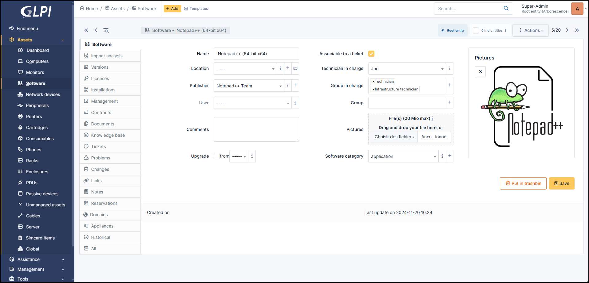

Software
========

GLPI allows management of software and their versions as well as licenses, associated or not to software versions.

A software is by default associated with an entity.

Financial management is done at the level of licenses; the financial management at software level is only a model for the licenses associated with this software.

Software can be imported automatically using a third-party inventory tool; in this case
a dictionary can be used to filter or clean the import data (see :doc:`Configure data dictionaries <../administration/dictionnaries>`.
Dictionaries are managed from menu entry **Administration > Dictionaries**).

It is recommended to first create the software without a version number in the name, then to create the versions and last to create the licenses.

.. note::
   In multi-entity mode, the list of software can rapidly become long because of double entries (one software per entity).
   A better approach can consist in grouping identical software in the same entity (see tab *Grouping* below), then to make recursive the elements that can be made recursive.

It is possible to use :doc:`templates with software <../overview/templates>`.

.. tip:: Note that if you modify a field manually, it will be considered locked.
          This will prevent it from being modified the next time the automatic inventory is uploaded.

          For more information, see :doc:`lock </modules/configuration/locks>`

* Name
* :doc:`Location </tabs/common_fields/location>`
* :doc:`Technician in charge </tabs/common_fields/technician_in_charge>`
* :doc:`Group in charge </tabs/common_fields/group_in_charge>`
* :doc:`User </tabs/common_fields/user>`
* :doc:`Group </tabs/common_fields/group>`
* :doc:`Comments </tabs/common_fields/comments>`
* :doc:`Pictures </tabs/common_fields/pictures>`

Some fields are specific in the software form:

- **Upgrade From** is an information, with no processing associated and which tells whether the software is an update of another software
- **Sofware category** allows to group software in the list of software of an asset
- **Associable to a ticket** defines whether the software can be seen in the drop-down list "Hardware" of a  ticket

Impact Analysis
---------------

:doc:`Impact analysis <../../tabs/impact_analysis>` enables an infrastructure diagram to be drawn up, showing the dependencies and impacts in the event of equipment loss.
This can be saved and exported

Versions
--------

A version of a software is the element that can be installed on a asset; see also :ref:`*Installations* tab <tab-install-software>`.

The main view lists the number of installations of the version.

* **Name**: the version number
* **Status**: in ITIL recommendations, it allows to follow the DSL (library storing authorized versions)
* **Operating system**: the operating system on which this software version runs
* **Summary**: overview of installations and entities in which the software is installed
* **Installations**: the number of installations of the version
* **Historical**: historical of the events
* **All**: all previous elements

Licenses
--------

:doc:`Licenses </modules/management/licenses>` play an important role in managing the software used in an organisation. They make it possible to manage software usage rights, 
to know who is using a licence, how many are available and how many are being used.
GLPI makes it possible to associate costs with licences, which facilitates budget management.
Licences can be linked to equipment (computers, servers, etc.) or to specific users, so you know who is using what.
It is also possible to set up expiry alerts.

Here are the fields available from this tab:

* Name
* Serial number
* Number
* Affected Items
* Type
* Purchase version
* Version in use
* Expiration
* Status

Installations
-------------

The installation of a software on a computer is visualized through a version and can be consulted
on a software form (list of computers having at least one version installed),
on a version form (computers having this version installed) and finally on a computer form
(list of versions of installed software, sorted by category).

.. note::

   * Column `license` is filled only when the license is affected to the concerned computer
   * The initial display of different categories depend upon user preferences. See :doc:`manage preferences </first-steps/preferences>`

Two options are available on the list of installations of software on a computer. Above the list, **Install** allows to install manually a version of a software on the computer, by selecting first the software and its version; if a license is associated with this software, the use version of the license is automatically selected.

To **Uninstall** a version of a software, mass actions must be used: first select the versions to be uninstalled, then select **Suppress definitively**. If a license is affected to the computer, it remains affected but its use version is erased.

Following the list of installed versions, the list of affected but non installed licenses is displayed. It is possible to add a new license to the computer. Mass actions allow, via the action **Install**, to install a use version of selected licenses.

Management
----------

:doc:`Management <../../modules/tabs/management>` of financial and administrative information,
this information is visible in the 'Management' tab on the software's form.

Documents
---------

The :doc:`document <../management/documents>` tab lets you link different types of file to a material (PDF, txt, png, etc.)
You can attach a document already uploaded to GLPI or add a new one directly from this tab.

Knowledge Base
--------------

Lists all the articles in the :doc:`knowledge base <../../tabs/knowledgebase>` relating to the item.

Tickets
-------

View all :doc:`tickets <../tabs/tickets>` linked to the software

Problems
--------

This tab refers to all hardware-related :doc:`problems <../assistance/problems>`.
Problems can also be linked to tickets, projects, etc. This allows you to have a complete scenario when necessary.

Changes
-------

:doc:`Changes <../assistance/changes>` lists all changes related to a material. From this tab, you can't link a change directly, you can do it from **Assistance** > **Changes** > **Items**.
You can create a new change from this page, which will be linked to the material you have selected.

Projects
--------

This tab lists all the projects linked to the software. Here you can only add a project that already exists.
To create a new one, go to :doc:`Projects <../tools/projects>`

Links
-----

:doc:`Links <../configuration/external_links>` offer several possibilities.
Send the GLPI object file to another URL of your choice, or generate an RDP file, for example.

Notes
-----

:doc:`Note </modules/tabs/notes>` lets you add enriched text and attach a document.

Reservations
------------

The :doc:`reservation </modules/tools/reservations>` tab lets you reserve equipment, view the reservation schedule, or cancel the possibility of reserving this equipment.
By default, equipment cannot be reserved; you must first authorize this action manually.

Domains
-------

You can attach :doc:`Domains </modules/management/domains>` to your computer. Domains are also linked to other objects such as records, problems, etc.

Appliances
----------

:doc:`Appliances </modules/management/appliance>` includes all business applications managed within GLPI.
They can be linked to another GLPI object (computer, application, etc.) as well as to another appliance.

.. include:: ../tabs/historical.rst

.. include:: ../tabs/all.rst

Grouping
~~~~~~~~

This section describes how to group software having same names in sub-entities, allowing to group software of child entities into mother entity.

.. note::

   This is only available for multi-entities platforms.

How to realize a grouping:

#. If the software does not exist in mother entity, create in this mother entity a software whose name is strictly identical to the name of software in child entities

#. Open the form of the software of the mother entity

#. Activate recursivity (sub-entities to Yes at top right); this will make a new tab `Grouping` appear after tab `History`

#. Open this tab; a list displays software having same names in child entities

#. Select appropriate lines and validate grouping

.. warning::

   This operation cannot be undone

This grouping have the following effects:

* Licenses are attached to the software in mother entity, but stay in origin sub-entities
* Versions are merged, no more doubles in mother entity
* Old software are moved to the trash

.. note::

   When using a third-party inventory tool, some extra steps are mandatory:

   * Empty trash after grouping, otherwise synchronization will restore the old software in case of new version
   * Associate the same vendor to the new software; as the synchronization checks vendor name, a new software would then be created

