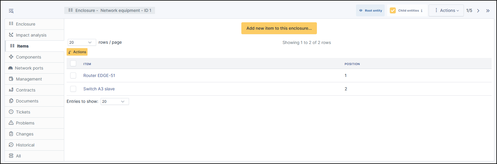
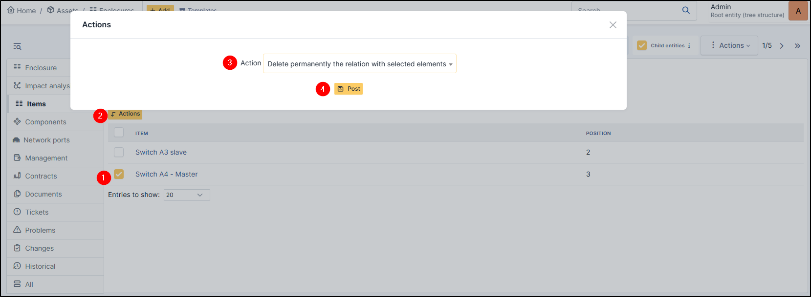

Items
-----

This tab displays the list of items linked to the chassis.
This allows for better organisation and simplified management thanks to a centralised view.

Add a item
~~~~~~~~~~

* To add an item (this item must already exist in your glpi), click on **Add new item to this enclosure**
* Select the **item type** (computer, monitor, network device, peripheral, PDU, passive device)
* Select the required **item**
* Select the **enclosure** in which the equipment is to be positioned
* Choose a **position**
* Click on **+ Add**

Delete an item
~~~~~~~~~~~~~~

To delete an item from enclosure, use the massive action :

