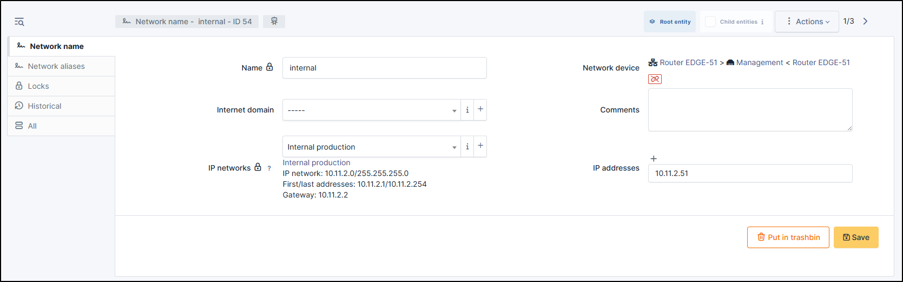

Network Name
------------

A network name is the unique identification of a machine from the Internet point of view.

Generally, a device is identified by one or more particular names on the network.
The DNS server will resolve this name to an IP address.
In case both IPv4 and IPv6 are used, this name will return two IP addresses: one in IPv4 and the other in IPv6.
This is why a network name can have several IP addresses.

A network name is composed of a name that corresponds to the :term:`FQDN` label and one or more IP addresses.

The IP network field appears in order to retrieve information about the different IP networks available.
This information is not kept in the network name because it can have several IP addresses and each can belong to several IP networks.

.. note::

   When entering a network name, the validity of the name as well as that of each IP address is checked.
   If one of these elements is not valid then it is rejected.

To add an IP address to a network name, click on the **+ Add** in front of the IP address entry fields.
To remove an IP address, simply delete the contents of the IP field you wish to remove.

Network alias
~~~~~~~~~~~~~

Displays a list of aliases for this network and allows adding new ones.

Traditionally, the network name is the one used by DNS for reverse resolution of an IP address,
while the aliases correspond to the `CNAME` of the :term:`FQDN` name.

Similarly, the alias name must have a valid :term:`FQDN` label