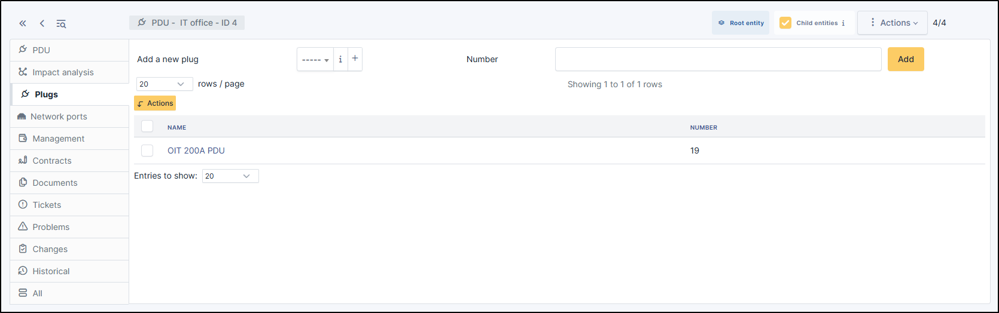
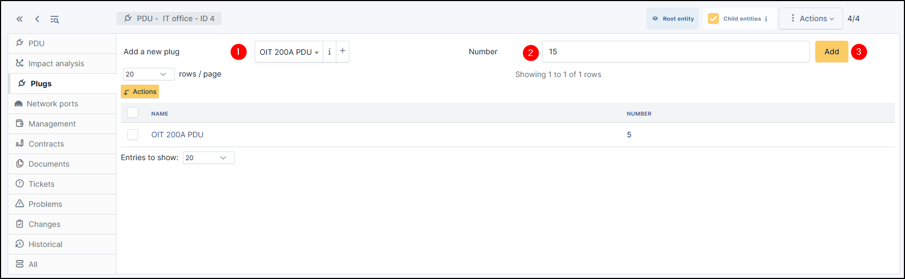
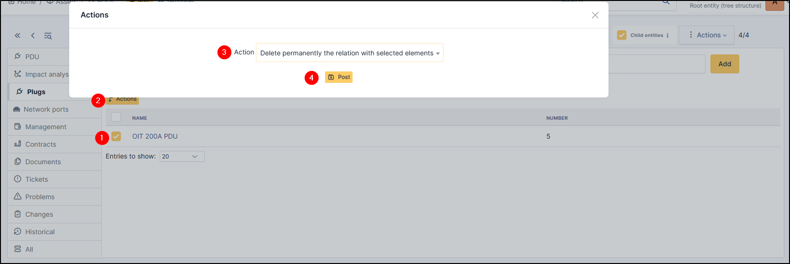
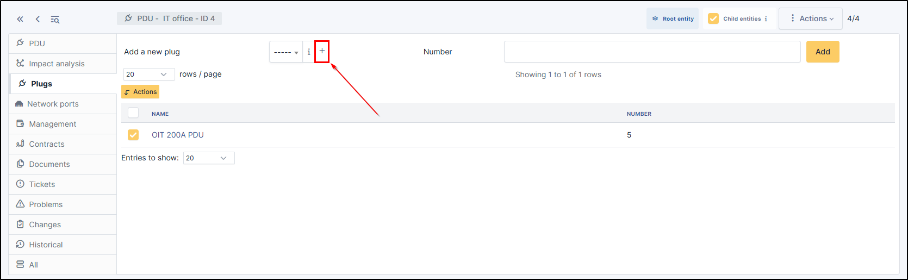
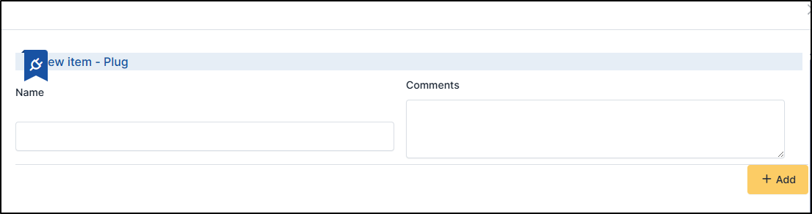

Plugs
-----

This tab shows the number of plugs available on a PDU. This item can be linked to a :doc:`rack <../racks>` or an :doc:`enclosure <../enclosures>`

Add a plug
~~~~~~~~~~

* To add a plug on PDU, choose the type of plug you require from the drop-down list
* Select a number of plugs available on the PDUs
* Click on **Add**

.. note:: you can use the same plug model several times

Delete a plug
~~~~~~~~~~~~~

To delete a plug, use the massive action :

* Select the plug
* Click on **Actions**
* Select **Delete permanently the relation with selected elements**
* Click on **Post**

Create a plug
~~~~~~~~~~~~~

If the plug model you want is not available, you can create a new one.

* Click on **+**

* Fill in the fields
* Click on **+Add**

.. note:: You can find a list of all your plugs in **Setup > Dropdowns > Plugs**
