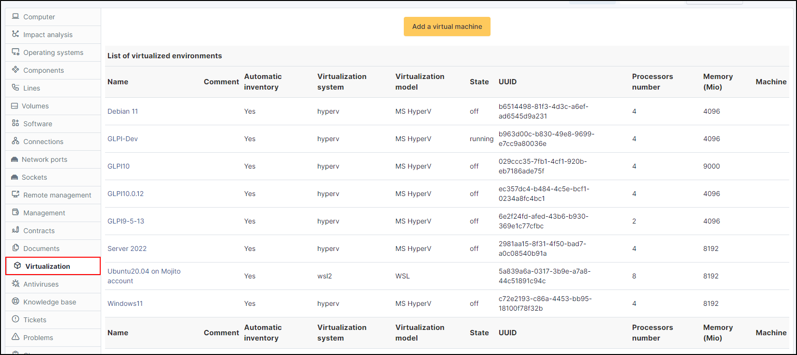
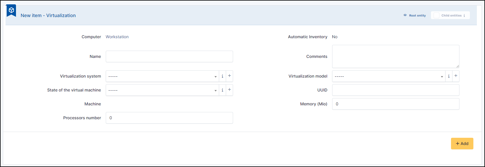
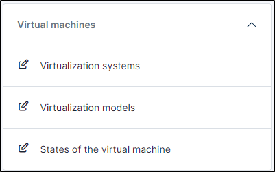
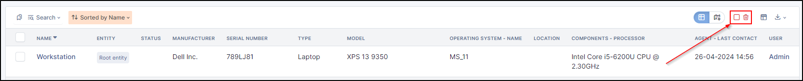

Virtualization
--------------

This tab displays the virtualization systems (virtual machines, containers, jails....) associated to a host.

.. tip::
   You can either remount the virtual machine in the assets tab or include it in the virtualization tab of the host that hosts them.
   To make this change, go to **Administration** > **Inventory** > **Virtualization**.

   .. image:: ../images/virtualization-import-type.png
      :alt: module assets - import type for virtualization
      :align: center
      :scale: 42 %

The available information vary from one system to another: for a virtual machine for instance, it includes :

* Name
* Automatic Inventory
* Virtualization system
* Virtualization model
* State
* UUID
* Processors number
* Allocated memory
* As well as the name of the physical machine (the host).

GLPI establishes the link between a host and a virtual machine based on the unique identifier (UUID).
In some case, it is possible that the UUID is different inside the physical machine and the virtual machine;
it is therefore impossible to make the link automatically.

Several systems are supported, including HyperV, VMWare, VirtualBox, WSL, etc.

The only way to link manually a virtual machine to a physical machine is to attribute the *same* UUID to the virtual machine declared on the host and to the virtual machine inside GLPI.

.. note::

   If using native inventory or third-party inventory tool, the virtualization information can be automatically imported and updated.

Add a virtual machine
~~~~~~~~~~~~~~~~~~~~~

* To add a new virtual machine, click on **Add a virtual machine**
* Enter the information of the new machine

* By clicking on **+**, you can add a new :

  * Virtualization system
  * Virtualization model

You can manage these items in **Setup** > **Dropdowns** > **Virtual Machines**

.. note::
   A machine added manually will, by default, be identified as automatic inventory: No. This information cannot be modified.

Delete a virtual machine
~~~~~~~~~~~~~~~~~~~~~~~~

- To delete a virtual, you need to click on this (on assets directly or in the virtualization tab of the host)
- Click on **Put in trashbin**
- If the VM was a computer in assets, click on the trashbin
- Select the **checkbox**
- Click on **Actions**
- Delete permanently (keep or remove devices as required)

.. note::
   If the VM is still present on the host, it will be remounted during the next inventory.
   You will therefore also need to delete it from the host