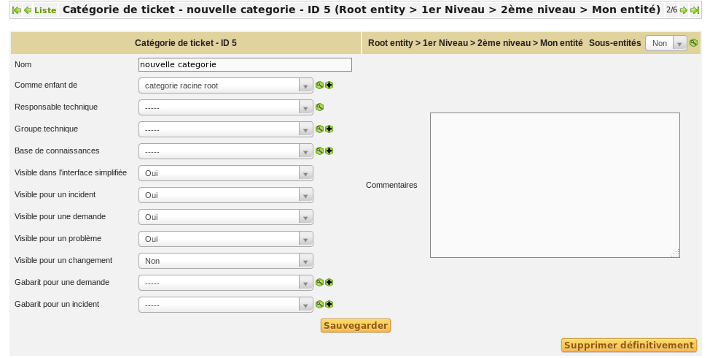

Categories
==========

A category can be made hierarchical:

* by selecting a parent category using in first tab the field `As child of`
* by adding a new child category in tab `ITIL Categories`

Ticket categories
-----------------

Ticket categories can be managed in dropdown setup *Setup > Dropdowns > Ticket Categories*.

Ticket categories are also used by changes and problems.

A person in charge and/or a technical group can be added to this category and will then be used for notifications.

A knowledge base category can also be associated to this category; this will register the solution in this category of the knowledge base.

.. ??? ***Exemple :*** - catégorie de ticket : panne disque dur - champ Base de connaissance de la catégorie : Panne > Ordinateur Si la catégorie "Panne disque dur" est sélectionnée dans le ticket, lors de l'ajout de la solution du ticket dans la base de connaissance, celle-ci sera stockée dans "Panne > Ordinateur".

A category can be invisible in simplified interface, in order to reduce list of categories for end-users. It can also be made visible or not for incidents, demands, problems or changes.

A template can be associated with this category and will be loaded when this category is selected in ticket. This template can be different for demands and incidents.

.. ??? sentence and example not clear
.. La catégorisation faciliter le traitement d'un objet. Par exemple, pour un ticket, en fonction de la configuration souhaitée, le demandeur peut indiquer une catégorie, et le technicien la modifier.
.. proposed translation:

Using categories eases ticket processing (for example, for a ticket, depending on the configuration, the requester can select a category and the technician can change it).

.. hint::

   When building a helpdesk, it is important to choose carefully the list of available categories: a too large number visible by end-users will make ticket creation less easy, whereas a too small number will not allow to qualify correctly the demand.

   Ticket categories allow to do automatic processing when creating a ticket, for instance modify ticket attributes; see :doc:`Business rules for tickets </modules/administration/05_Règles/04_Règles_métier_pour_les_tickets>`.

Task categories
---------------

Task categories are used to sort task in order to ease their processing or to build meaningful statistics.

.. ??? All the remaining is already there in the other files => removed
.. Scheduling rules
.. ----------------
.. `Les règles d'ordonnancement <04_Module_Assistance/03_Définir_la_matrice_de_calcul_de_la_priorité.rst>`__
.. Configurer la matrice d'attribution des priorités en fonction de l'urgence et de l'impact : limiter les niveaux d'urgence et d'impact disponibles.
.. Planning management
.. -------------------
.. `Consulter et gérer les plannings <04_Module_Assistance/09_Planning.rst>`__
.. Suivez les tâches planifiées.
.. Email notification
.. ------------------
.. Les actions sur les tickets peuvent entrainer l'envoi de notification suivant un évènement déclencheur (création d'un ticket, réponse à enquête de satisfaction...). Voir **configurer les notifications**.
.. Statistics
.. ----------
.. `Les statistiques <04_Module_Assistance/10_Statistiques.rst>`__
.. Les rapports concernant les tickets, les problèmes ou les changements sont disponibles dans le menu ***Assistance > Statistiques***.

