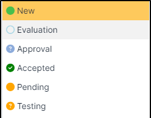
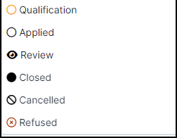
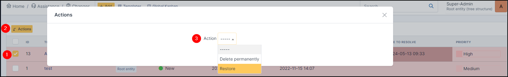
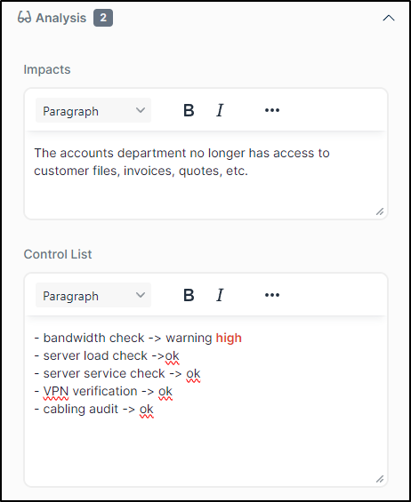
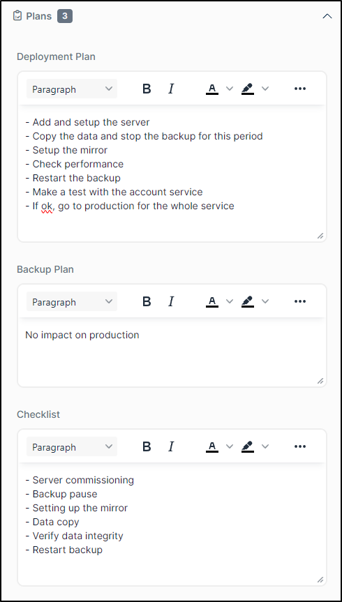
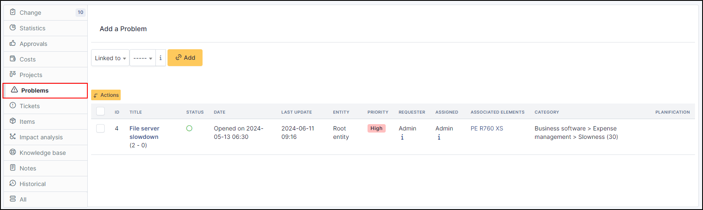
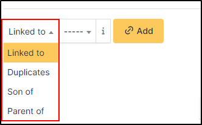
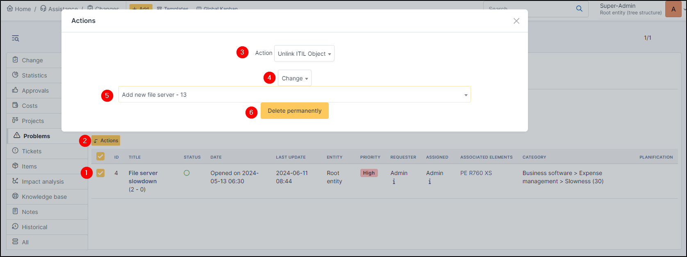
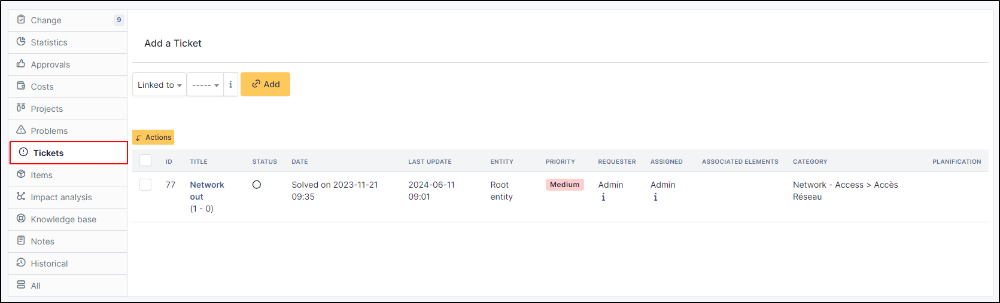

Manage changes
==============

A change is a modification of the information system's infrastructure.

A change can be created either from a ticket form or a problem form, in tab **Changes**, or from menu **Assistance > Changes**.

The form to create a change is similar to the ticket creation form and shares with it many terms: *requester*, *watcher*, *assigned to*, *status*, *urgency*, *impact*, *priority*, *category*. For more information see :doc:`Manage tickets </modules/assistance/tickets/ticketmanagement>`. The validation process is also the same as tickets in order to allow preliminary validation of the change (tab *Validations*).

Once the change is created, it is possible to attach tickets but also impacted items (tab *Items*). An analysis phase (tab *Analysis*) consists in describing impacts and controls list in order to implement this change through a deployment plan, a backup plan and a checklist (tab *Plans*).

Same as tickets, task, costs and solution allow to follow and solve the change. For complex changes management, a change can be linked with one or several projects allowing a mode detailed management (:doc:`Manage projects </modules/tools/projects>`).

Changes use their own notifications (see :doc:`configuration of email follow-ups <email_notifications>`).

Add a change
------------

* To add a new change, click on **+ Add** at the top of the screen
* Fill in the various tabs of your change to make it as complete as possible

Status
~~~~~~

Several statuses are available, including some for test phases, validation, qualification, etc.

Delete a change
---------------

* To delete a change, click on the change concerned
* Click on put in trashbin at the bottom of the screen

Restore or delete permanently
-----------------------------

* To delete or restore a change, click on the trashbin (at top right of screen)
* Select the change concerned
* Click on **Actions**
* Select **Restore** or **Delete permanently**
* Click on **Post**

.. Danger:: **Delete permanently** remove definitively the change, you won't be able to get it back.

The different tabs
------------------

Analysis
~~~~~~~~

This tab contains :

- Impacts
- Control list in order to implement the change.

Plans
~~~~~

This plan contains :

- Deployment plan
- Backup plan
- Checklist

Statistics
~~~~~~~~~~

The statistics are intended to provide information, showing how long it takes to take over, close a change, etc. Statistics similar to tickets

Approvals
~~~~~~~~~

Approval allows you to send requests to groups and/or users (or certain users within a group) in order to obtain their validation of the change in question.
You can see :doc:`Approvals <../../tabs/approvals>` for more information.

.. include:: ../../tabs/cost.rst

.. include:: ../../tabs/projects.rst

Problems
~~~~~~~~

Changes may be due to problems. In this tab, you can link a problem to your change.

Problems can be linked in several ways :

* Linked To
* Duplicates
* Son of
* Parent of

Problems can be linked in several ways. This information is for information purposes only.

Link a problem
^^^^^^^^^^^^^^

* To link a problem, select it une the dropdown list
* Select the type of the link
* Click on **Add**

.. note:: You can not add a new problem here, you can just add an existing problem.
    To add a new :doc:`problem <problems>`, go to **Assistance** > **Problems**

Unlink a problem
^^^^^^^^^^^^^^^^

To unlink a problem, you need to use **massive actions**

* Select the check box of the problem(s)
* Click on **Actions**
* Select **Unlink ITIL Object**
* Select **Change**
* Select the change concerned
* Click on **Delete permanently**

Tickets
~~~~~~~

A change may have been introduced via a ticket. In this tab you can attach the ticket(s) affected by the change.

Like problems, tickets can be linked in several ways :

* Linked To
* Duplicates
* Son of
* Parent of

Tickets can be linked in several ways. This information is for information purposes only.

Link a ticket
^^^^^^^^^^^^^^

* To link a ticket, select it une the dropdown list
* Select the type of the link
* Click on **Add**

.. note:: You can not add a new ticket here, you can just add an existing ticket.
    To add a new :doc:`ticket <tickets>`, go to **Assistance** > **Tickets**

Unlink a ticket
^^^^^^^^^^^^^^^^

To unlink a ticket, you need to use **massive actions**

* Select the check box of the ticket(s)
* Click on **Actions**
* Select **Unlink ITIL Object**
* Select **ticket**
* Select the ticket concerned
* Click on **Delete permanently**

.. include:: ../../tabs/item.rst

Impact Analysis
~~~~~~~~~~~~~~~~

Impact analysis allows you to create diagrams of your infrastructure and see the impact of a change on it.

To see how impact analysis works, go to :doc:`impact analysis<../../tabs/impact_analysis>`

.. include:: ../../tabs/knowledgebase.rst

.. include:: ../tabs/notes.rst

.. include:: ../tabs/historical.rst

.. include:: ../tabs/all.rst
